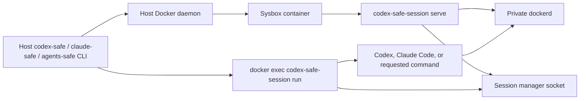

# Architecture

Status: Implemented multi-agent environment with a shared session manager.

Scope: Host-side project discovery and launch, the Sysbox container, its private Docker daemon, and the
container-local command lifetime protocol.

## Runtime Topology

`codex-safe`, `claude-safe`, and `agents-safe` discover the requested Git worktree, derive the same mount and identity
plan, and create or reuse one deterministically named container. Codex and Claude Code can therefore run concurrently
against one worktree and private Docker daemon. The container runs under Sysbox and never receives the host Docker
socket.

The privileged `serve` process recreates the invoking host identity inside the container, prepares its ephemeral
home, starts the private daemon, and owns the session manager. Each unprivileged `run` wrapper registers before it
starts a command and keeps that registration until the child exits. The manager shuts down the container only
after the last registered command disconnects and the idle timeout expires.

Every session mounts the daemon-local `codex-safe-codex` and `codex-safe-claude` volumes read-only. The image contains
neither product executable. `make docker-build` initializes both volumes after building the local image, while
`codex-safe update` and `claude-safe update` refresh them independently without a rebuild. Each updater uses an
ordinary maintenance container with only its installation volume read-write. Host Codex and Claude state remain
separate writable binds; sharing is limited to the project/runtime resources exposed by the common creation plan.

## Core Modules

This table maps executable code to the design document that owns its durable contract. `make check-docs` verifies
both the module paths and document links.

| Module | Responsibility | Owning design doc |
| --- | --- | --- |
| `cmd/codex-safe/` | Host CLI. | [Safe environment](docs/design-docs/codex-safe.md) |
| `cmd/claude-safe/` | Claude Code host CLI and update dispatch. | [Claude Code integration](docs/design-docs/claude-safe.md) |
| `cmd/agents-safe/` | Host CLI for arbitrary container commands. | [Safe environment](docs/design-docs/codex-safe.md) |
| `internal/cli/` | Shared launcher CLI. | [Safe environment](docs/design-docs/codex-safe.md) |
| `internal/launchcli/` | Composes host and project resolution into the CLI's resolved config. | [Launcher configuration][launcher-config] |
| `internal/launchcli/dependencies/` | Resolves host dependency-cache locations without Docker. | [Host-backed dependency caches](docs/design-docs/host-backed-dependency-caches.md) |
| `internal/gitproject/` | Git discovery. | [Safe environment](docs/design-docs/codex-safe.md) |
| `internal/launcher/` | Managed-container lifecycle and host launch orchestration. | [Safe environment](docs/design-docs/codex-safe.md) |
| `internal/launcher/launchplan/` | Validated worktree and bind-mount launch contract. | [Safe environment](docs/design-docs/codex-safe.md) |
| `internal/launcher/projectenv/` | Local config and image definitions. | [Launcher configuration][launcher-config] |
| `internal/launcher/dockercli/` | Typed adapter for the host Docker CLI. | [Safe environment](docs/design-docs/codex-safe.md) |
| `cmd/codex-safe-session/` | Container CLI. | [Session manager](docs/design-docs/go-session-manager.md) |
| `internal/container/` | Container bootstrap. | [Session manager](docs/design-docs/go-session-manager.md) |
| `internal/launcher/hostmcp/` | MCP endpoint discovery. | [Host MCP Access](docs/design-docs/host-mcp-forwarding.md) |
| `internal/mcpchannel/` | MCP channel wire contract. | [Host MCP Access](docs/design-docs/host-mcp-forwarding.md) |
| `internal/relay/` | Host MCP relay sidecar. | [Host MCP Access](docs/design-docs/host-mcp-forwarding.md) |
| `internal/session/` | Command lifecycle. | [Session manager](docs/design-docs/go-session-manager.md) |
| `internal/terminal/` | Terminal detection. | [Session manager](docs/design-docs/go-session-manager.md) |
| `container/` | Container image and shell defaults. | [Safe environment](docs/design-docs/codex-safe.md) |
| `tests/smoke/` | Real Docker/Sysbox boundary verification. | [Safe environment](docs/design-docs/codex-safe.md) |

[launcher-config]: docs/design-docs/project-launcher-configuration.md

## Data and Trust Boundaries

- The selected worktree is mounted read-write at the same absolute path.
- Local `.agents-safe/config.toml` serializes the validated host-specific mount plan and may add explicit project
  mounts for new containers.
- Git-topology roles are required and fail before Docker access when omitted. Host Git config, Codex home, Claude
  state, personal skills, and host MCP are degradable roles: omission keeps them absent and emits an explicit startup
  warning.
- A linked worktree's primary checkout is mounted read-only while the shared Git directory remains writable.
- The host home is not mounted implicitly. Explicit local project configuration may expose narrower directories;
  supported configuration files otherwise receive only their documented mounts.
- The host Docker socket is never mounted into the container.
- Both shared executable volumes are read-only in project sessions and read-write only in their isolated maintenance
  containers started after `make docker-build` or by the matching product update command.
- The session container shares no host namespace. The optional relay sidecar in
  [Host MCP Access](docs/design-docs/host-mcp-forwarding.md) shares the host network namespace only, runs no agent
  code, and exists only while a session forwards host MCP endpoints.
- Nested Docker state belongs to the private daemon and disappears with the container.
- Passwordless sudo grants root only inside the Sysbox container, not on the host.

## Change Boundaries

- Host discovery, mount, naming, reuse, or Docker argument changes belong to
  [Safe Environment for Running Codex Agents](docs/design-docs/codex-safe.md).
- Shared Codex volume, executable path, initialization, and update changes belong to
  [Persistent Container Codex Installation](docs/design-docs/persistent-codex-installation.md).
- Claude state, executable volume, command policy, installation, and update changes belong to
  [Safe Claude Code Integration](docs/design-docs/claude-safe.md).
- Project initialization, typed local config, and CLI precedence belong to
  [Project Launcher Configuration](docs/design-docs/project-launcher-configuration.md).
- Project-image discovery, automatic builds, BuildKit caching, and compatibility validation belong to
  [Project-Specific Agent Environments](docs/design-docs/project-environments.md).
- Container startup, daemon supervision, registration, command wrapping, and idle shutdown changes belong to
  [Go Session Manager](docs/design-docs/go-session-manager.md).
- Reaching host MCP servers that listen on loopback belongs to
  [Host MCP Access](docs/design-docs/host-mcp-forwarding.md).
- Runtime or security-boundary changes must update the owning design doc in the same change.
- Non-trivial implementations follow the lifecycle in [Execution Plans](docs/exec-plans/README.md).
- Review findings and deferred work follow [Reviews](docs/reviews/README.md).
- Required automated and real-host checks are selected through [Testing](docs/testing.md).
