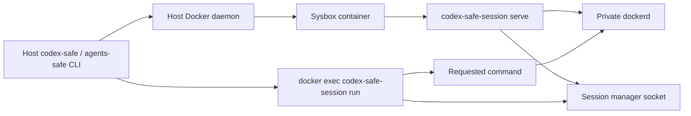

# Architecture

Status: Implemented MVP with an active session-manager evolution.

Scope: Host-side project discovery and launch, the Sysbox container, its private Docker daemon, and the
container-local command lifetime protocol.

## Runtime Topology

`codex-safe` and `agents-safe` discover the requested Git worktree, derive a mount and identity plan, and create or
reuse one deterministically named container. The container runs under Sysbox and never receives the host
Docker socket.

The privileged `serve` process recreates the invoking host identity inside the container, prepares its ephemeral
home, starts the private daemon, and owns the session manager. Each unprivileged `run` wrapper registers before it
starts a command and keeps that registration until the child exits. The manager shuts down the container only
after the last registered command disconnects and the idle timeout expires.

## Core Modules

This table maps executable code to the design document that owns its durable contract. `make check-docs` verifies
both the module paths and document links.

| Module | Responsibility | Owning design doc |
| --- | --- | --- |
| `cmd/codex-safe/` | Host CLI. | [Safe environment](docs/design-docs/codex-safe.md) |
| `cmd/agents-safe/` | Host CLI for arbitrary container commands. | [Safe environment](docs/design-docs/codex-safe.md) |
| `internal/cli/` | Shared launcher CLI. | [Safe environment](docs/design-docs/codex-safe.md) |
| `internal/gitproject/` | Git discovery. | [Safe environment](docs/design-docs/codex-safe.md) |
| `internal/launcher/` | Managed-container lifecycle and host launch orchestration. | [Safe environment](docs/design-docs/codex-safe.md) |
| `internal/launcher/launchplan/` | Validated worktree and bind-mount launch contract. | [Safe environment](docs/design-docs/codex-safe.md) |
| `internal/launcher/projectenv/` | Initializes and reads local project image and mount configuration. | [Project environments](docs/design-docs/project-environments.md) |
| `internal/launcher/dockercli/` | Typed adapter for the host Docker CLI. | [Safe environment](docs/design-docs/codex-safe.md) |
| `cmd/codex-safe-session/` | Container CLI. | [Session manager](docs/design-docs/go-session-manager.md) |
| `internal/container/` | Container bootstrap. | [Session manager](docs/design-docs/go-session-manager.md) |
| `internal/launcher/hostmcp/` | MCP endpoint discovery. | [Host MCP Access](docs/design-docs/host-mcp-forwarding.md) |
| `internal/mcpchannel/` | MCP channel wire contract. | [Host MCP Access](docs/design-docs/host-mcp-forwarding.md) |
| `internal/relay/` | Host MCP relay sidecar. | [Host MCP Access](docs/design-docs/host-mcp-forwarding.md) |
| `internal/session/` | Command lifecycle. | [Session manager](docs/design-docs/go-session-manager.md) |
| `internal/terminal/` | Terminal detection. | [Session manager](docs/design-docs/go-session-manager.md) |
| `container/` | Container image and shell defaults. | [Safe environment](docs/design-docs/codex-safe.md) |
| `tests/smoke/` | Real Docker/Sysbox boundary verification. | [Safe environment](docs/design-docs/codex-safe.md) |

## Data and Trust Boundaries

- The selected worktree is mounted read-write at the same absolute path.
- Additional directories explicitly listed in local `.agents-safe/config.toml` are mounted read-write at the same
  absolute paths for new containers.
- A linked worktree's primary checkout is mounted read-only while the shared Git directory remains writable.
- The host home is not mounted implicitly. Explicit local project configuration may expose narrower directories;
  supported configuration files otherwise receive only their documented mounts.
- The host Docker socket is never mounted into the container.
- The session container shares no host namespace. The optional relay sidecar in
  [Host MCP Access](docs/design-docs/host-mcp-forwarding.md) shares the host network namespace only, runs no agent
  code, and exists only while a session forwards host MCP endpoints.
- Nested Docker state belongs to the private daemon and disappears with the container.
- Passwordless sudo grants root only inside the Sysbox container, not on the host.

## Change Boundaries

- Host discovery, mount, naming, reuse, or Docker argument changes belong to
  [Safe Environment for Running Codex Agents](docs/design-docs/codex-safe.md).
- Project initialization, local mount configuration, project-image discovery, automatic builds, BuildKit caching,
  and compatibility validation belong to
  [Project-Specific Agent Environments](docs/design-docs/project-environments.md).
- Container startup, daemon supervision, registration, command wrapping, and idle shutdown changes belong to
  [Go Session Manager](docs/design-docs/go-session-manager.md).
- Reaching host MCP servers that listen on loopback belongs to
  [Host MCP Access](docs/design-docs/host-mcp-forwarding.md).
- Runtime or security-boundary changes must update the owning design doc in the same change.
- Non-trivial implementations follow the lifecycle in [Execution Plans](docs/exec-plans/README.md).
- Review findings and deferred work follow [Reviews](docs/reviews/README.md).
- Required automated and real-host checks are selected through [Testing](docs/testing.md).
