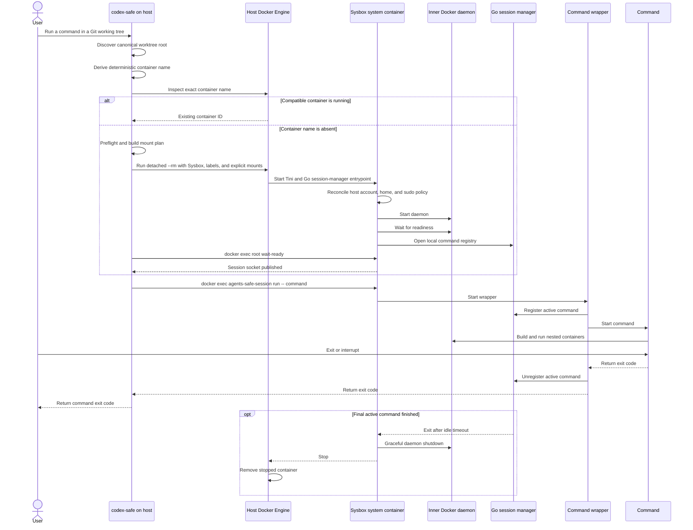

# Safe Environment for Running Agents

Status: Implemented

Scope:

- the common `codex-safe`, `claude-safe`, and `agents-safe` runtime contract on a Linux host;
- discovery and mounting of the active Git project, linked worktrees, host `.gitconfig`, the resolved Codex home,
  and personal Codex skills;
- the Codex CLI executable, process environment, argument forwarding, and authentication handoff;
- an independent Docker daemon running inside a Sysbox container;
- security boundaries, lifecycle, launch failures, and isolation verification.

## Purpose and Intent

### Problem

A Codex agent needs write access to a project and the ability to run Docker containers. Running the agent directly
on the host gives it everything available to the host user. Passing `/var/run/docker.sock` into a regular container
also gives the agent effective control over the host Docker daemon.

We need a local command that exposes only explicitly allowed host paths and provides an independent Docker daemon.
Mistakes made by the agent or its nested containers must not affect unrelated user files or host containers.

### Worked Example

Before:

```text
cd /home/user/sources/app-feature
codex

Codex can access the user's environment and talks to the host Docker daemon.
```

After:

```text
cd /home/user/sources/app-feature
codex-safe

Codex runs inside a Sysbox container. It sees app-feature, its Codex home,
while docker ps shows only containers from the nested Docker daemon.
```

The same isolated project environment can run an explicit foreground command:

```text
cd /home/user/sources/app-feature
agents-safe bash
```

`agents-safe` passes `bash` directly to the container session wrapper. It does not start a host shell and does not
interpret the command through another shell.

If `app-feature` is a linked worktree, the command also mounts the primary checkout and common Git directory. The
absolute target referenced by `.git` remains valid, so `git status`, `git commit`, and branch operations work without
rewriting repository metadata.

### Chosen Shape

`codex-safe`, `claude-safe`, and `agents-safe` are trusted Go programs running on the host. They validate the
environment, compute one common bind-mount set, start an ephemeral system container through `sysbox-runc`, and hand
control to managed foreground processes inside that container.

The launcher resolves the optional Codex state directory from the host's `CODEX_HOME` or operating-system user-home
API. It does not assume `/home/<user>`, `/Users/<user>`, or a Windows profile path. An existing resolved directory is
mounted into the container as its Codex home; otherwise Codex uses ephemeral container-local state. The executable
always comes from the daemon-local Codex volume mounted read-only in the session.

The container has its own Docker daemon and Docker CLI. The host Docker socket is not mounted. Nested containers use
only the container's daemon and storage and can access host files only through paths already visible inside the
container.

Go owns project discovery, validation, mount planning, Docker argument construction, process execution, and exit-code
propagation. The launcher invokes the host Docker CLI with separate argv elements. Shell is limited to container
bootstrap and test harnesses; it is not used to interpolate host paths or construct the production `docker run`
command.

Within the host implementation, `internal/launcher/launchplan` owns the validated worktree, working-directory, and
bind-mount contract. `internal/launcher/dockercli` accepts Docker-specific create and exec requests and owns CLI argv,
inspect decoding, subprocess execution, and transport diagnostics. The parent `internal/launcher` package owns
managed-container identity, label expectations, lifecycle, reuse, user mounts, and retry decisions.

### Success Criteria

- One `codex-safe` invocation starts interactive Codex in the current Git project.
- One `claude-safe` invocation starts interactive Claude Code in the same isolated project environment.
- One `agents-safe bash` invocation starts Bash in that same isolated project environment.
- Project changes and Codex state persist on the host with usable file ownership.
- Codex can read and persist its documented configuration, authentication, logs, sessions, skills, and standalone
  package metadata through the explicitly mounted Codex paths.
- Home and Codex-state discovery uses operating-system APIs and `CODEX_HOME`, not platform-specific path literals.
- A linked worktree remains a fully functional Git working tree inside the container.
- `docker build` uses BuildKit through the Docker Buildx CLI plugin; `docker run` and Docker Compose use the same
  separate nested daemon.
- The agent cannot see the host daemon's socket, containers, images, or volumes.
- The agent receives no host paths beyond the explicit mount set.
- Concurrent invocations for the same worktree reuse one container until the last managed command finishes.
- A preflight or nested-daemon failure stops the launch without an unsafe fallback.

### Tradeoff

This container isolates the host more strongly than conventional Docker-in-Docker with `--privileged` or a host
Docker socket mount. It is not a secrecy boundary for allowed mounts. The agent can read, change, delete, or transmit
project files and resolved Codex-home contents.

Each container session starts with clean nested Docker storage. Commands routed into that live session reuse its
images, containers, volumes, and build cache. A new session after the last managed command finishes starts clean again;
persistent cross-session caching can be designed separately after measurement shows that it is needed.

## Contract

### 1. Command Interface

The user-facing interface is:

```text
codex-safe [launcher options] [-- codex arguments]
claude-safe [launcher options] [-- Claude Code arguments]
agents-safe init [--project path]
agents-safe [launcher options] [--] command [argument ...]
```

- With no arguments, the command starts interactive `codex` for the Git project containing the current directory.
- `--` separates launcher options from Codex arguments. Arguments after it are forwarded without reparsing.
- The current subdirectory is preserved as the Codex working directory at the same absolute path.
- With `--project`, the canonicalized project path becomes the working directory.
- The canonical worktree root and invoking host UID identify a running container. Its resolved Codex-home and
  personal-skills sources must also match before it is eligible for reuse.
- When exactly one eligible container is running, the command executes there with the requested working directory.
- `--image` selects an image only when creating a new container; it does not replace an active environment.
- An explicit `--image` bypasses `.agents-safe/Dockerfile` discovery; otherwise project-image behavior is owned by
  [Project-Specific Agent Environments](project-environments.md).
- The typed `.agents-safe/config.toml` is resolved as specified by
  [Project Launcher Configuration](project-launcher-configuration.md); mount changes apply only to a new container.
- Interactive mode attaches stdin, stdout, stderr, and the terminal to the container process.
- After successful environment setup, the Codex exit code becomes the `codex-safe` exit code.

`codex-safe` always executes the volume-backed `codex` binary by absolute path. Arguments after `--` are Codex
arguments, not an arbitrary executable.

`agents-safe` requires a command. Launcher options precede that command; `--` is optional and can disambiguate a
command name that starts with a hyphen. The command and every argument remain separate argv elements and run directly
through the session wrapper. For example, `agents-safe bash` runs image-provided Bash, and
`agents-safe bash -c 'make test'` passes the script to that Bash. `agents-safe` does not invoke a shell implicitly.
It can execute only programs available in the image or explicitly mounted project paths.

`agents-safe init` creates the files specified by
[Project Launcher Configuration](project-launcher-configuration.md) and returns without initializing Docker. Because
a leading `init` is reserved for that operation, `agents-safe -- init` executes a container command named `init`.
`codex-safe update` and `claude-safe update` are host-side subcommands. Each updates its shared Linux installation
before Git discovery and without constructing a Sysbox session. A product command after `--` remains forwarded to
that product.

All three commands use the same project discovery, mount plan, image selection, session-reuse validation, terminal
attachment, and exit-code propagation. The lower-level session wrapper remains command-agnostic for container-local
supervision.

Minimum launcher options:

- `--help`: show launcher help and exit;
- `--project <path>`: select a project instead of the current directory;
- `--image <reference>`: override the image for diagnostics or experiments;
- `--cpus <count>`: optionally cap the container-session CPU; unset means no limit;
- `--memory <size>`: optionally cap the container-session memory; unset means no limit;
- `--pids-limit <count>`: optionally cap the container-session PID count; unset means no limit.

The project controls the default image and pins it by immutable digest. An image override intentionally expands the
trusted computing base and is always displayed before launch.

Automatic project-owned image derivation is specified by
[`Project-Specific Agent Environments`](project-environments.md). That contract keeps the explicit `--image`
override and adds `.agents-safe/Dockerfile` discovery only when no override was supplied.

### 2. Project Discovery

The launcher accepts only an existing local Git working tree. It obtains the following paths through Git:

- the physical absolute requested working directory;
- the active working-tree root;
- the active working tree's absolute Git directory;
- the absolute common Git directory.

Paths are canonicalized before Docker arguments are built. The launcher does not parse `.git` files manually or
construct repository paths from untrusted string fragments.

Launching outside a Git working tree fails before a container is created. Arbitrary directories are excluded from the
first release because they do not provide a reliable project boundary.

The first release supports a linked worktree only when its common Git directory is the `.git` directory of an
existing primary checkout. A worktree attached to a bare repository or an external common Git directory fails
preflight.

### 3. Mount Plan

All mounts use explicit `--mount` syntax. Each source must already exist, and source and target paths are canonicalized.
The launcher never creates a missing source directory as a side effect of a typo.

Host bind mounts keep `rprivate` propagation. A mount created by the nested Docker daemon must not propagate back into
the host mount namespace.

#### Regular checkout

- The active working-tree root is mounted read-write at the same absolute path.
- The container starts in the absolute equivalent of the original current directory.

#### Linked worktree

- The active worktree root is mounted read-write at the same absolute path.
- The primary checkout root is mounted read-only at the same absolute path.
- The primary checkout's common Git directory is a separate read-write mount at the same absolute path.
- The nested read-write Git-directory mount takes precedence over the primary checkout's read-only mount.

Preserving absolute paths is mandatory. A linked worktree's `.git` file normally points to an absolute location inside
the common Git directory. Mounting only the project at `/workspace` would break that reference. The same path mapping
also lets the nested Docker daemon resolve absolute bind paths from Compose configuration correctly.

The primary checkout is read-only so the agent cannot accidentally modify a second working copy. The common Git
directory stays read-write because commits, refs, the linked-worktree index, and Git lock files must persist.

#### Project Python virtual environments

By default no virtual-environment target is preconfigured. On every launch, each existing directory under the active
worktree that contains a regular `pyvenv.cfg` is masked by a writable session-local `tmpfs` mounted after the worktree
bind. Discovery does not follow symlinks, skips `.git`, and stops descending once it finds an environment.

A regular Python-project marker at the worktree root also reserves the conventional root `.venv` before it exists.
The fixed marker set is `pyproject.toml`, `setup.py`, `setup.cfg`, `requirements.txt`, `Pipfile`, `uv.lock`,
`poetry.lock`, `pdm.lock`, `tox.ini`, `pytest.ini`, and `.python-version`. Marker symlinks and directories do not
trigger reservation. Nested project markers do not proactively create nested targets; regular `pyvenv.cfg` discovery
still masks nested environments after they exist.

If the reserved `.venv` is absent, the host launcher creates one empty mountpoint only after it has ruled out
active-container reuse and immediately before cold container creation. An existing symlink or non-directory target
fails closed. The host directory remains empty after session removal; environment contents live on tmpfs and disappear
with the managed container. One-time mountpoint materialization is not a fingerprint input because the requested tmpfs
target and mode are identical before and after it.

`common.tmpfs_mounts` optionally adds further explicit targets to the selected set, and duplicate targets are removed.
The image cannot read or modify host environments. Docker receives these masks through its dedicated `--tmpfs`
option; the launcher also passes the same validated target/mode list to privileged container bootstrap. Sysbox 0.7 can
attach the broader idmapped worktree bind after Docker's tmpfs and cover it, so bootstrap reapplies every tmpfs inside
the final mount namespace and verifies its effective filesystem type before session readiness. A missing target, mount
failure, or non-tmpfs result fails startup without running an agent. The same contract applies to regular and linked
worktrees.

`common.use_host_python_venv = true` or the explicit `--use-host-python-venv` flag skips proactive, discovered, and
configured venv tmpfs mounts, exposing those directories through the normal worktree bind. The resolved policy and
complete tmpfs target/mode list are creation-time fingerprint inputs. Reusable Python downloads belong in the
separately configured [host-backed uv cache](host-backed-dependency-caches.md), not in a virtual environment.

#### Path overlaps

The launcher builds the complete mount plan before launch and removes exact duplicates. For nested targets, it mounts
the broadest read-only directory first and then applies narrower read-write mounts.

If a target requires incompatible sources or modes that this rule cannot resolve, preflight fails. The launcher never
silently broadens read-write access.

#### Shared user mounts

Every regular-checkout and linked-worktree launch receives the same user mounts:

- The resolved host Codex home, when present, is mounted read-write as the container's Codex home. Without that
  optional role, `codex-safe` uses ephemeral container-local Codex state and `agents-safe` receives no Codex mount.
- Complete default Claude state is mounted read-write at its native `~/.claude` and `~/.claude.json` paths. An explicit
  `CLAUDE_CONFIG_DIR` is mounted as one directory and preserved in managed-command environments. The detailed policy
  belongs to [Safe Claude Code Integration](claude-safe.md).
- When host `$HOME/.agents/skills` exists, that exact directory is mounted read-only at the equivalent path for the
  container user.

#### Local project-configured mounts

The resolved mount topology above is serialized with explicit roles, paths, modes, and descriptions in
`.agents-safe/config.toml`. The file is an authoritative host-specific snapshot; required roles fail when omitted,
degradable roles warn when omitted, and present paths and security-sensitive modes are validated before Docker
creation. The role classification, syntax, layering, and CLI precedence are owned by
[Project Launcher Configuration](project-launcher-configuration.md).

The file is local and Git-ignored, but it remains writable project content. A process with worktree access can modify
it for a later cold launch, so every configured writable source is explicit operator trust.

#### Host home path and Git configuration

- The launcher resolves the invoking user's home with the operating-system user-home API. Environment variables and
  path examples such as `/home/user`, `/Users/user`, or `C:\Users\user` are not hard-coded launcher branches.
- The launcher creates a container-local home directory at the same absolute path as the resolved host home on the
  supported Linux host and sets both the process environment and container passwd entry to that path.
- The host home directory itself is not mounted. Apart from explicitly allowed file mounts, its contents exist only
  in the ephemeral container filesystem.
- When host `$HOME/.gitconfig` exists as a regular file, it is canonicalized and mounted read-only as
  `$HOME/.gitconfig` at that same absolute path inside the container.
- A missing host `.gitconfig` is allowed and produces no mount.
- Files referenced through `include.path`, credential helpers, and other configuration are not mounted implicitly.
  They work only when already available in the image or through another allowed mount.

### 4. Codex Agent Integration

#### Codex home resolution

The launcher resolves exactly one host Codex-home source before it creates or reuses a container:

1. When host `CODEX_HOME` is set and non-empty, its trimmed value is the requested source.
2. Otherwise, the source is `.codex` below the operating-system-resolved host home.
3. A relative `CODEX_HOME`, the filesystem root, an unsupported path, or a non-directory always fails preflight
   without creating it or falling back to another location. A missing explicitly requested `CODEX_HOME` is also an
   error because it is invalid host intent, not an omitted config role. When the implicit default `.codex` directory
   is absent, both launchers omit the degradable `codex_home` role. `codex-safe` warns that host configuration,
   authentication, and session persistence are unavailable and uses ephemeral container-local state; `agents-safe`
   starts without a Codex mount.
4. An existing source is canonicalized before the mount plan is built. A symlink used as the source may resolve to
   another directory, but symlinks inside it do not authorize additional host mounts.

When a Codex home is resolved, the canonical host source is bind-mounted read-write at `$HOME/.codex` inside the
container and the managed command receives `CODEX_HOME=<container-home>/.codex`, even when the host selected a custom
source. This separates host-native path syntax from the Linux container path and gives Codex one stable container-local
location. A launch with no host Codex home sets no explicit `CODEX_HOME` and mounts nothing at `$HOME/.codex`;
image-local state below `HOME` disappears with the session container.

For example, the default source may be `/home/alex/.codex` on Linux, `/Users/alex/.codex` on macOS, or
`C:\Users\alex\.codex` on Windows. The first release still launches only on Linux because the Sysbox runtime and
identity mapping are Linux contracts. The resolution rule avoids hard-coded Linux paths but does not by itself add
Docker Desktop, macOS, or Windows runtime support.

Codex also discovers personal authored skills under `$HOME/.agents/skills`. When that exact host directory exists, the
launcher canonicalizes it and mounts it read-only at the equivalent container path. A missing directory is allowed.
The launcher does not mount the broader `$HOME/.agents` directory or follow skill symlinks by adding their external
targets to the mount plan.

For `codex-safe`, a dangling `.agents` parent symlink or dangling `skills` symlink is a configuration error rather than
a silently absent skill set. `agents-safe` treats those same broken optional paths as absent because its arbitrary
commands do not require personal Codex skills.

To keep the read-only guarantee meaningful, the launcher rejects a canonical personal-skills source that overlaps any
writable mount source: the active worktree root, a linked worktree's common Git directory, or the resolved Codex home.
Overlap means the skills source equals, contains, or is contained by a writable source. A skills directory reachable
through a writable alias, including through a symlink whose target resolves inside a writable mount, fails preflight
rather than being mounted read-only while remaining writable through the other path.

#### Codex executable and process

The container image contains no Codex executable or dispatcher. Every session mounts the daemon-local
`agents-safe-codex` volume read-only at `/opt/agents-safe/codex`, and the launcher runs its `bin/codex` by absolute path.
`make docker-build` initializes or updates the volume after building the local image; later routine updates use
`codex-safe update`. Session startup performs no network update and fails executable lookup if the installation is
absent.

Host-side Codex binaries, including standalone package caches under the mounted state directory, remain data and are
never selected as the container's launcher binary. The complete update and failure contract is owned by
[Persistent Container Codex Installation and Updates](persistent-codex-installation.md).

Every `codex-safe` invocation runs this process through the session wrapper:

```text
agents-safe-session run -- /opt/agents-safe/codex/bin/codex --sandbox danger-full-access [forwarded Codex arguments]
```

The process uses the invoking host UID and GID, the selected project directory as its working directory, the
container-local `HOME`, optional mounted `CODEX_HOME`, and the launcher's terminal streams. Arguments stay separate
argv elements; the launcher does not invoke a shell. Start failures and Codex exit status propagate through the
wrapper and launcher.

The launcher selects `--sandbox danger-full-access` by default. The Sysbox container is the isolation boundary, so
Codex's own bubblewrap-based inner sandbox is redundant, and the image intentionally ships no bubblewrap on `PATH`.
Without the default Codex reports that it "could not find bubblewrap" and falls back to a bundled copy; the explicit
sandbox mode keeps Codex fully functional inside the container without weakening the outer boundary. The default is
suppressed when the forwarded arguments already select a policy through `-s`/`--sandbox` or
`--dangerously-bypass-approvals-and-sandbox` (or `--full-auto` on a subcommand), so an explicit user choice is never
overridden. `agents-safe` runs an arbitrary command and never adds this flag.

`agents-safe` uses the same identity, working directory, terminal streams, and wrapper, but replaces the Codex argv
with the required command argv. Both launchers mount and set `CODEX_HOME` only when a host Codex home exists; its
absence is degradable rather than a launch failure. The command exit status propagates through `agents-safe`.

#### Persistent state, configuration, and skills

The read-write Codex-home mount persists Codex's documented configuration, authentication, logs, sessions, skills,
and host standalone package metadata. The managed Linux executable store is a separate read-only named volume, so
host-native packages remain visible as state but are not selected. Other files physically present below the mounted
source remain visible, but the launcher does not promise that Codex interprets them. Project-scoped `.codex`
configuration and repository skills remain available through the project mount and keep their normal precedence.

The launcher does not rewrite configuration. Hooks, MCP server commands, skills, plugins, or config values that refer
to host paths or binaries outside the allowed mounts can fail inside the Linux container. Platform-specific binaries
from a macOS or Windows Codex home are not made Linux-compatible by mounting the directory.

The mount is an explicitly allowed host area, not a secret store. Code running with agent permissions can read its
tokens, change its configuration, or delete its state. A nested container can also receive the directory if the agent
explicitly bind-mounts it through the inner Docker daemon. Personal skills are read-only through their separate mount,
but scripts they contain execute with the same permissions as the agent when Codex selects them.

#### Authentication boundary

File-based credentials in `$CODEX_HOME/auth.json` are available when the Codex-home mount is present. Without it,
Codex has only ephemeral container-local state and host file-based credentials are unavailable. Credentials stored
only in the host operating system's keychain or keyring are also unavailable inside the container. The launcher does
not mount keyring services, browser profiles, desktop sockets, `.ssh`, cloud credential directories, password stores,
Git credential helpers, or pre-existing Unix sockets. The only socket mount this project allows is the
launcher-created host MCP channel owned by [`host-mcp-forwarding.md`](host-mcp-forwarding.md), which carries no host
credential and exposes only the endpoints that design selected.

The launcher neither changes `cli_auth_credentials_store` nor converts credentials between storage modes. If the
mounted configuration requires an unavailable keyring, Codex reports the authentication error and the launcher
propagates it. An interactive login performed inside the container may persist file-based credentials in the mounted
Codex home according to Codex's own configuration.

The launcher does not copy the complete host environment or implicitly forward API keys. Only the documented allowlist
needed for the terminal, locale, Codex paths, and an explicitly configured proxy is forwarded.

### 5. Container and Sysbox

The container runs through the local Docker Engine with `--runtime=sysbox-runc`. For the session container, the
launcher does not use:

- `--privileged` on the container;
- `/var/run/docker.sock` or any other host container-engine socket;
- `--pid=host`, `--network=host`, `--ipc=host`, or `--userns=host`;
- bind mounts of `/`, `/home`, `/var/lib/docker`, `/dev`, or other broad host paths.

These rules govern the session container, where the agent runs. The separate relay sidecar defined by
[`host-mcp-forwarding.md`](host-mcp-forwarding.md) deliberately uses `--network=host` to reach host loopback MCP
servers; it runs no agent code and receives no capability, Docker socket, or writable root filesystem.

The container gets its own PID, mount, network, IPC, UTS, cgroup, and user namespaces. Root inside the container
is constrained by the Sysbox user namespace and is not host root.

The recreated host account has passwordless `sudo` to root inside the container. This is required for installing
diagnostic packages and other container-local administration. It does not grant host root, add bind mounts, or expose
the host Docker socket, but it does allow changes to the ephemeral container filesystem and every already-allowed
read-write host mount.

The security contract does not depend on an AppArmor profile. Isolation comes from namespaces, restricted mounts,
cgroups, and Sysbox behavior. With the shared UID/GID mapping in Sysbox CE, all sessions are treated as belonging to
one trusted local user rather than mutually untrusted tenants.

The container image includes:

- `curl` and the maintenance wrapper used to install Codex into the shared volume;
- Docker CLI, Docker daemon, and the Compose plugin;
- Git, Make, Less, and Ripgrep for routine repository inspection;
- `jq` and SQLite clients, file and archive inspection tools, and process, socket, IP, DNS, and TCP diagnostics;
- `sudo` with a validated passwordless policy for the recreated host account;
- an init process that reaps child processes and handles signals correctly;
- a Go session-manager entrypoint that performs account bootstrap and supervises the nested daemon.

The image defaults to the `C.UTF-8` locale so interactive shells and text tools correctly classify UTF-8 input and
output, including Cyrillic, without requiring a language-specific locale.

The image advertises `xterm-256color`, whose terminfo entry is present in the image. Interactive Bash uses a colored
prompt and automatic color modes for common tools; tools still suppress automatic colors when output is not a TTY.

Codex does not start until the nested daemon passes its readiness check. A timeout or daemon failure prints
container-local diagnostics and exits nonzero.

### 6. Inner Docker Contract

The nested Docker daemon stores containers, images, layers, networks, and volumes in the container's private
`/var/lib/docker`. Sysbox may control the physical placement, but the objects are logically separate from host Docker
objects and objects belonging to other `codex-safe` sessions.

The inner `docker` CLI connects only to the nested daemon socket by default. The launcher and image do not configure a
fallback to a host context or remote daemon.

A bind source passed to inner `docker run -v` is resolved against the container's filesystem. The project can
therefore be passed to a nested container at its preserved absolute path, while unavailable host paths outside the
allowed mount set cannot be obtained this way.

Publishing a port through nested Docker exposes it in the container's network namespace, not on the host.
Explicit host publication of nested ports is outside the first contract.

### 7. File Ownership

A file created by Codex or a nested container in a read-write project mount must remain readable and editable by the
host user who invoked `codex-safe`. The launcher must not leave project files owned by an identity the host user cannot
modify.

Each managed command has the invoking host user's numeric UID and primary GID. Its login name and primary group name
also match the host account, so tools that display or resolve account names behave consistently on both sides. The
launcher resolves those names through the host account database and the Go entrypoint creates or renames the
corresponding local container entries. Each command runs through `docker exec` with that numeric identity. A
conflicting or unsupported account mapping fails the launch; it never falls back to an image-defined identity such as
`ubuntu`.

Exact UID/GID translation through Sysbox user namespaces, ID-mapped mounts, or shiftfs is an implementation detail.
A smoke test or preflight detects an incompatible filesystem. The launcher never repairs ownership by recursively
running `chown` over the host project.

The first release supports only local filesystems compatible with the selected Sysbox version. NFS and other network
filesystems are unsupported without separate evidence that their ID mapping behaves correctly.

### 8. Resource Policy

By default the container runs with no CPU, memory, or PID cgroup limit. It behaves like a local development
process and may use as much host CPU and memory as its workload and nested containers require. Nested containers share
the container's unbounded resource view and are limited only by the host.

The launcher computes no default limits and runs no minimum-memory preflight. It does not derive caps from host CPU or
memory count.

Optional caps are opt-in and unset by default:

- `--cpus <count>`: cap the container-session CPU;
- `--memory <size>`: cap the container-session memory;
- `--pids-limit <count>`: cap the container-session process count.

When a cap is provided, it applies as a container cgroup limit shared by all nested containers, its value is
validated, and the active caps are printed before launch. When no cap is provided, no limit is set and none is printed.

Running unbounded is a deliberate tradeoff. A runaway agent or nested build can exhaust host CPU or memory and trigger
host-level OOM, exactly as an unsandboxed local process can. Users who need a bound set an explicit cap.

A portable disk limit for the writable layer is outside the first release because support depends on the host Docker
storage driver and filesystem. This is a known residual risk. Installation documentation must require free-space
monitoring and describe cleanup of stopped containers and Sysbox data.

### 9. Network Policy

The container uses a separate Docker bridge network. Outbound access is enabled because Codex, package managers,
and Docker registries require network access. Nested Docker networks remain inside this network boundary.

`codex-safe` does not prevent network exfiltration. Code in the container can transmit accessible project or
Codex-home content. Domain allowlists, enforced proxies, and fully offline operation require a separate design.

Host services that listen on loopback are not reachable from the container under this contract. Narrow, explicit reach
to the host MCP servers named by the resolved Codex home is owned by
[`host-mcp-forwarding.md`](host-mcp-forwarding.md).

### 10. Lifecycle and Concurrency

A new container has a deterministic name derived from the canonical worktree root and invoking host UID. The
launcher inspects that exact name, then validates `agents-safe.managed`, `agents-safe.project-path`,
`agents-safe.host-uid`, and `agents-safe.manager-protocol`, then validates `agents-safe.launch-config`, the deterministic
fingerprint of all creation-time parameters defined by
[Project Launcher Configuration](project-launcher-configuration.md#4-parameter-classes-and-active-containers).

The product-state and `agents-safe.personal-skills` labels each contain the canonical resolved source or the literal
`absent`. They remain diagnostic metadata and are not independent reuse predicates; their effective mount state is
already covered by `agents-safe.launch-config`. `agents-safe.host-mcp` is also diagnostic metadata owned by
[`host-mcp-forwarding.md`](host-mcp-forwarding.md). That design sets `agents-safe.host-mcp-channel`, which locates a
running container's MCP channel and is read rather than compared. A compatible running container receives the new
command through `docker exec`; an absent name is created with detached `docker run --rm`. Different worktrees continue
to use distinct Docker daemons and writable layers.

Creation-time parameters are fixed when the container is created and cannot be changed by `docker exec`. A fingerprint
mismatch prevents reuse. The launcher reports the running and requested fingerprints and asks the user to finish the
active session before retrying; it does not silently use stale configuration, terminate another command, or replace
the container. Ownership or protocol label mismatches remain name conflicts. Command-time parameters are excluded
from the fingerprint and apply to each new `docker exec`.

A change between absent and present product state changes the normalized physical mount plan and therefore the
creation-time fingerprint. It uses the same generic fingerprint-mismatch rejection as every other creation-time
change; diagnostic product-state labels do not select a separate active-session error path.

The container's foreground workload is a Go session manager. Every `docker exec`, including the first, invokes
`agents-safe-session run -- COMMAND`. That wrapper connects to a container-local Unix socket, runs the requested command,
and holds the connection until its direct child exits. The manager exits after the last registered command finishes
and the single idle timeout expires. The detailed protocol, race handling, and shutdown contract are defined in
[`go-session-manager.md`](go-session-manager.md).



The wrapper passes Docker exec streams to its child, forwards termination signals, and returns the child's exit status.
Normal exit or Ctrl-C finishes only that managed command. The container, nested daemon, and nested containers
stop after the final registered command finishes and the manager's idle timeout expires. The container is
automatically removed after it stops.

If a launcher or terminal disappears while its command continues inside the container, the wrapper keeps that real
command registered until it exits. If the wrapper or command dies, the local connection closes and the manager releases
it. A host Docker daemon or machine failure can still leave a stopped or running container record. Only a
running, protocol-compatible container is eligible for reuse; stopped containers are not restarted. A separate
diagnostic command or documented procedure finds resources through the `codex-safe` labels and removes only confirmed
stale sessions.

### 11. Preflight and Failure Behavior

Before creating a container, the launcher verifies:

1. The host is a supported Linux system.
2. The `docker` command exists and a local Docker daemon responds.
3. The Docker Engine has `sysbox-runc` registered.
4. The project is a Git working tree and all computed mount sources exist.
5. A present resolved Codex home is a directory, is accessible read-write, and can be represented safely as a bind
   source. Without the degradable role, `codex-safe` warns and uses ephemeral state while `agents-safe` skips the
   mount.
6. The optional personal-skills source is absent or is an accessible directory representable as a read-only bind.
7. The image resolves to the pinned digest or was explicitly supplied by the user and preserves the session runtime
   contract; the Codex executable comes from the separately mounted volume.
8. The mount plan contains no conflicts or paths outside the allowed set.
9. Any provided resource-limit cap is syntactically valid; no cap is required.

An error identifies the failed check and provides a diagnostic action. The launcher never compensates for missing
Sysbox by using `runc`, `--privileged`, the host Docker socket, or direct host execution of Codex.
An image-pull, container, or nested-daemon failure is returned to the user without retrying in a less isolated
mode.

## Invariants

- The host Docker socket is never visible inside the container.
- Each worktree session receives a separate nested Docker daemon; registered concurrent commands in that session share
  it.
- No user command is the container's lifecycle-owning main process.
- Read-write host access is limited to the configured mount plan, including the active working tree, linked-worktree
  common Git directory, resolved product state, and the host MCP channel directory defined by
  [`host-mcp-forwarding.md`](host-mcp-forwarding.md).
- Personal host skills outside the Codex home are exposed only through the narrow read-only
  `$HOME/.agents/skills` mount.
- The linked worktree's primary checkout is read-only except for the nested common Git directory.
- Git working-tree and common-directory absolute paths match their host paths.
- The session container is never privileged and never shares host namespaces. The one component that shares the host
  network namespace is the relay sidecar owned by [`host-mcp-forwarding.md`](host-mcp-forwarding.md), which runs this
  project's own image with no capability, no Docker socket, and a read-only root filesystem.
- Unsafe fallback behavior is forbidden.
- Host-side orchestration and Docker argument construction are implemented in Go.
- `codex-safe` executes the Codex installation from the launcher-managed read-only volume and sets explicit
  container-local `CODEX_HOME` only when the corresponding host mount is present.
- `claude-safe` executes the independent Claude Code installation from its launcher-managed read-only volume and uses
  either the native split state paths or the validated explicit `CLAUDE_CONFIG_DIR`.
- `agents-safe` executes the requested command only inside the managed container and never through a host shell.
- Arguments and paths are separate argv elements and are never passed through `eval` or shell reinterpretation.
- After the final managed command finishes normally, the session does not intentionally leave nested containers
  running.

## Boundaries and Non-Goals

This design protects against accidental or erroneous agent access to unrelated host files and the host Docker daemon.
It also reduces the impact of root access inside the agent environment through the Sysbox user namespace.

The trusted computing base includes:

- the host-side Go `codex-safe`, `claude-safe`, and `agents-safe` programs;
- the container-side Go session manager and its registration protocol;
- the local Docker Engine and its configuration;
- Sysbox and the Linux kernel;
- the pinned container image and its Go entrypoint;
- the user who selects the project and any image override.

The design intentionally does not promise:

- protection of the active project, common Git directory, or resolved product homes from either agent;
- protection of Codex or Claude credentials from code running in the same environment;
- network isolation or exfiltration prevention;
- protection from vulnerabilities in the kernel, Docker, Sysbox, or the container image;
- isolation between untrusted local tenants when Sysbox CE uses a shared UID/GID mapping;
- safe concurrent writes by multiple agents to one shared worktree;
- access to USB, GPU, FUSE, or other host devices;
- SSH agent forwarding, Git credential helpers, or automatic `git push`;
- Docker Desktop, macOS, Windows, rootless host Docker, or remote Docker daemons in the first release;
- automatic translation of host-specific hooks, MCP commands, skill scripts, plugins, or absolute paths for the Linux
  container;
- reuse of credentials stored only in the host operating system's keychain or keyring;
- linked worktrees attached to bare repositories or common Git directories outside a primary checkout;
- automatic discovery and mounting of external Git submodules;
- publishing nested-container ports on the host;
- persistent nested Docker images, volumes, or build cache;
- a portable disk quota for nested Docker storage.

Rejected alternative: mount the host Docker socket. This would be faster and would reuse the host cache, but it would
give the agent control over host containers, mounts, and privileges, defeating the project's primary goal.

Rejected alternative: run the container with `--privileged`. This is common for Docker-in-Docker but greatly
expands container privileges. Sysbox is selected specifically to run system workloads without this flag.

Rejected alternative: mount only the linked worktree at `/workspace`. Its absolute `.git` reference would lose its
target, and absolute project bind paths inside nested Docker would differ from host paths.

## Test Plan

### Launcher contract tests

- Discover a regular checkout from both its root and a nested directory.
- Discover a linked worktree whose path contains spaces and shell metacharacters.
- Resolve canonical paths when the launcher starts through a symbolic link.
- Verify the exact mount plan and mode of every mount without starting a container.
- Resolve default and explicit `CODEX_HOME` sources without hard-coded home prefixes.
- Allow a missing implicit default Codex home with the exact degradation warning; reject a missing explicit source
  and any relative, root, non-directory, unreadable, or unwritable source.
- Prove an absent-to-present Codex-home change uses the generic creation-time fingerprint mismatch and that diagnostic
  Codex-home labels are not independent reuse predicates.
- Canonicalize a symlinked Codex-home source without adding mounts for external symlinks contained inside it.
- Reject a dangling default Codex-home symlink without offering to create it.
- Mount an existing `$HOME/.agents/skills` read-only, allow it to be absent, and reject an invalid source.
- Reject a dangling personal-skills path before either launcher reaches Docker.
- Prove no missing Codex-home path is created as a launcher side effect.
- Verify `HOME` and `CODEX_HOME`, the volume-backed absolute `codex` argv, forwarded arguments, working directory,
  and exit status.
- Verify `agents-safe bash` preserves direct argv, starts in the selected project, rejects an omitted command, and
  propagates the command exit status.
- Verify `claude-safe` preserves permission-mode precedence, uses the absolute managed executable, and persists
  complete default or explicit Claude state without changing the Codex state contract.
- Reject reuse when a Codex-home or personal-skills change alters the creation fingerprint; diagnostic labels are not
  compatibility predicates.
- Reject launches outside Git or without Docker or `sysbox-runc`.
- Prove that unknown options and arguments after `--` cannot trigger shell injection.
- Prove that every preflight and runtime failure has no fallback path.

### Integration tests on a Sysbox host

- Modify an existing file and create a new one in a regular checkout, then verify host content and ownership.
- Run `git status`, `git add`, `git commit`, and ref reads in a linked worktree.
- Prove that a primary-checkout file is immutable while linked-worktree Git metadata changes.
- Start a nested container with a project bind mount and verify bidirectional changes.
- Create a nested image, container, network, and volume and prove they are absent from host Docker.
- Prove that host containers and `/var/run/docker.sock` are inaccessible from both the Sysbox container and nested
  containers.
- Attempt to read a known host-home marker outside allowed mounts and prove the path is absent.
- Mount a temporary Codex home with sentinel configuration, global instructions, and a skill; verify Codex sees them
  and writes session state back to the host without exposing a real credential.
- Prove personal skills are readable but not writable and that an external symlink target remains unavailable.
- Prove a host standalone Codex binary under the mounted state cannot shadow the volume-backed Linux executable.
- Verify file-based authentication with a dedicated test account only in an opt-in credentialed acceptance test; keep
  real user credentials out of fixtures, logs, and CI artifacts.
- Prove that the primary checkout's read-only mount cannot be remounted read-write from either container layer.
- With no caps, run load from multiple nested containers and prove no default CPU, memory, or PID limit is imposed.
- With explicit `--cpus`, `--memory`, and `--pids-limit`, prove each cap is enforced on the container session.
- Run a second command for one live worktree and prove it shares the container and nested Docker daemon.
- Hold one live session and prove both product launchers use its same container and independent installation/state
  mounts.
- Exit the first of two overlapping commands and prove the second command and container remain alive.
- Run sessions for two worktrees concurrently and prove they do not share nested Docker state.
- Run `agents-safe bash` and prove the public generic command path starts Bash in the selected project.

### Lifecycle tests

- Cover normal exit, Ctrl-C, SIGTERM, Codex failure, and nested-daemon failure.
- Verify terminal resize and interactive input.
- Verify the deterministic name is derived from canonical worktree path and host UID, inspected directly, and reused
  through a wrapped `docker exec`.
- Reject reuse when any creation-time parameter changes; prove command-time argument changes reuse the container.
- Verify simultaneous first callers create one container and both commands register with its manager.
- Verify the final managed command removes the container only after the idle timeout.
- After each normal scenario, prove the Sysbox container and nested containers stopped and were removed.
- Simulate launcher failure and prove stale resources carry the expected labels and can be diagnosed safely.

### Security review gate

Before the first release, inspect the actual container configuration through `docker inspect` and verify:

- runtime, namespaces, capabilities, and disabled privileged mode;
- the complete mount list and read-write modes;
- the absence of the host Docker socket and broad host paths;
- network mode and any explicitly configured cgroup limits;
- the pinned image digest;
- Sysbox UID/GID behavior on every supported filesystem.

## Implementation Plan

The minimal infrastructure proof is tracked in
[`2026-07-13-codex-safe-mvp-exec-plan.md`](../exec-plans/completed/2026-07-13-codex-safe-mvp-exec-plan.md).

The shared project-container lifecycle is tracked in
[`2026-07-14-go-session-manager-exec-plan.md`](../exec-plans/completed/2026-07-14-go-session-manager-exec-plan.md).

Running Codex inside the container — Codex-home resolution, personal skills, the product command, and user-mount
reuse labels — is tracked in
[`2026-07-15-codex-launch-exec-plan.md`](../exec-plans/completed/2026-07-15-codex-launch-exec-plan.md).

## References

- [Sysbox project and Docker runtime usage](https://github.com/nestybox/sysbox)
- [Sysbox security model](https://github.com/nestybox/sysbox/blob/master/docs/user-guide/security.md)
- [Sysbox host requirements](https://github.com/nestybox/sysbox/blob/master/docs/user-guide/install-package.md)
- [Docker bind mounts and propagation](https://docs.docker.com/engine/storage/bind-mounts/)
- [Codex environment variables and `CODEX_HOME`](https://learn.chatgpt.com/docs/config-file/environment-variables)
- [Codex authentication and credential storage](https://learn.chatgpt.com/docs/auth)
- [Codex skill locations](https://learn.chatgpt.com/docs/build-skills)
