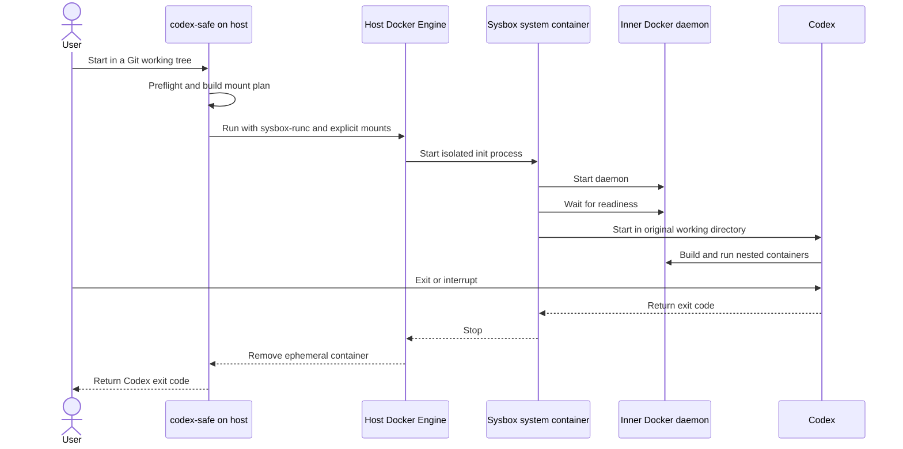

# Safe Environment for Running Codex Agents

Status: Proposed

Scope:

- the `codex-safe` command contract on a Linux host;
- discovery and mounting of the active Git project, linked worktrees, and `~/.codex`;
- an independent Docker daemon running inside a Sysbox container;
- security boundaries, lifecycle, launch failures, and isolation verification.

## Purpose and Intent

### Problem

A Codex agent needs write access to a project and the ability to run Docker containers. Running the agent directly
on the host gives it everything available to the host user. Passing `/var/run/docker.sock` into a regular container
also gives the agent effective control over the host Docker daemon.

We need a local command that exposes only explicitly allowed host paths and provides an independent Docker daemon.
Mistakes made by the agent or its nested containers must not affect unrelated user files or host containers.

### Worked Example

Before:

```text
cd /home/user/sources/app-feature
codex

Codex can access the user's environment and talks to the host Docker daemon.
```

After:

```text
cd /home/user/sources/app-feature
codex-safe

Codex runs inside a Sysbox container. It sees app-feature and ~/.codex,
while docker ps shows only containers from the nested Docker daemon.
```

If `app-feature` is a linked worktree, the command also mounts the primary checkout and common Git directory. The
absolute target referenced by `.git` remains valid, so `git status`, `git commit`, and branch operations work without
rewriting repository metadata.

### Chosen Shape

`codex-safe` is a trusted Go program running on the host. It validates the environment, computes the minimum bind-mount
set, starts an ephemeral system container through `sysbox-runc`, and hands control to Codex inside that container.

The container has its own Docker daemon and Docker CLI. The host Docker socket is not mounted. Nested containers use
only the outer container's daemon and storage and can access host files only through paths already visible inside the
outer container.

Go owns project discovery, validation, mount planning, Docker argument construction, process execution, and exit-code
propagation. Shell is limited to container bootstrap and test harnesses; it is not used to interpolate host paths or
construct the production `docker run` command.

### Success Criteria

- One `codex-safe` invocation starts interactive Codex in the current Git project.
- Project changes and Codex state persist on the host with usable file ownership.
- A linked worktree remains a fully functional Git working tree inside the container.
- `docker build`, `docker run`, and Docker Compose use a separate nested daemon.
- The agent cannot see the host daemon's socket, containers, images, or volumes.
- The agent receives no host paths beyond the explicit mount set.
- A preflight or nested-daemon failure stops the launch without an unsafe fallback.

### Tradeoff

This container isolates the host more strongly than conventional Docker-in-Docker with `--privileged` or a host
Docker socket mount. It is not a secrecy boundary for allowed mounts. The agent can read, change, delete, or transmit
project files and `~/.codex` contents.

Each launch starts with clean nested Docker storage. This improves session independence but makes repeated image pulls
and builds slower. Persistent caching can be designed separately after measurement shows that it is needed.

## Contract

### 1. Command Interface

The user-facing interface is:

```text
codex-safe [launcher options] [-- codex arguments]
```

- With no arguments, the command starts interactive `codex` for the Git project containing the current directory.
- `--` separates launcher options from Codex arguments. Arguments after it are forwarded without reparsing.
- The current subdirectory is preserved as the Codex working directory at the same absolute path.
- With `--project`, the canonicalized project path becomes the working directory.
- Interactive mode attaches stdin, stdout, stderr, and the terminal to the container process.
- After successful environment setup, the Codex exit code becomes the `codex-safe` exit code.

Minimum launcher options:

- `--help`: show launcher help and exit;
- `--project <path>`: select a project instead of the current directory;
- `--image <reference>`: override the image for diagnostics or experiments;
- `--cpus <count>`: override the outer-session CPU limit;
- `--memory <size>`: override the outer-session memory limit;
- `--pids-limit <count>`: override the outer-session PID limit.

The project controls the default image and pins it by immutable digest. An image override intentionally expands the
trusted computing base and is always displayed before launch.

### 2. Project Discovery

The launcher accepts only an existing local Git working tree. It obtains the following paths through Git:

- the physical absolute requested working directory;
- the active working-tree root;
- the active working tree's absolute Git directory;
- the absolute common Git directory.

Paths are canonicalized before Docker arguments are built. The launcher does not parse `.git` files manually or
construct repository paths from untrusted string fragments.

Launching outside a Git working tree fails before a container is created. Arbitrary directories are excluded from the
first release because they do not provide a reliable project boundary.

The first release supports a linked worktree only when its common Git directory is the `.git` directory of an
existing primary checkout. A worktree attached to a bare repository or an external common Git directory fails
preflight.

### 3. Mount Plan

All mounts use explicit `--mount` syntax. Each source must already exist, and source and target paths are canonicalized.
The launcher never creates a missing source directory as a side effect of a typo.

Host bind mounts keep `rprivate` propagation. A mount created by the nested Docker daemon must not propagate back into
the host mount namespace.

#### Regular checkout

- The active working-tree root is mounted read-write at the same absolute path.
- The outer container starts in the absolute equivalent of the original current directory.
- Host `~/.codex` is mounted read-write at `$HOME/.codex` for the container's Codex user.

#### Linked worktree

- The active worktree root is mounted read-write at the same absolute path.
- The primary checkout root is mounted read-only at the same absolute path.
- The primary checkout's common Git directory is a separate read-write mount at the same absolute path.
- The nested read-write Git-directory mount takes precedence over the primary checkout's read-only mount.

Preserving absolute paths is mandatory. A linked worktree's `.git` file normally points to an absolute location inside
the common Git directory. Mounting only the project at `/workspace` would break that reference. The same path mapping
also lets the nested Docker daemon resolve absolute bind paths from Compose configuration correctly.

The primary checkout is read-only so the agent cannot accidentally modify a second working copy. The common Git
directory stays read-write because commits, refs, the linked-worktree index, and Git lock files must persist.

#### Path overlaps

The launcher builds the complete mount plan before launch and removes exact duplicates. For nested targets, it mounts
the broadest read-only directory first and then applies narrower read-write mounts.

If a target requires incompatible sources or modes that this rule cannot resolve, preflight fails. The launcher never
silently broadens read-write access.

### 4. Codex State and Credentials

The entire host `~/.codex` directory is available to Codex read-write. This persists authentication, configuration,
history, and other state between launches.

This mount is an explicitly allowed host area, not a secret store. Code running with agent permissions can read its
tokens, change its configuration, or delete its state. A nested container can also receive the directory if the agent
explicitly bind-mounts it through the inner Docker daemon.

The launcher does not mount the rest of the home directory, `.ssh`, cloud credentials, password stores, Git credential
helpers, or arbitrary Unix sockets. It does not copy the complete host environment. Only a documented allowlist needed
for the terminal, locale, and an explicitly configured proxy is forwarded.

### 5. Outer Container and Sysbox

The outer container runs through the local Docker Engine with `--runtime=sysbox-runc`. The launcher does not use:

- `--privileged` on the outer container;
- `/var/run/docker.sock` or any other host container-engine socket;
- `--pid=host`, `--network=host`, `--ipc=host`, or `--userns=host`;
- bind mounts of `/`, `/home`, `/var/lib/docker`, `/dev`, or other broad host paths.

The outer container gets its own PID, mount, network, IPC, UTS, cgroup, and user namespaces. Root inside the container
is constrained by the Sysbox user namespace and is not host root.

The security contract does not depend on an AppArmor profile. Isolation comes from namespaces, restricted mounts,
cgroups, and Sysbox behavior. With the shared UID/GID mapping in Sysbox CE, all sessions are treated as belonging to
one trusted local user rather than mutually untrusted tenants.

The container image includes:

- Codex and its runtime dependencies;
- Docker CLI, Docker daemon, and the Compose plugin;
- an init process that reaps child processes and handles signals correctly;
- an entrypoint that starts the daemon, waits for readiness, and then starts Codex.

Codex does not start until the nested daemon passes its readiness check. A timeout or daemon failure prints outer-
container diagnostics and exits nonzero.

### 6. Inner Docker Contract

The nested Docker daemon stores containers, images, layers, networks, and volumes in the outer container's private
`/var/lib/docker`. Sysbox may control the physical placement, but the objects are logically separate from host Docker
objects and objects belonging to other `codex-safe` sessions.

The inner `docker` CLI connects only to the nested daemon socket by default. The launcher and image do not configure a
fallback to a host context or remote daemon.

A bind source passed to inner `docker run -v` is resolved against the outer container's filesystem. The project can
therefore be passed to a nested container at its preserved absolute path, while unavailable host paths outside the
allowed mount set cannot be obtained this way.

Publishing a port through nested Docker exposes it in the outer container's network namespace, not on the host.
Explicit host publication of nested ports is outside the first contract.

### 7. File Ownership

A file created by Codex or a nested container in a read-write project mount must remain readable and editable by the
host user who invoked `codex-safe`. The launcher must not leave project files owned by an identity the host user cannot
modify.

Exact UID/GID translation through Sysbox user namespaces, ID-mapped mounts, or shiftfs is an implementation detail.
A smoke test or preflight detects an incompatible filesystem. The launcher never repairs ownership by recursively
running `chown` over the host project.

The first release supports only local filesystems compatible with the selected Sysbox version. NFS and other network
filesystems are unsupported without separate evidence that their ID mapping behaves correctly.

### 8. Resource Policy

The outer container receives cgroup limits for CPU, memory, and process count. All nested containers share those limits
and cannot collectively exceed the outer session's cgroup.

Default values are:

- CPU: `min(4, max(1, floor(host logical CPUs / 2)))`;
- memory: `min(8 GiB, floor(host memory / 2))`;
- PID: `4096`.

If the computed memory limit is below `2 GiB`, preflight fails and suggests an explicit override. Positive values can
be changed with launcher options. The active limits are printed before launch so OOM, throttling, and PID exhaustion
can be diagnosed.

A portable disk limit for the writable layer is outside the first release because support depends on the host Docker
storage driver and filesystem. This is a known residual risk. Installation documentation must require free-space
monitoring and describe cleanup of stopped outer containers and Sysbox data.

### 9. Network Policy

The outer container uses a separate Docker bridge network. Outbound access is enabled because Codex, package managers,
and Docker registries require network access. Nested Docker networks remain inside this network boundary.

`codex-safe` does not prevent network exfiltration. Code in the container can transmit accessible project or
`~/.codex` content. Domain allowlists, enforced proxies, and fully offline operation require a separate design.

### 10. Lifecycle and Concurrency

Each invocation creates a container with a unique name that is not derived only from the directory name. Concurrent
invocations for the same project use distinct Docker daemons, writable layers, and container names, but share the host
project and `~/.codex`.



The launcher forwards terminal resize events and signals to the interactive process. Normal exit, Ctrl-C, and
termination stop the outer container, nested daemon, and nested containers. The outer container is automatically
removed after it stops.

If the launcher receives SIGKILL or the Docker daemon fails, a stopped or running outer container may remain. The next
launch does not reuse it. A separate diagnostic command or documented procedure finds resources through the
`codex-safe` project label and removes only confirmed stale sessions.

### 11. Preflight and Failure Behavior

Before creating a container, the launcher verifies:

1. The host is a supported Linux system.
2. The `docker` command exists and a local Docker daemon responds.
3. The Docker Engine has `sysbox-runc` registered.
4. The project is a Git working tree and all computed mount sources exist.
5. `~/.codex` exists, is a directory, and is accessible to the invoking user.
6. The image resolves to the pinned digest or was explicitly supplied by the user.
7. The mount plan contains no conflicts or paths outside the allowed set.
8. Resource-limit configuration is syntactically valid.

An error identifies the failed check and provides a diagnostic action. The launcher never compensates for missing
Sysbox by using `runc`, `--privileged`, the host Docker socket, or direct host execution of Codex.

An image-pull, outer-container, or nested-daemon failure is returned to the user without retrying in a less isolated
mode.

## Invariants

- The host Docker socket is never visible inside the outer container.
- Each invocation receives a separate nested Docker daemon.
- Read-write host access is limited to the active working tree, linked-worktree common Git directory, and `~/.codex`.
- The linked worktree's primary checkout is read-only except for the nested common Git directory.
- Git working-tree and common-directory absolute paths match their host paths.
- The outer container is never privileged and never shares host namespaces.
- Unsafe fallback behavior is forbidden.
- Host-side orchestration and Docker argument construction are implemented in Go.
- Arguments and paths are separate argv elements and are never passed through `eval` or shell reinterpretation.
- A normal `codex-safe` exit does not intentionally leave nested containers running.

## Boundaries and Non-Goals

This design protects against accidental or erroneous agent access to unrelated host files and the host Docker daemon.
It also reduces the impact of root access inside the agent environment through the Sysbox user namespace.

The trusted computing base includes:

- the host-side Go `codex-safe` program;
- the local Docker Engine and its configuration;
- Sysbox and the Linux kernel;
- the pinned outer image and its entrypoint;
- the user who selects the project and any image override.

The design intentionally does not promise:

- protection of the active project, common Git directory, or `~/.codex` from the agent;
- protection of Codex tokens from code running in the same environment;
- network isolation or exfiltration prevention;
- protection from vulnerabilities in the kernel, Docker, Sysbox, or the container image;
- isolation between untrusted local tenants when Sysbox CE uses a shared UID/GID mapping;
- safe concurrent writes by multiple agents to one worktree or `~/.codex`;
- access to USB, GPU, FUSE, or other host devices;
- SSH agent forwarding, Git credential helpers, or automatic `git push`;
- Docker Desktop, macOS, Windows, rootless host Docker, or remote Docker daemons in the first release;
- linked worktrees attached to bare repositories or common Git directories outside a primary checkout;
- automatic discovery and mounting of external Git submodules;
- publishing nested-container ports on the host;
- persistent nested Docker images, volumes, or build cache;
- a portable disk quota for nested Docker storage.

Rejected alternative: mount the host Docker socket. This would be faster and would reuse the host cache, but it would
give the agent control over host containers, mounts, and privileges, defeating the project's primary goal.

Rejected alternative: run the outer container with `--privileged`. This is common for Docker-in-Docker but greatly
expands container privileges. Sysbox is selected specifically to run system workloads without this flag.

Rejected alternative: mount only the linked worktree at `/workspace`. Its absolute `.git` reference would lose its
target, and absolute project bind paths inside nested Docker would differ from host paths.

## Test Plan

### Launcher contract tests

- Discover a regular checkout from both its root and a nested directory.
- Discover a linked worktree whose path contains spaces and shell metacharacters.
- Resolve canonical paths when the launcher starts through a symbolic link.
- Verify the exact mount plan and mode of every mount without starting a container.
- Reject launches outside Git or without `~/.codex`, Docker, or `sysbox-runc`.
- Prove that unknown options and arguments after `--` cannot trigger shell injection.
- Prove that every preflight and runtime failure has no fallback path.

### Integration tests on a Sysbox host

- Modify an existing file and create a new one in a regular checkout, then verify host content and ownership.
- Run `git status`, `git add`, `git commit`, and ref reads in a linked worktree.
- Prove that a primary-checkout file is immutable while linked-worktree Git metadata changes.
- Start a nested container with a project bind mount and verify bidirectional changes.
- Create a nested image, container, network, and volume and prove they are absent from host Docker.
- Prove that host containers and `/var/run/docker.sock` are inaccessible from outer and nested containers.
- Attempt to read a known host-home marker outside allowed mounts and prove the path is absent.
- Prove that the primary checkout's read-only mount cannot be remounted read-write from either container layer.
- Exercise CPU, memory, and PID limits with load from multiple nested containers.
- Run two sessions concurrently and prove they do not share nested Docker state.

### Lifecycle tests

- Cover normal exit, Ctrl-C, SIGTERM, Codex failure, and nested-daemon failure.
- Verify terminal resize and interactive input.
- After each normal scenario, prove outer and nested containers stopped and were removed.
- Simulate launcher failure and prove stale resources carry the expected labels and can be diagnosed safely.

### Security review gate

Before the first release, inspect the actual outer-container configuration through `docker inspect` and verify:

- runtime, namespaces, capabilities, and disabled privileged mode;
- the complete mount list and read-write modes;
- the absence of the host Docker socket and broad host paths;
- network mode and cgroup limits;
- the pinned image digest;
- Sysbox UID/GID behavior on every supported filesystem.

## Implementation Plan

The minimal infrastructure proof is tracked in
[`2026-07-13-codex-safe-mvp-exec-plan.md`](../exec-plans/review/2026-07-13-codex-safe-mvp-exec-plan.md).

## References

- [Sysbox project and Docker runtime usage](https://github.com/nestybox/sysbox)
- [Sysbox security model](https://github.com/nestybox/sysbox/blob/master/docs/user-guide/security.md)
- [Sysbox host requirements](https://github.com/nestybox/sysbox/blob/master/docs/user-guide/install-package.md)
- [Docker bind mounts and propagation](https://docs.docker.com/engine/storage/bind-mounts/)
