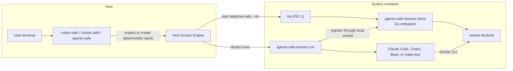
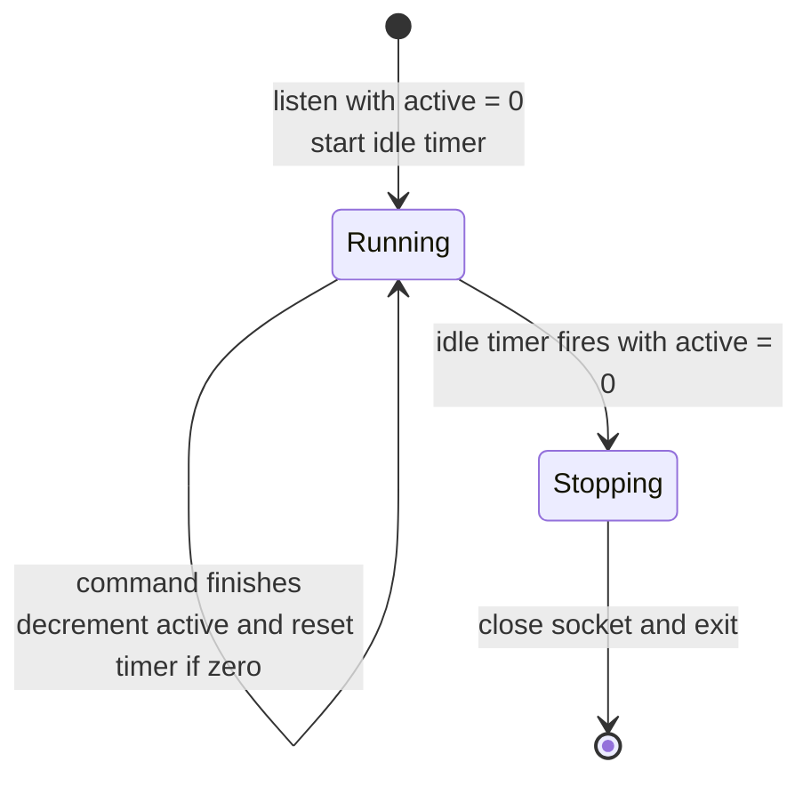

# Go Session Manager for Shared Agent Containers

Status: Implemented

Scope:

- the lifetime of one Sysbox container shared by concurrent `codex-safe`, `claude-safe`, and `agents-safe` commands;
- container-local registration of foreground commands;
- startup, shutdown, and create-versus-stop races;
- session reuse compatibility for creation-time user mounts;
- ownership boundaries between the host launcher, Go session-manager entrypoint, and command wrapper.

## Purpose and Intent

### Problem

Docker ties a container's lifetime to its main process. The old launcher made the first requested command that process
and sent later commands through `docker exec`. If the first command exited, Docker stopped and removed the container
even when a later command was still running.

No user command should own the shared environment. The container should remain alive while any managed
foreground command is running, then stop and retain the existing `--rm` cleanup behavior after the last command exits.

### Worked Example

Before:

```text
Terminal A: claude-safe
Terminal B: codex-safe
Terminal A: exit

The container exits because Claude Code from Terminal A is its main process.
Terminal B loses the shared environment while Codex is still running.
```

After:

```text
session manager
├── active command A → Claude Code
└── active command B → Codex

Terminal A: exit          command A finishes, command B remains
Terminal B: Codex exits   command B finishes, active count becomes zero
```

An interactive Bash session is an active command for as long as Bash is running. Exiting that Bash does not stop the
container while Claude Code, Codex, `make test`, another shell, or any other managed foreground command remains active.

### Chosen Shape

The container starts detached. Its long-running workload and image entrypoint is a small Go session manager
rather than a user command or shell script. Every requested command, including the first one, enters through the same
wrapper:

```text
docker exec ... agents-safe-session run -- COMMAND ARG...
```

The wrapper connects to the manager over a Unix socket that exists only inside the container. It starts the
requested command, holds the connection while that command runs, and exits with the command's status. The manager
counts these open connections.

The manager does not query Docker for exec processes and the host does not track active commands. There is no host
runtime directory, socket mount, lock file, heartbeat, or persistent session registry.



### Success Criteria

- No user command has special ownership of the container.
- The container remains running while at least one managed foreground command is running.
- Exiting one of several concurrent commands does not interrupt the remaining commands.
- Interactive Bash, Codex, Claude Code, `less`, tests, and other foreground commands use the same lifetime rule.
- The final command exit starts the idle timeout, followed by nested-daemon shutdown and container removal.
- Two simultaneous first launches for one project create at most one container.
- TTY behavior, argv boundaries, working directories, and command exit codes remain unchanged.

### Tradeoff

The lifetime signal is the command inside the container, not the host Docker CLI connection. If a host terminal or
launcher disappears but its command continues running inside the container, that command remains active and keeps the
session alive. This is intentional: the manager reports actual running work rather than guessing client connectivity.

The manager does not make an idle session persistent. The short idle timeout absorbs immediate reconnect races, but a
container with no managed foreground commands exits. Detached background workloads do not keep it alive after their
owning foreground command finishes.

## Contract

### 1. Session Identity and Atomic Creation

One container session is identified by the canonical worktree root and invoking host UID. Its project key is:

```text
hex(SHA-256(decimal UID + NUL + canonical worktree root))[:24]
```

The 24 hexadecimal characters provide a fixed-length Docker-safe key. The launcher uses this container name:

```text
codex-safe-<project key>
```

The UID remains part of the hash input and is also stored explicitly in `agents-safe.host-uid`; repeating it in the
container name would not add identity information.

Ownership, protocol, the creation fingerprint, and selected unhashed diagnostic values remain in labels so the
launcher can validate the container before reuse and operators can inspect sessions:

- `agents-safe.managed=true`: marks containers owned by this launcher;
- `agents-safe.project-path`: canonical worktree root;
- `agents-safe.host-uid`: invoking numeric UID;
- `agents-safe.manager-protocol=1`: required wrapper-manager compatibility;
- `agents-safe.launch-config`: SHA-256 fingerprint of all creation-time parameters;
- `agents-safe.codex-home`: canonical host source mounted as the container's Codex home, or the literal `absent` for
  an `agents-safe` container created without one; diagnostic only;
- `agents-safe.claude-home`: canonical host source mounted as Claude's state directory, or `absent`; diagnostic only;
- `agents-safe.claude-config`: canonical default global `.claude.json` source, or `absent` when the state uses an
  explicit `CLAUDE_CONFIG_DIR` or is unavailable; diagnostic only;
- `agents-safe.personal-skills`: canonical host source mounted for personal skills, or the literal `absent` when the
  optional directory does not exist; diagnostic only;
- `agents-safe.host-mcp`: sorted `host:port` list of forwarded host MCP endpoints, or the literal `absent` when none
  were forwarded; diagnostic only, as defined by [`host-mcp-forwarding.md`](host-mcp-forwarding.md);
- `agents-safe.host-mcp-channel`: host directory of that container's MCP channel, absent as a label when no endpoint
  was forwarded. It locates the channel and is never compared for reuse.

The project path and UID determine the container name. After ownership and protocol validation,
`agents-safe.launch-config` is the sole creation-time reuse predicate; the product-state, personal-skills, and host-MCP
labels are not compared independently.

The label namespace is part of the ownership proof. A container carrying the previous `codex-safe.*` keys is rejected
as a deterministic-name conflict after an upgrade; it is never read as a compatible `agents-safe.*` session. Let that
container finish or stop it deliberately before launching a replacement.

The deterministic name is the creation lock. Docker permits only one container with a given name, so concurrent
launchers cannot both create the same project session.

For example:

```text
UID:          1000
Project root: /home/alex/sources/example-project
Hash input:   1000\0/home/alex/sources/example-project
Project key:  aba8b4ca4ff345d5d0443c0c
Name:         codex-safe-aba8b4ca4ff345d5d0443c0c
```

The relevant Docker create arguments are:

```bash
docker run --detach --rm \
    --name codex-safe-aba8b4ca4ff345d5d0443c0c \
    --label agents-safe.managed=true \
    --label agents-safe.project-path=/home/alex/sources/example-project \
    --label agents-safe.host-uid=1000 \
    --label agents-safe.manager-protocol=1 \
    --label agents-safe.codex-home=/home/alex/.codex \
    --label agents-safe.claude-home=/home/alex/.claude \
    --label agents-safe.claude-config=/home/alex/.claude.json \
    --label agents-safe.personal-skills=/home/alex/.agents/skills \
    agents-safe-mvp:local
```

The path remains inspectable without decoding the hash:

```bash
docker inspect codex-safe-aba8b4ca4ff345d5d0443c0c \
    --format '{{json .Config.Labels}}'
```

```json
{
  "agents-safe.codex-home": "/home/alex/.codex",
  "agents-safe.claude-home": "/home/alex/.claude",
  "agents-safe.claude-config": "/home/alex/.claude.json",
  "agents-safe.host-uid": "1000",
  "agents-safe.managed": "true",
  "agents-safe.manager-protocol": "1",
  "agents-safe.personal-skills": "/home/alex/.agents/skills",
  "agents-safe.project-path": "/home/alex/sources/example-project"
}
```

Labels are for validation and operator diagnostics, not launcher discovery. For example, an operator can list every
managed container or narrow the list to one project:

```bash
docker ps -a \
    --filter 'label=agents-safe.managed=true' \
    --format '{{.Names}}\t{{.Status}}'

docker ps -a \
    --filter 'label=agents-safe.managed=true' \
    --filter 'label=agents-safe.project-path=/home/alex/sources/example-project' \
    --format '{{.Names}}\t{{.Status}}'
```

The launcher follows this algorithm:

1. Derive the deterministic name from the canonical project root and host UID.
2. Inspect that exact name.
3. If it does not exist, create it with `docker run --detach --rm`.
4. If an ownership, project, UID, or manager-protocol label differs, fail with a name-conflict diagnostic.
5. If it is running and the creation fingerprint differs, report that the active session uses a different immutable
   launch configuration and ask the user to finish that session before retrying.
6. If it is running and the fingerprint matches, run the wrapper in it.
7. If it is not running, or its manager rejects registration during shutdown, wait a bounded time for the name to be
   released and retry once.
8. If a concurrent create loses the name race, inspect and validate the winner using the same rules.

A hash collision or unrelated stale container is never treated as a reusable session based on name alone. Full labels
remain authoritative after Docker provides atomic name ownership.

### 2. Container Startup and Readiness

The container starts detached and receives no container-level stdin or TTY. User interaction belongs to the
individual `docker exec` commands.

The image has no shell entrypoint. Its exec-form entrypoint selects the `agents-safe-session` binary, and its default
command selects `serve`:

```dockerfile
ENTRYPOINT ["/usr/bin/tini", "--", "/usr/local/bin/agents-safe-session"]
CMD ["serve"]
```

The session container does not override that command, so Docker starts:

```text
tini -- agents-safe-session serve
```

The Go `serve` process starts as root and performs the existing privileged bootstrap:

1. create the host-matching account and group;
2. create the container-local home and install shell configuration;
3. configure passwordless container-local sudo;
4. start the nested Docker daemon and wait for it to become ready;
5. create `/run/agents-safe` for the recreated host user;
6. create the manager listener owned by that user.

The Go process remains root because it owns the root-started dockerd child and must stop it cleanly. It never executes
user commands. Each `docker exec` explicitly runs `agents-safe-session run` and its child with the recreated host UID
and GID.

The manager listens on `/run/agents-safe/session.sock`. The directory has mode `0700` and the socket has mode `0600`.
Both are part of the ephemeral container filesystem and are not bind-mounted from the host.

When shutdown commits, the manager creates `/run/agents-safe/stopping` with mode `0600` and the recreated host user's
UID/GID. The marker remains alongside the socket until the next manager startup removes stale runtime state. A wrapper
checks it before and after connecting so a committed shutdown is reported immediately instead of being mistaken for
bootstrap that is still in progress. The marker is container-local and is not a host lease, lock, heartbeat, or
additional discovery mechanism.

Before returning any eligible running session for user exec, the launcher executes `agents-safe-session wait-ready` as
root. The command waits for the manager socket to exist and returns only after account setup, nested-daemon readiness,
and manager listener setup are complete. It does not connect to the manager, register a command, or change the idle
timer. For an established session the socket already exists, so the check returns immediately.

Only after that barrier does the launcher execute an unprivileged `agents-safe-session run`. This ordering keeps root
account reconciliation ahead of every process using the recreated UID, including a concurrent first caller that loses
the deterministic-name create race and adopts the winner while it is still bootstrapping.

The manager starts the same 5-second idle timer used after commands finish. A wrapper already waiting for the socket
connects as soon as the manager listens. If the creating launcher dies before `docker exec`, the unused manager exits
after that same timeout. Bootstrap failure is reported using container state and `docker logs`.

### 3. Container-Local Registration Protocol

Each `agents-safe-session run` process opens one Unix stream connection to the manager. The connection represents one
active command.

The manager registers a connection under its state lock and writes one acknowledgement byte. The wrapper does not
start the command until it receives that byte. If shutdown has already committed, the manager closes the connection
without acknowledging it and the command does not start. The wrapper also checks the container-local `stopping`
marker to distinguish this state from incomplete bootstrap.

After acknowledgement, the wrapper holds the connection without sending requests, heartbeats, or command data.
Closing the connection unregisters the command. There is no general RPC format or separate protocol negotiation;
compatibility is enforced by the container's `agents-safe.manager-protocol` label.

Command argv, environment, terminal bytes, working directory, and project data never enter the socket.

### 4. Command Wrapper

The host launcher prefixes every requested command with the image-provided wrapper:

```text
agents-safe-session run -- COMMAND ARG...
```

Docker still selects the container user, group, home, working directory, stdin attachment, and optional TTY. Arguments
after `--` remain separate argv elements and are never reconstructed as a shell string.

After registering with the manager, the wrapper:

1. starts the requested command as its direct child;
2. connects the child's stdin, stdout, and stderr directly to its own Docker exec streams;
3. forwards termination signals it receives;
4. waits for the direct child to exit;
5. closes the manager connection and unregisters the command;
6. exits with the child's exit status, including signal-derived status.

The wrapper remains alive while the direct child runs. Consequently `bash` is active until that Bash process exits,
`make test` is active until Make exits, and Codex is active until Codex exits.

Processes detached by a command do not independently register. Once the direct child finishes, the wrapper closes its
connection even if unrelated or orphaned background processes still exist in the container.

### 5. Manager State Machine

The manager has two externally meaningful states:

- `running`: the manager accepts commands and tracks `active`; its idle timer runs only while `active == 0`;
- `stopping`: the idle timer fired with `active == 0`, so no new commands are accepted.



The MVP idle timeout is one fixed 5-second value. It applies both immediately after manager startup and whenever the
last command finishes. There is no separate initial timeout or configurable idle policy.

The transition to `stopping` is atomic with connection registration. A racing wrapper is therefore either accepted
and cancels shutdown, or rejected after shutdown commits. It is never acknowledged and then lost from the count.

### 6. Go Entrypoint Supervision and Shutdown

The same `agents-safe-session serve` process owns account bootstrap, the manager state machine, and dockerd supervision.
There is no intermediate shell supervisor and no second manager child.

Normal idle shutdown proceeds in this order:

1. the manager observes zero active commands for the full idle timeout and commits shutdown;
2. it closes the listener, sends SIGTERM to dockerd, and waits for bounded graceful shutdown;
3. the Go entrypoint exits successfully;
4. Docker stops remaining namespace processes and removes the container.

If dockerd exits while the manager is active, `serve` stops accepting commands and exits nonzero. On SIGINT or
SIGTERM, it closes the listener, terminates dockerd, and waits for it. Tini remains PID 1 only to forward signals to
the Go entrypoint and reap adopted processes.

`--rm` remains enabled. The design intentionally reaches a stopped container instead of retaining one for restart.

### 7. Concurrency and Race Handling

#### Two simultaneous first callers

Both try the same deterministic container name. One create succeeds. The other receives a Docker name conflict,
verifies the winner's full labels, waits for readiness through its wrapper, and reuses it.

#### New command during idle timeout

The wrapper connects to the local socket and registers under the manager's state lock. Registration either cancels
the timer or the connection closes without acknowledgement.

#### New command after shutdown commits

`docker exec` or wrapper registration fails because the old container is stopping. The launcher waits for the
deterministic name to be released, creates one replacement container, and retries the command once.

#### Legacy random-name containers

The deterministic-name launcher does not discover containers created by older random-name versions. Before upgrading,
the user must close those active sessions. Because sessions retain `--rm`, a normally stopped legacy container leaves
no record that needs migration.

### 8. Runtime and Failure Behavior

The manager logs state changes, active counts, and its shutdown reason to container stdout and stderr. It does not log
command argv, environment values, terminal data, or project contents.

Failure behavior is:

- manager bootstrap failure: the Go entrypoint stops dockerd if necessary and the container exits;
- wrapper cannot register: the user command does not start;
- command cannot start: the wrapper unregisters it and returns a nonzero status;
- wrapper crashes: its socket closes and the manager unregisters the command;
- command exits nonzero: the wrapper returns the same status without treating it as manager failure;
- manager crashes: Docker terminates the container namespace, including dockerd;
- dockerd crashes: the manager closes its listener and the container exits nonzero.

If the host launcher or terminal disappears, Docker may leave the exec process running inside the container. The
wrapper and its command then remain a real active command until they exit. This is not a stale manager record. A later
launcher can reuse the session, inspect it, or explicitly stop the container if the command is unwanted.

Host Docker daemon or machine failure can still prevent normal cleanup. Existing identity labels remain the source
for diagnosing any surviving container record.

### 9. Security Properties

The manager socket is not exposed to the host or nested containers by default. It can only register an active command
inside the current container and cannot request host operations, mounts, or Docker configuration.

Any process already running as the recreated host user can connect to the socket and keep the session alive. This is a
denial-of-service possibility within the existing trust boundary: the same user already controls the project and the
nested Docker daemon. The protocol provides no path to the host Docker socket or unrelated host files.

The wrapper receives commands only from its own argv supplied by `docker exec`. The manager never executes data read
from the socket.

## Invariants

- A container's lifetime never depends on one distinguished user command.
- Every requested command, including the first, runs through `agents-safe-session run`.
- The manager cannot exit for idleness while any registered wrapper's direct child is running.
- A wrapper connection is counted at most once and released exactly once.
- No manager-protocol message contains or executes command data.
- Docker's deterministic-name constraint prevents duplicate container creation.
- A running container is reused only when its versioned creation fingerprint matches the complete requested contract.
- Once manager shutdown commits, the old manager never accepts another command.
- Final-command shutdown retains `docker run --rm` cleanup.
- Manager failure never triggers host execution, a privileged container, or use of the host Docker socket.

## Boundaries and Non-Goals

This design owns container liveness while managed foreground commands run. It does not own persistent terminal
sessions, terminal reattachment, background service health, or arbitrary process discovery.

The following are deliberately outside this contract:

- keeping a container alive only because it has detached background or nested containers;
- resuming a Bash, Codex, or Claude Code terminal after its original exec attachment is lost;
- retaining an idle container indefinitely for later manual attachment;
- restarting stopped or failed containers;
- coordinating sessions across hosts or remote Docker daemons;
- isolation between mutually untrusted processes running as the same container user;
- making the manager a general RPC, shell, or terminal server.

Rejected alternative: keep the first user command as the container main process. Docker stops the container when that
process exits, even if commands created by later exec calls are still running.

Rejected alternative: maintain host-visible control sockets and lock files. Command lifetime is already observable by
a small wrapper inside the container, so host runtime state adds paths, cleanup, and failure modes without improving
the chosen command-based semantics.

Rejected alternative: poll Docker exec instances. Docker can inspect a known exec ID but does not provide a public
endpoint for listing all exec instances. Polling would also introduce missed-event and stop-versus-start races.

## Test Plan

### Manager unit tests

- Start with zero commands and verify transition to `stopping` after the idle timeout.
- Register and finish one command, then verify the same idle timeout is used again.
- Hold two connections, close either one first, and prove the manager remains accepting.
- Register during the idle timeout and prove the timer is cancelled.
- Race registration against idle expiry and prove it is either acknowledged or closed.
- Prove a command cannot start before its acknowledgement.
- Cover SIGTERM and listener failure without goroutine, connection, or timer leaks.

### Wrapper unit tests

- Preserve argv values containing spaces, shell metacharacters, and empty strings.
- Pass stdin, stdout, and stderr without buffering or reinterpretation.
- Return zero, nonzero, command-not-found, and signal-derived statuses.
- Hold the registration until the direct child exits and release it on every failure path.
- Forward termination signals and avoid leaving the direct child orphaned after normal wrapper shutdown.

### Go entrypoint unit tests

- Validate required identity, home, and daemon-readiness inputs before making changes.
- Cover account reuse, rename, conflict, home, sudoers, directory ownership, and file modes without a shell.
- Prove dockerd readiness through its private Unix socket and retain diagnostics on timeout or early exit.
- Stop dockerd on manager idle exit and external signals; stop accepting commands when dockerd exits unexpectedly.
- Prove the root `serve` process never receives or executes user command argv.

### Host launcher tests

- Derive the same Docker name for the same canonical root and UID.
- Derive different names for different worktrees or UIDs.
- Verify direct inspection of the deterministic name, exact identity labels, product-state labels, and fingerprint.
- Verify detached `docker run --rm` uses that name.
- Verify cold creation and running-session adoption run root `wait-ready` before the user-owned wrapper.
- Verify first and subsequent commands receive the same wrapper prefix.
- Handle matching name conflicts by reuse and ownership or protocol mismatches by a name-conflict diagnostic.
- Reject a running container with any different creation-time product state or mount using the active-session
  diagnostic.
- Prove discovery does not require listing containers by label.
- Preserve TTY selection, working directory, user identity, and argv boundaries.

### Sysbox integration tests

- Start Bash and `make test`, exit Bash, and prove Make and nested Docker remain alive.
- Exit the final command and prove manager, dockerd, and container disappear after the idle timeout.
- Run two first callers concurrently and prove exactly one container and nested daemon exist.
- Launch the same worktree with different user-mount sources and prove the live container is not reused or terminated.
- Hold one session, run both product launchers in it, and prove they share one container while retaining independent
  state mounts.
- Start a command during the idle timeout and prove reuse or one clean replacement after committed shutdown.
- Disconnect a host Docker CLI while its command continues and prove the command keeps the session active.
- Crash the wrapper, manager, and dockerd independently and verify bounded cleanup and diagnostics.
- Exercise Bash, Ctrl-C, terminal resize, piped stdin, Cyrillic text, and exact command exit codes.

## Where the Code Lives

Implemented ownership:

- `cmd/agents-safe-session/`: one image binary with `serve` and `run` modes, plus the relay mode owned by
  [`host-mcp-forwarding.md`](host-mcp-forwarding.md);
- `internal/session/`: local protocol, manager state machine, and command wrapper;
- `internal/container/`: privileged account bootstrap, dockerd readiness, and process supervision;
- `internal/launcher/`: deterministic naming, detached creation, conflict retry, and wrapper-prefixed `docker exec`;
- `container/Dockerfile`: reproducible manager build, direct Go entrypoint configuration, and default `serve` command;
- `tests/smoke/`: overlapping-command, race, crash, TTY, and cleanup proofs on a real Sysbox host.

## Related Design

The broader mounting, identity, nested-Docker, and security contract remains in
[`agents-safe.md`](agents-safe.md).

## Implementation Plan

Implementation is tracked in
[`2026-07-14-go-session-manager-exec-plan.md`](../exec-plans/completed/2026-07-14-go-session-manager-exec-plan.md).

## References

- [Docker Engine API: exec create, start, and inspect](https://docs.docker.com/reference/api/engine/)
