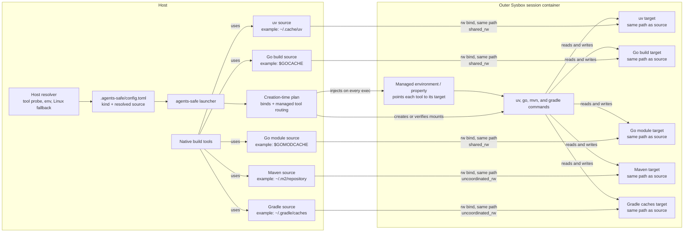

# Host-Backed Dependency Caches

Status: Proposed

Scope:

- explicit reuse of existing host caches by uv, Go, Maven, and Gradle commands in the outer session container;
- host-side cache resolution, explicit container tool routing, concurrency policies, active-session compatibility,
  and failure behavior;
- the security and ownership consequences of sharing writable dependency state with project code.

Project-image builds and BuildKit caching remain owned by
[Project-Specific Agent Environments](project-environments.md). Generic mounts, container identity, and the Sysbox
boundary remain owned by [Safe Environment](codex-safe.md). Typed TOML schema, overlay, and creation-time
fingerprinting remain owned by [Project Launcher Configuration](project-launcher-configuration.md).

## Purpose and Intent

### Problem

The session container is disposable. A command that downloads Python wheels, Go modules, Maven artifacts, or Gradle
dependencies can therefore repeat the same downloads after the session is destroyed. Keeping a second
`agents-safe`-only copy would avoid the download but duplicate host disk usage and cache maintenance.

An `additional` bind mount can expose a host cache today, but it carries no tool identity or sharing policy. The
launcher cannot tell whether concurrent writers are safe, place the cache at the path the tool will use, or distinguish
a dependency cache from a directory containing configuration and credentials.

### Worked Example

Before, two cold sessions each populate an unrelated container-local cache:

```text
cold session A -> download dependencies -> container removed -> cache lost
cold session B -> download the same dependencies again
```

After, the user opts into narrow host directories in the ignored project config:

```toml
[[common.dependency_caches]]
kind = "uv"
source = "/home/alex/.cache/uv"

[[common.dependency_caches]]
kind = "go_build"
source = "/home/alex/.cache/go-build"

[[common.dependency_caches]]
kind = "go_modules"
source = "/home/alex/go/pkg/mod"

[[common.dependency_caches]]
kind = "maven"
source = "/home/alex/.m2/repository"

[[common.dependency_caches]]
kind = "gradle"
source = "/home/alex/.gradle/caches"
```

The next cold session mounts the same physical directories used by native host commands. A cache miss written by
either side is available to the other side later. No copied or `agents-safe`-specific cache is required.

### Mount Topology



The host resolver determines the effective cache directory before Docker is involved and persists that absolute path
as `source`. Each bind then mounts the canonical physical directory at the same host-visible target for the supported
Linux/Sysbox runtime. On every managed command, the session wrapper explicitly points the tool to that target through
the kind's environment variable or Maven system property. Container defaults never select the attached cache.

Host nodes show common defaults, not required locations. There is no copy or intermediate Docker volume.
Project-image builds and nested Docker containers do not receive these mounts or routing settings implicitly.

### Chosen Shape

Dependency caches are explicit, typed project configuration. `source` may be the tool's real host cache or a dedicated
directory; the launcher does not require a second copy. `agents-safe init` runs a resolver for each selected kind
against the host identity and host platform, then writes the effective absolute paths. Ordinary launches never repeat
discovery or change the configured mount set.

Each `kind` owns its host resolver, container routing setting, and sharing policy. The normalized absolute path
recorded in `source` is also the container target, so the user sees the same path on both sides. Symlinks are resolved
separately to identify and validate the physical host directory. The user chooses only the kind and source; neither
the target nor policy can be overridden in TOML. Explicit tool routing, rather than a container home-directory
convention, makes the mounted path authoritative.

The initial support policy is deliberately asymmetric:

- uv, the Go build cache, and the Go module cache support direct shared read-write access;
- Maven exposes its live local repository only as explicitly uncoordinated read-write state;
- Gradle exposes its live `caches/` subtree only as explicitly uncoordinated read-write state; Gradle owns
  version-specific hits and misses.

### Success Criteria

- A user can reuse the same physical cache from host and container without a second `agents-safe` cache copy.
- A user can persist dependency downloads across cold sessions without mounting a whole host home.
- A default `agents-safe init` discovers existing concurrency-safe uv and Go caches without prompting and reports
  every enabled path.
- Maven and writable Gradle caches are enabled only by an explicit kind selection that acknowledges uncoordinated
  writes.
- The generated mount and managed-routing plan is deterministic and visible before Docker creation.
- Concurrent read-write access is supported only where the tool documents it; the launcher never claims to serialize
  native host and container writers.
- Cache changes cannot silently alter the creation-time contract of an already running session.
- A missing or unsafe source fails explicitly; tool-owned incompatibilities remain visible and never cause the
  launcher to fall back to a broader mount.
- Projects that should not trust one another can use separate host cache sources.

### Tradeoff

A live bind mount provides the best local hit rate and no duplication, but it creates two-way coupling. Container code
can delete or poison entries later consumed by native host builds, while host cleanup or writes can disrupt a running
container build. Sharing is therefore limited to one trust domain; unsupported concurrent writers require explicit
Maven or Gradle kind selection as acknowledgement.

## Contract

### 1. Configuration and Resolution

The project schema gains one optional list:

```go
type CommonConfig struct {
	Image            string                  `toml:"image"`
	NoHostMCP        bool                    `toml:"no_host_mcp"`
	Mounts           []MountConfig           `toml:"mounts"`
	DependencyCaches []DependencyCacheConfig `toml:"dependency_caches"`
}

type DependencyCacheConfig struct {
	Kind   DependencyCacheKind `toml:"kind"`
	Source string              `toml:"source"`
}
```

`DependencyCacheKind` accepts `uv`, `go_build`, `go_modules`, `maven`, and `gradle`. The launcher derives one fixed
sharing policy for each kind according to the tool matrix below. There is no serialized mode or policy override.

Resolution follows these rules:

1. An omitted list means no host-backed dependency caches.
2. Unlike `common.mounts`, `dependency_caches` has no default snapshot. An omitted list and a present empty list both
   resolve to no caches. The TOML overlay still uses `*[]DependencyCacheConfig` so presence remains explicit without
   permitting a future default to reintroduce implicit cache mounts.
3. A present non-empty list replaces the whole cache list as one TOML value; entries are never merged.
4. By default, `agents-safe init` discovers only existing concurrency-safe caches: uv, Go build, and Go modules. It
   does not select Maven or Gradle, and it does not create a missing cache directory.
5. Each kind may appear at most once. Unknown kinds and a legacy or hand-written `mode` key fail before Docker
   access; the launcher never accepts a user-supplied sharing policy.
6. `source` is the selected host cache directory, not an expression to evaluate in the container. Init writes the
   resolved host default; a manual entry may select another validated directory. It must already be an absolute path
   to an existing directory; the launcher does not expand `~` or environment variables in config. It lexically
   normalizes the path and uses it as the container target. It separately resolves symlinks to obtain the canonical
   physical bind source used for validation, labels, and the creation-time fingerprint. A symlink alias is therefore
   preserved as the tool-visible path without requiring the alias itself in the container.
7. A source may be a standard live host cache such as `~/.cache/uv`, `$GOMODCACHE`, `~/.m2/repository`, or
   `~/.gradle/caches`. It cannot be `/`, the host home, an ancestor of the host home, or overlap a project, Git,
   Codex-home, personal-skills, host-MCP, or other cache mount.
8. A source must be readable, writable, and searchable by the invoking host identity.
9. A configured Gradle source must end in `/caches`; its parent is the managed `GRADLE_USER_HOME`. Only the `caches/`
   subtree is mounted, so sibling settings, init scripts, wrapper state, and credentials remain container-local.
10. A configured Maven source must contain no whitespace because the session wrapper must represent it as one
    `MAVEN_OPTS` system-property token without invoking a shell.
11. The launcher never runs recursive `chown`, repairs a cache layout, copies credentials, or weakens permissions.

There is no launch-time CLI override. Cache bindings are persistent project intent and live only in the ignored
`.agents-safe/config.toml`.

### 2. Initialization UX

Cache discovery is an `agents-safe init` concern, not a launch concern:

```text
agents-safe init
agents-safe init --host-caches=none
agents-safe init --host-caches=uv,go_build,go_modules
agents-safe init --host-caches=uv,go_build,go_modules,maven,gradle
```

The default is `--host-caches=auto`, which selects existing uv, Go build, and Go module caches. `none` writes an empty
list. A comma-separated kind list selects an explicit subset and fails if any selected source cannot be resolved or
does not exist. Naming `maven` or `gradle` explicitly selects its live cache under the fixed uncoordinated-write
policy.

Initialization remains non-interactive. It never changes behavior based on whether stdin is a terminal, and scripts
do not need a `--yes` flag. Automatic discovery covers only the concurrency-safe kinds. Naming `maven` or `gradle`
is the additional acknowledgement for uncoordinated writable state. `--host-caches=none` is the opt-out for projects
that should see no host dependency state.

Before returning success, init prints the exact persisted paths plus each kind's derived policy:

```text
Host dependency caches:
  uv          /home/alex/.cache/uv       shared_rw
  go_build    /home/alex/.cache/go-build shared_rw
  go_modules  /home/alex/go/pkg/mod      shared_rw
```

An explicit Maven or Gradle selection adds its row and one warning that host and container writers are not
coordinated. An empty result says `No existing shared read-write host dependency caches detected`; it is not an error
in `auto` mode.

Resolution uses the invoking host identity and performs no network or Docker access. Automatic mode resolves only
the first three kinds; an explicit kind list resolves every selected kind:

- uv: use the absolute result of `uv cache dir` when uv is installed, then `UV_CACHE_DIR`,
  `XDG_CACHE_HOME/uv`, and `<host-home>/.cache/uv` as no-binary fallbacks;
- Go build: use the absolute `GOCACHE` reported by `go env`, then the standard user-cache fallback;
- Go modules: use the absolute `GOMODCACHE` reported by `go env`, then `<host-home>/go/pkg/mod`;
- Maven: use the configured `localRepository` when it can be read without executing Maven, then
  `<host-home>/.m2/repository`;
- Gradle: use `GRADLE_USER_HOME`, then `<host-home>/.gradle`, and append `caches`.

These resolvers determine the tool's effective default for a native host command without invocation-specific flags
or project overrides. Each resolver takes the first valid applicable result in its ordered tool-probe, configuration,
environment, and host-platform fallback chain. Tool probes are bounded and read-only. A missing executable permits
the next step; a failed probe, malformed output, relative path, unreadable settings file, or nonexistent final
directory makes a concurrency-safe kind unavailable in `auto` mode and produces a concise diagnostic. The same
condition is an error for every explicitly selected kind.

The first release implements only Linux host fallbacks because Linux with Sysbox is the supported runtime. It does
not probe the container or apply the container image's home-directory conventions. Supporting another host platform
requires a resolver for that platform and, when its path syntax cannot be used in Linux, a separate target-translation
contract. It does not require changing how tools are routed once a valid container target exists.

Because initialization preserves existing files, cache discovery never rewrites an existing `config.toml`. Existing
projects enable caches by editing their ignored config; an update command that preserves arbitrary TOML formatting is
outside the first release.

In-memory launcher defaults keep `dependency_caches` empty. Initialization adds its detected snapshot only to the
config passed to the encoder, so launching a project without `.agents-safe/config.toml` never triggers discovery or
implicit cache mounts.

### 3. Tool Profiles

The launcher derives targets and managed routing settings; the TOML cannot override them.

| Kind | Persistent content | Managed container routing | Derived sharing policy |
| --- | --- | --- | --- |
| `uv` | uv download/build cache | `UV_CACHE_DIR=<container-target>` | `shared_rw` |
| `go_build` | Go build, test, and fuzz cache | `GOCACHE=<container-target>` | `shared_rw` |
| `go_modules` | downloaded Go modules | `GOMODCACHE=<container-target>` | `shared_rw` |
| `maven` | Maven local repository | `MAVEN_OPTS += -Dmaven.repo.local=<container-target>` | `uncoordinated_rw` |
| `gradle` | Gradle `caches/` directory | `GRADLE_USER_HOME=<parent-of-container-target>` | `uncoordinated_rw` |

For a configured kind, the session wrapper sets the routing value on every managed command. It overrides an
image-owned `UV_CACHE_DIR`, `GOCACHE`, `GOMODCACHE`, or `GRADLE_USER_HOME` with the configured target or its documented
parent. The tool does not have to infer a cache from the container user, home, XDG directories, or OS defaults.
Without that kind, the launcher leaves the image value untouched. Host values participate only in init discovery and
are never copied wholesale into the container.

The session wrapper appends `-Dmaven.repo.local=<configured-target>` to the container's existing `MAVEN_OPTS` value
before starting a managed command. This preserves other image-owned JVM options, makes the managed property the last
environment-supplied value, and does not import host `MAVEN_OPTS` or mount `~/.m2/settings.xml`.

These settings are routing defaults, not confinement. An explicit tool argument or project-owned configuration may
override them and leave the attached cache unused; the launcher does not rewrite command argv or project files.

The Gradle profile derives `GRADLE_USER_HOME` as the parent of the configured `caches/` source and mounts only that
cache directory at the configured path. It does not expose host `gradle.properties`, `init.gradle`, `init.d/`, daemon
state, wrapper credentials, or the rest of the host Gradle user home. Wrapper distributions are not part of the first
contract.

### 4. Host and Container Compatibility

The supported runtime is a local Linux host with Sysbox. The host resolver handles Linux cache-location conventions;
the managed container routing prevents a different container home or distribution default from changing the cache
selected by the tool. The outer container uses the host kernel and CPU architecture.

This contract does not attempt to share macOS or Windows cache trees with Linux. Docker Desktop, remote daemons, and
cross-architecture emulation remain out of scope. Explicit routing solves tool-path ambiguity after a mount exists;
it does not make foreign host path syntax, filesystem semantics, or binary cache entries Linux-compatible.

Host and container can still have different Linux distributions, libc versions, JDKs, Python interpreters, and tool
versions. Each profile treats that difference separately:

| Kind | Cross-environment behavior | Decision |
| --- | --- | --- |
| `uv` | Cache buckets and wheel compatibility are versioned/tagged. | Share the live cache. |
| `go_modules` | Downloaded source is independent of target OS and architecture. | Share the live cache. |
| `go_build` | Keys include Go inputs and toolchain, but not changes in cgo C libraries. | Share with a cgo caveat. |
| `maven` | Most artifacts are JVM-neutral; native artifacts should use classifiers. | Operator avoids overlap. |
| `gradle` | Metadata formats are versioned and cross-version reuse may be partial. | Let Gradle decide hits. |

An incompatibility should normally produce a miss or a parallel versioned entry, not installation of an artifact for
the wrong platform. The exceptions are ecosystem packages published under insufficient platform coordinates and the
documented Go cgo limitation; the launcher cannot repair either problem. It does not probe or compare tool versions.

### 5. Derived Sharing Policies

`shared_rw` is the diagnostic name for the policy derived for uv and Go. It relies on the package manager's own
concurrent-cache contract. The launcher adds no coarse lock and does not make direct file edits.

`uncoordinated_rw` is the diagnostic name for the policy derived for Maven and Gradle. Explicitly selecting either
kind acknowledges that the launcher cannot enforce one writer:

1. The user must name `maven` or `gradle` in `--host-caches` or add that kind to the project config; automatic
   initialization never selects this policy.
2. The launcher prints that native host processes, other session containers, and detached container processes may
   access the same directory without coordination.
3. The launcher does not acquire a lock or imply that sequential access was verified.
4. The operator must avoid overlapping native and container writers. A dedicated cache is not required.
5. Standard Maven and Gradle commands are accepted, but `mvnd`, Gradle daemons, and detached processes make the
   overlap window harder to observe.

A launcher-owned lock would not establish the claimed invariant. Native host tools would not honor it, another
launcher version could omit it, and the current session contract waits only for the direct child of `docker exec`.
Detached descendants can outlive that child and continue using the cache. A real single-writer guarantee would
require every host and container client to use the same external coordinator.

If concurrent native and container Maven builds are required, both Maven installations must use a compatible Maven
Resolver file-lock implementation. The launcher does not silently change the host Maven configuration. Sequential
reuse of a live Gradle cache remains supported after explicitly selecting the `gradle` kind. Overlapping writable
Gradle processes across the container boundary are unsupported because they usually cannot communicate; use an
artifact proxy instead.

### 6. Mount Plan and Session Reuse

Dependency caches are creation-time state because Docker cannot add a bind mount to a running container.

This design does not define a separate cache fingerprint. It extends the one versioned canonical structure owned by
[Project Launcher Configuration](project-launcher-configuration.md#4-parameter-classes-and-active-containers).
Implementation increments that structure from schema version 1 to version 2, which makes every session created by an
older launcher incompatible after upgrade, even when the resolved cache list is empty.

The version 2 structure appends `dependency_caches` after the existing fields. Its entries use deterministic kind
order and contain:

- the kind;
- the canonical physical host source;
- the managed tool-routing contract.

Each cache bind also participates in the normalized `mounts` field. Its source is the canonical physical host path,
and its target is the normalized configured host path. The `dependency_caches` entry adds the tool identity and
behavior that the physical bind alone cannot express; it does not duplicate the target already encoded by `mounts`
and the tool contract.

The cache contents, timestamps, size, and current hit rate are excluded. Normal cache writes therefore do not make a
running session incompatible.

The matching typed schema, presence-aware overlay, schema-version bump, and canonical fingerprint field are recorded
in the owning launcher-configuration design and must ship in the same implementation change.

Changing, adding, or removing a cache while the project container is active produces the normal creation-time
mismatch error and asks the user to finish the active session. It never replaces or mutates the live container.

Each cache also appears in inspectable diagnostic metadata without exposing directory contents. The normalized
physical mounts remain the reuse authority; labels are not independent compatibility predicates.

### 7. Runtime and Failure Behavior

For each cold or reused invocation, the launcher performs this sequence:

1. Parse the typed config and resolve every configured source to its physical host directory.
2. Validate source scope, permissions, overlaps, the supported kind, and the path-preserving target and derived
   policy.
3. Build the normalized mount and per-command routing plan and compare it with any active session.
4. On cold creation, mount cache sources with the invoking host identity's existing Sysbox translation.
5. Print the uncoordinated-write warning, if any, inject managed routing, and run the requested command.

Failures are explicit:

- missing or inaccessible source: fail before Docker creation or reuse;
- source changed through a symlink: fail the active-session fingerprint comparison;
- tool reports a corrupt or incompatible cache: propagate the tool error unchanged;
- cache miss or stale metadata: let the tool apply its normal online refresh policy.

The launcher does not automatically clear or retry a corrupt cache. Cleanup must use the owning tool while no other
session is accessing that source.

### 8. Tool-Specific Risks

#### uv

uv documents its cache as append-only and safe for concurrent readers and writers. It also versions incompatible
cache buckets, so different uv releases may coexist but can retain duplicate entries.

If the cache and Python environment are on different filesystems, uv cannot use its fastest link strategy and falls
back to copying. The container profile should set an explicit copy link mode only when a real-host probe confirms the
bind and environment are on different filesystems; it must not assume this from path names alone.

#### Go

The Go build and module caches are independently safe for concurrent `go` command invocations. They remain separate
bindings because users may share downloaded source more broadly than architecture- and toolchain-sensitive build
outputs.

The build cache does not detect changes to C libraries used through cgo. A host OS or toolchain change may require
`go clean -cache` or a forced rebuild. The module cache can contain private module source and uses read-only files;
cleanup should use `go clean -modcache`, not recursive permission changes.

#### Maven

The Maven local repository is not only a download cache. It also contains locally installed artifacts, mutable
snapshot metadata, resolution-error markers, and Resolver bookkeeping.

A shared writable repository can therefore leak one project's `mvn install` output into another build under the same
coordinates. Resolver locking also varies by version and configuration. The live `~/.m2/repository` is available only
through explicit `maven` selection; every host and container project using it becomes one trust domain.

#### Gradle

Gradle's writable dependency cache uses file locks plus process communication. Gradle explicitly notes that this
communication is usually unavailable across containers, so a raw shared read-write bind is not a general concurrent
solution.

Gradle changes metadata formats across version ranges. The live `caches/` tree can contain parallel version-specific
entries, and a different Gradle version may miss and contact the configured repository. The launcher neither infers
compatibility nor promises a cross-version hit; it propagates Gradle failures unchanged.

Explicit `gradle` selection may use the host's real `~/.gradle/caches` directory. Mounting all of `~/.gradle` remains
forbidden: that directory also carries initialization scripts, properties, daemon state, logs, and potentially
credentials or encryption material. Exposing it would add code execution and secret access unrelated to caching.

### 9. Security, Integrity, and Operations

A writable cache is writable host state. Every process in the session, including nested containers to which the user
re-exports the mount, can read, replace, or delete its contents.

Hard rules:

- Do not share a writable source between projects that do not already trust one another.
- Treat a live host cache and every native or container build using it as one writable trust domain.
- Do not store repository credentials, settings files, signing keys, or package-manager configuration in a cache
  source.
- Keep lockfiles, checksums, signatures, Maven dependency verification, and Gradle dependency verification enabled;
  a warm cache is an optimization, not an integrity authority.
- Treat private modules and proprietary artifacts as confidential host data exposed to every project using that
  source.
- Never make a build silently offline. A miss may use the network unless the user explicitly invokes the tool's
  offline mode.
- Cache size is unbounded in the first release. The launcher reports configured sources but does not prune them or
  impose a quota.

The operator owns backup, pruning, and trust-domain layout. The launcher owns only safe attachment, deterministic
tool routing, and the declared sharing policy.

## Boundaries and Non-Goals

This design applies to commands executed in the outer `codex-safe` or `agents-safe` session.

It deliberately does not provide:

- caches during `.agents-safe/Dockerfile` builds, which execute before the session mounts exist;
- automatic cache mounts or environment propagation into nested Docker containers;
- persistent nested-Docker images, volumes, or BuildKit cache;
- launch-time cache rediscovery, cache migration, format conversion, warming, pruning, quotas, or hit-rate telemetry;
- a cross-host or multi-user cache service;
- support for network filesystems before locking and Sysbox ID-mapping are proven there;
- a promise that dependencies can be rebuilt without network access.

To use a configured cache in nested Docker, the project must explicitly pass the outer cache target and matching tool
configuration to that nested container. That is an intentional additional trust decision.

## Alternatives Considered

### Raw `additional` mounts

This is the smallest current workaround and remains an escape hatch. It is not the primary contract because the
launcher cannot validate tool layout, set the required tool path, select a concurrency policy, or stop a user from
mounting all of `.m2` or `.gradle` accidentally.

### Docker named volumes

Named volumes avoid host UID/path portability problems and can persist across session containers. They are harder to
inspect, seed from an existing host cache, back up, and scope to a user. They also remain host-Docker state rather than
an explicit project-local choice.

They are a reasonable future default when sharing with native host tools is not required.

### Read-only seed plus writable overlay

Gradle can consume an operator-prepared read-only dependency-cache root containing `modules-2/` through
`GRADLE_RO_DEP_CACHE`, while writing misses to a separate Gradle user home. This is safer than a live writable cache
when builds overlap, but it requires a second snapshot, manual refresh, and filtering of lock and garbage-collection
files. New downloads do not flow back automatically. Because that conflicts with the primary goal of reusing one
physical host cache without duplication, the first release does not expose it as a cache profile.

### Artifact or module proxy

A local Nexus, Artifactory, Maven proxy, Go module proxy, or HTTP package-cache service provides better concurrency,
central policy, and cross-host reuse. It does not cover Go build outputs or every uv build artifact, and it adds a
service lifecycle, authentication, certificates, and another network trust boundary.

This is the preferred long-term answer for teams; direct directories target one developer host.

### Copy-in and snapshot promotion

The launcher could copy a cache into each cold session and promote a validated snapshot on shutdown. This isolates
writers and supports content-addressed keys, but large copies slow startup, interrupted shutdown loses data, and
conflict resolution becomes launcher-owned package-manager logic.

### Bake dependencies into the project image

Dockerfile layers and BuildKit cache mounts work well for stable image-build dependencies. They do not accelerate
arbitrary runtime commands after lockfiles change, and rebuilding the image is heavier than reusing a package cache.

Vendoring is stronger for hermetic or offline builds but increases repository size and moves dependency updates into
source control. It is a project policy, not a launcher cache feature.

## Test Plan

### Configuration and plan tests

- Decode and encode every supported kind; reject duplicates, unknown kinds, and any serialized `mode` key.
- Discover every existing concurrency-safe cache during default init without creating missing directories or
  selecting Maven or writable Gradle.
- Keep `--host-caches=none` empty and resolve an explicit comma-separated subset, including Maven and writable Gradle.
- Keep init non-interactive and prove discovery performs no Docker or network access.
- Resolve each kind through host tool probe, environment, then Linux fallback; never consult container defaults.
- Preserve an existing `config.toml` without rediscovery or rewrite.
- Prove omitted and present-empty `dependency_caches` both resolve empty while a present non-empty list replaces the
  whole list through a presence-aware overlay.
- Resolve symlinks once and reject root, host-home, project, Git, Codex-home, and cache-to-cache overlaps.
- For a symlinked configured source, use the resolved physical directory as bind source while preserving the
  configured absolute path as bind target and managed routing value.
- Verify every target equals its normalized configured source and check mount flags, managed routing, ordering, and
  diagnostics.
- Reject a configured Gradle source not ending in `/caches` and a configured Maven source containing whitespace.
- Prove cache config changes alter the creation-time fingerprint while cache content changes do not.
- Reject a missing source before Docker access.
- Compose the Maven system property without importing host settings or credentials.
- Override conflicting image-owned cache variables for configured kinds and preserve them for unconfigured kinds.
- Accept standard live host-cache paths without creating an `agents-safe`-specific sibling cache.

### Concurrency and warning tests

- Run concurrent uv and Go writers against one temporary shared cache and verify both complete without launcher locks.
- Print one explicit warning for Maven or writable Gradle and prove the launcher creates no coordination artifact.
- Prove Maven and writable Gradle are absent from `auto` and require explicit kind selection.
- Allow two uncoordinated invocations without claiming that their package-manager operations are safe.

### Integration tests on a Sysbox host

- Warm each cache, destroy the session, disable network access, and prove a covered dependency is reused cold.
- Warm with a native host command, consume from the container, then warm in the container and consume on the host.
- Verify host ownership remains the invoking user's after cache writes and cleanup.
- Run two worktrees concurrently against shared uv and Go caches.
- Run Maven and writable Gradle sequentially against their live host caches and verify bidirectional reuse.
- Demonstrate that a detached child can outlive its direct wrapper and keep the uncoordinated-write risk visible.
- Exercise same-version and mixed-version host/container tools, accepting tool-owned misses while detecting
  corruption or launcher path drift, and cover the documented Go cgo invalidation procedure.
- Inspect mounts and prove `.m2/settings.xml`, Gradle init scripts, host credentials, and unrelated home files are
  absent.
- Prove a cache config change rejects reuse of a live container.
- Prove project-image builds and nested containers receive no cache access implicitly.

## Where the Code Lives

Planned ownership:

- `internal/launcher/projectenv/`: typed TOML schema, kind validation, and fixed policy derivation;
- `internal/launchcli/`: host-source resolution and tool environment composition;
- `internal/launcher/launchplan/`: cache mounts, overlap policy, and canonical ordering;
- `internal/launcher/`: creation fingerprint, diagnostic metadata, and uncoordinated-write warnings;
- `internal/container/`: managed tool environment;
- `tests/smoke/`: real Sysbox ownership, concurrency, persistence, and isolation proof.

## References

- [uv caching](https://docs.astral.sh/uv/concepts/cache/)
- [uv in Docker](https://docs.astral.sh/uv/guides/integration/docker/)
- [Go build and test caching](https://go.dev/cmd/go/#hdr-Build_and_test_caching)
- [Go module cache](https://go.dev/ref/mod#module-cache)
- [Maven Resolver local repository](https://maven.apache.org/resolver/local-repository.html)
- [Maven local repositories](https://maven.apache.org/repositories/local.html)
- [Gradle dependency caching](https://docs.gradle.org/current/userguide/dependency_caching.html)
- [Gradle-managed directories](https://docs.gradle.org/current/userguide/directory_layout.html)
