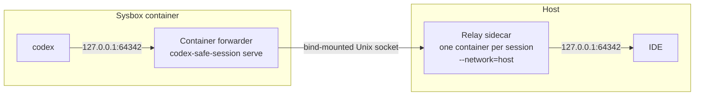
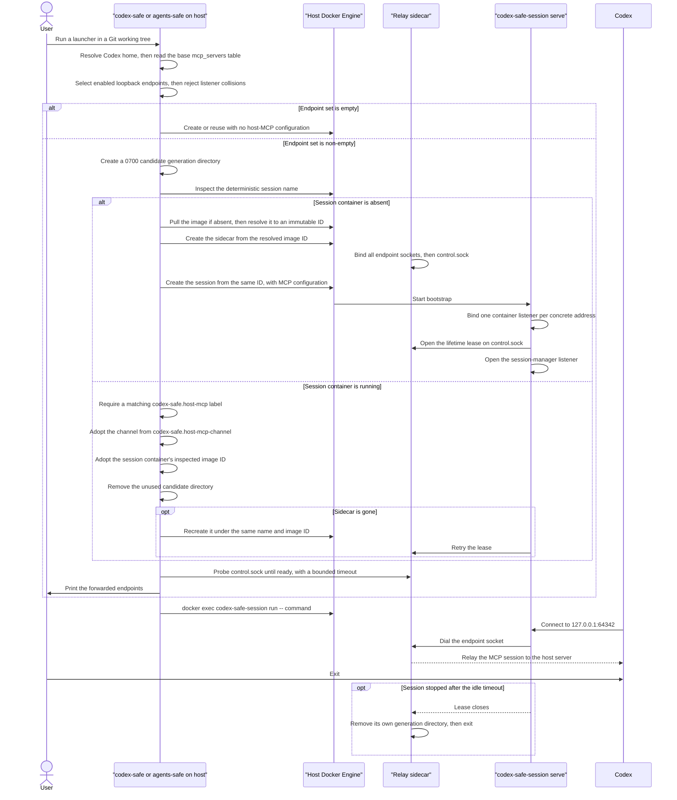

# Host MCP Access from codex-safe Containers

Status: Proposed

Scope:

- discovery of Codex MCP servers that run on the host and listen on a loopback address;
- the container-local listeners that reproduce those host addresses and ports inside the session container;
- the per-session host relay that reaches host loopback services, and its lifetime and single-instance rules;
- the Unix-socket channel between the two, its mount, and the access control it relies on;
- creation-time configuration, reuse compatibility, and visibility of the forwarded endpoint set;
- the security boundary this feature widens, and what it deliberately still refuses.

## Purpose and Intent

### Problem

Codex assembles its MCP server list from several layers: the `mcp_servers` table in `config.toml` in the resolved
Codex home, a selected profile, a trusted project-level `.codex` configuration, and `-c` overrides on the command
line. This design covers the first layer only, and says so here rather than in a late non-goal, because that scope
limit is visible to users. Where this document says "configured", it means the base `mcp_servers` table.

The Codex home is already mounted read-write into the container by [`codex-safe.md`](codex-safe.md), so every layer
reaches the container unchanged. Servers reached over a public URL keep working there because outbound network access
is allowed.

A local MCP server does not. It is a process on the host that listens on a loopback address, and its URL travels into
the container unchanged. Inside the container, `127.0.0.1` is the container's own loopback, so nothing answers. Codex
reports the MCP server as unavailable and the user loses a tool that works in every unsandboxed terminal.

Two independent barriers cause this, and only removing both restores the tool:

- Container loopback is not host loopback: the container has its own network namespace.
- Host loopback is not reachable from the container at all: a service bound to `127.0.0.1` on the host does not accept
  connections arriving on the Docker bridge gateway address. Making the container's own loopback resolvable is
  therefore necessary but not sufficient.

### Worked Example

The JetBrains IDE exposes an MCP server on the host and the user's base `config.toml` configures it:

```toml
[mcp_servers.idea]
url = "http://127.0.0.1:64342/stream"

[mcp_servers.openaiDeveloperDocs]
url = "https://developers.openai.com/mcp"
```

Before:

```text
cd /home/alex/sources/app-feature
codex-safe

openaiDeveloperDocs  works: a public URL needs only outbound network access.
idea                 fails: nothing listens on the container's own 127.0.0.1:64342.
```

After:

```text
cd /home/alex/sources/app-feature
codex-safe
Forwarding host MCP endpoints: idea -> 127.0.0.1:64342

openaiDeveloperDocs  works, unchanged.
idea                 works: the container's 127.0.0.1:64342 reaches the IDE on the host.
```

The Codex home is not rewritten. The URL that works on the host is the URL that works inside the container, which is
the whole point: one `config.toml` is shared by the host and the sandbox.

A loopback server that exists only in a profile, a trusted project configuration, or a `-c` override is not forwarded
and keeps failing exactly as it does today. That gap is fail-closed — a missed endpoint is an unavailable tool, never
an unintended hole — but it is a real product limit, not a footnote. Closing it is named as future scope in
[Boundaries and Non-Goals](#boundaries-and-non-goals).

### Chosen Shape

The launcher reads the resolved Codex home's base `mcp_servers` table, keeps every enabled entry whose `url` names a
loopback host, and turns that set into a channel with two forwarders and no host TCP port:



- Container forwarder: `codex-safe-session serve` listens on the exact loopback address and port the host URL names,
  and dials this session's Unix socket for that endpoint. It exists so the unmodified URL resolves inside the
  container.
- Relay sidecar: a second container, running the same pinned image with `--network=host`, serves those Unix sockets
  and dials the host loopback endpoint. It exists because the session container cannot open a host loopback socket by
  itself.
- Channel: a directory of Unix sockets, one per endpoint plus one control socket, created fresh for each session and
  bind-mounted into both containers.

Five decisions carry the design, and each one closes a class of failure rather than documenting it:

- The channel is a Unix socket, not a host TCP port on the bridge gateway. Nothing binds a host port, so there is no
  port to collide with, no arbitration to get wrong, no privileged-port limit, and no way for an unrelated container
  on the bridge to reach the endpoint. Authorization is the mount plus file ownership, which the kernel enforces,
  rather than a source IP address, which the kernel does not attest.
- The relay is a container, not a host process. This looks like the heavier option and is in fact the more confined
  one: a detached host process would run with the invoking user's full filesystem and Docker access, while the
  sidecar has a read-only root filesystem, every capability dropped, no Docker socket, and one mount. It gains
  exactly one thing over the session container — the host network namespace — which is precisely the capability this
  feature exists to provide.
- The relay's lifetime is the session's, not the launcher's, and Docker owns both its identity and its cleanup. A
  command deliberately outlives its launcher under [`go-session-manager.md`](go-session-manager.md), so a
  launcher-owned relay would strand that command without MCP. A lifetime lease held by `serve` replaces watching the
  Docker daemon, and the session container's own name — already the creation lock for a session — arbitrates the
  sidecar too, so this design adds no lock file of its own.
- The channel directory belongs to one session generation, not to the worktree. Its path carries a random identifier,
  and the session container records that path in a label. Successive containers for one worktree reuse the project
  key and the container name, so a directory keyed only by project would let a departing relay delete the channel of
  the session that replaced it.
- The forwarded set is fixed at container creation, passed in as an environment variable, and recorded as a reuse
  label, exactly like the Codex-home and personal-skills mounts. The socket directory is a bind mount, and
  `docker exec` cannot add one.

Both forwarders are Go code in the image this project already ships and already trusts. No `socat`, no shell, and no
new image package participates in the data path.

This shape was contingent on a Linux/Sysbox spike, which passed on 2026-07-17. It was specified fully so the spike
had something exact to falsify; the verdict and its tested environment are in [Open Questions](#open-questions).

### Success Criteria

- An enabled loopback MCP server in the base `mcp_servers` table answers inside the container at the address its URL
  names. A server from a profile, project configuration, or `-c` override is out of scope and unchanged.
- The host `config.toml` is never rewritten, and a public MCP URL keeps working with no forwarder involved.
- No host TCP port is bound, and no unrelated host user or outer session can reach the channel.
- MCP keeps working after the launcher that created the session exits while another command still runs.
- `codex-safe` and `agents-safe` behave identically here, and neither depends on the other being installed.
- The forwarded endpoint set is printed before launch, so a boundary widening is never silent.
- `--no-host-mcp` disables discovery, both forwarders, the relay, and the mount.
- A container is reused only when its forwarded endpoint set matches the current resolution.
- A configured set that cannot be represented by distinct container listeners fails preflight with a named collision.
- A stopped session's relay never disturbs the channel of the session that replaces it.
- A missing, unreadable, or malformed `config.toml` never silently drops a configured endpoint.

### Tradeoff

This feature deliberately punches one hole through the sandbox that [`codex-safe.md`](codex-safe.md) otherwise
maintains: the agent gains reach to a named set of host loopback ports. That is the requested capability, not a leak,
but it must be understood as real. An MCP server is an RPC surface, and whatever the host server can do — edit files
through the IDE, read a database, run a tool — the agent can now ask it to do, unconstrained by the container's mount
plan. The endpoint set is therefore narrow, explicit, printed, and derived from configuration the user already wrote.

The second cost is a project-wide one. Until now nothing in a session shared a host namespace, and the relay sidecar
does. It is confined in every other respect and runs no agent code, but the invariant genuinely changes, and
[Boundaries and Non-Goals](#boundaries-and-non-goals) states the new scope rather than burying it.

The third is a second container per session with MCP endpoints, plus the lease that ties it to `serve`. That is
accepted because the alternatives are worse: a relay owned by one CLI attachment silently breaks a contract
`go-session-manager.md` states explicitly, and a detached host process buys the same lifetime at the price of far more
authority.

## Contract

### 1. Endpoint Discovery

The launcher resolves the forwarded endpoint set from the Codex home it already resolved for the launch. Discovery
runs during preflight, before a container is created or reused.

Discovery rules:

- Source: `config.toml` directly below the resolved Codex home, and only its `mcp_servers` table.
- Selection: an entry qualifies only when it has a `url` key whose host part is a loopback host and it is not
  explicitly disabled.
- Loopback test: an IP literal in `127.0.0.0/8`, the IP literal `::1`, or the name `localhost`. Any other host is left
  alone, because a public or LAN URL already works through normal outbound access.
- Enablement: `enabled` is decoded as a tri-state that defaults to true. `enabled = false` excludes the entry, because
  forwarding a server the user switched off would widen the boundary for no benefit.
- Endpoint identity: the pair of the configured host, exactly as written and lowercased, and the port. A missing port
  is the URL scheme's default (`http` is 80, `https` is 443).
- Deduplication: two servers naming the same host and port produce one endpoint. Both names appear in the banner.
- Listener expansion: each endpoint expands to the concrete container addresses its host requires. A loopback IP
  literal expands to itself, whichever address in `127.0.0.0/8` or `::1` it names. Only the name `localhost` expands
  to both `127.0.0.1` and `::1`.
- Collision rejection: if one concrete listener address is claimed by two endpoints with different relay
  destinations, discovery fails preflight and names both servers, both configured endpoints, and the contested
  address.

`localhost`, `127.0.0.1`, and `::1` are three distinct endpoints, never folded together. They can resolve to different
services on the host, and rewriting `localhost` to `127.0.0.1` would make an IPv6-only server unreachable. The
configured host is carried through to the relay's dial unchanged, so the host resolver makes the same choice Codex
would have made outside the container.

Keeping them distinct is what makes the collision rule necessary. `localhost` needs both concrete loopback addresses,
so it overlaps any explicit `127.0.0.1` or `::1` endpoint on the same port:

```toml
[mcp_servers.by_name]
url = "http://localhost:64342/stream"

[mcp_servers.by_address]
url = "http://127.0.0.1:64342/stream"
```

Both entries are individually valid and select different relay destinations, but one container listener cannot serve
both. Discovery rejects the pair during preflight rather than letting the second bind fail with `EADDRINUSE` and take
the whole container down at start. The user resolves it by naming both endpoints explicitly or removing one.

Not selected, and not an error:

- An entry with `command` instead of `url`. A stdio server is started by Codex inside the container as a child
  process, so it needs no network forwarding. Whether its executable exists in the container is a separate concern
  that this design does not address.
- A `url` naming a public host, a LAN host, or a Unix socket.
- An entry with `enabled = false`.

Failure behavior is fail-closed, matching the launcher's existing preflight style:

- An unreadable `config.toml` fails the launch. Silently forwarding nothing would present a broken MCP server as a
  Codex problem.
- A `config.toml` that does not parse as TOML fails the launch with the parser's position.
- A `url` that does not parse, or that names a loopback host with an invalid port, fails the launch.
- Two endpoints contending for one container listener address fail the launch, as described above.
- An absent `config.toml` is not an error. The endpoint set is empty and no forwarder, mount, or relay exists.
- An `agents-safe` launch that resolved no Codex home has an empty endpoint set for the same reason.

An empty endpoint set is the zero-cost path: no environment variable, no mount, no relay, no listener, and no banner
line. A user with no local MCP servers sees the launcher behave exactly as it does today.

Discovery reads the base `mcp_servers` table only, as [Problem](#problem) states. It does not resolve profiles,
trusted project-level `.codex` configuration, or `-c mcp_servers.<name>.url=...` overrides forwarded to Codex. This is
a fail-closed gap in the safe direction: an endpoint that discovery misses is simply not forwarded, so Codex reports
it unavailable exactly as it does today. No unresolved configuration path can cause an *unintended* forward, because
only what discovery selected is ever given a listener.

### 2. The Channel

The channel is a directory of Unix sockets on the host, bind-mounted into both containers. It replaces what would
otherwise be a host TCP port, and it is the reason this design needs no network-level access control.

- Host directory: `<runtime-dir>/codex-safe/<project key>/<generation>/`, where `<project key>` is the same key that
  names the container in [`go-session-manager.md`](go-session-manager.md), `<generation>` is a fresh random
  identifier, and `<runtime-dir>` is `XDG_RUNTIME_DIR`. The launcher creates it with mode `0700`, owned by the
  invoking user, before either container is created.
- Session container target: `/run/codex-safe-host-mcp/`, the generation directory only. This is deliberately not under
  `/run/codex-safe/`, which `serve` creates and chowns for the session manager; a bind mount inside that directory
  would entangle two lifetimes for no reason.
- Sidecar target: the project runtime parent, so the sidecar can remove its own generation directory after the
  established session lease reaches EOF. It is the only mount the sidecar receives.
- Socket per endpoint: `e<index>.sock`, indexed over the sorted endpoint list. Neither side derives a socket name from
  an address, so no escaping rule has to agree across the mount.
- Control socket: `control.sock`, carrying the readiness and lease protocol defined in
  [Relay Sidecar](#4-relay-sidecar). It carries no MCP traffic.
- Mode: each socket is `0600` and owned by the invoking user. Sysbox maps that identity into the session container the
  same way it maps project-file ownership, so the container user can connect.

The mounts are read-write because `connect(2)` requires write permission on the socket inode, and because the sidecar
creates and removes the sockets. Neither grants anything beyond this session's channel.

#### Generation ownership

The generation identifier is what makes cleanup safe, and it exists because the project key does not.

A worktree's project key, container name, and channel path would otherwise be stable across successive sessions. A
sidecar removes its generation directory after its lease drops, but Docker can release the deterministic session
container name before that cleanup finishes. A launcher then creates the next session on the same project key, and the
departing sidecar deletes the channel the new session is already using — the new container keeps its listeners but
loses the socket path behind them. The generation also keeps the two sidecars distinct, so the departing one cannot
hold the name the arriving one needs.

The rules that follow:

- Fresh directory: every session creation allocates a new random generation directory. A directory is never reused
  by a later session.
- Recorded path: the session container records its channel directory in the `codex-safe.host-mcp-channel` label. This
  label locates the channel; it is never compared for reuse compatibility, because a reusing launcher legitimately
  computes a different candidate.
- Scoped cleanup: a sidecar removes the whole generation directory only after an established lease reaches EOF, which
  proves the session process that holds the bind mount is gone. On its own signal, internal failure, or initial lease
  timeout it removes only its socket entries and preserves the directory inode.
- Loser cleanup: a launcher that loses the session container-name race stops and waits for its unleased candidate
  sidecar, removes only its own candidate directory, and adopts the winner's directory from the winner's label.
- No inferred cleanup: a launcher never removes a generation merely because no running session label references it.
  That test is racy before session-container creation. Crash residue is inert inside the user's `XDG_RUNTIME_DIR` and
  remains for that directory's normal OS lifecycle; automatic stale collection is future operations work.

#### Access control

Access control is the mount and the file mode, together. It draws a boundary around the session, not around the
processes inside it:

- Another host user cannot reach the channel, because `XDG_RUNTIME_DIR` and the directory are `0700`.
- An unrelated outer session cannot reach it, because the mounts exist only in this session's two containers.
- Every process in this session that can act as the recreated user can use the channel. The agent has passwordless
  container-local sudo and a private Docker daemon, so it can also bind-mount the channel into one of its own nested
  containers, exactly as [`codex-safe.md`](codex-safe.md) already documents for the Codex-home mount.
- The invoking host user can reach it and already has direct loopback access without it.

The last two points are deliberate, not a gap. This design authorizes a session, and everything the session already
controls inherits that authorization. It never claims process-level authorization inside the container, which the
existing trust boundary does not provide and which this feature does not add.

This is why no token, source-IP allowlist, or handshake appears in this design. Against another host user or an
unrelated session, the kernel already enforces the boundary at the mount and the inode. Against the session's own
processes, no user-space secret would help, because they can read it.

#### Path constraints

`XDG_RUNTIME_DIR` must be set and must be a directory owned by the invoking user. If it is not, and the endpoint set
is non-empty, the launch fails with that diagnostic rather than falling back to a world-traversable temporary
directory. The full socket path must also fit the platform's `sockaddr_un` limit of 108 bytes; the launcher validates
this during preflight, because the failure is otherwise a confusing `bind` error at container start. The generation
identifier is sized with that budget in mind.

### 3. Container Forwarders

Every forwarded endpoint is served inside the container by `codex-safe-session serve`, the process that already owns
container bootstrap and supervision.

The launcher passes the resolved set at container creation as JSON, so no ad-hoc separator has to be escaped:

```text
CODEX_SAFE_HOST_MCP=[{"listen":["127.0.0.1:64342"],"socket":"/run/codex-safe-host-mcp/e0.sock"}]
```

`serve` starts the forwarders after account bootstrap and before it opens the manager listener, so the first wrapper's
acknowledgement continues to mean the environment is ready. In that window it also opens the sidecar lease described
in [Relay Sidecar](#4-relay-sidecar). For each endpoint, `serve`:

1. listens on every address in `listen`, in the container's network namespace;
2. accepts connections and dials the endpoint's Unix socket for each one;
3. copies bytes in both directions until either side closes, then closes the other side.

The `listen` list resolves the `localhost` ambiguity at the only place that can see both stacks:

- A configured loopback IP literal listens on that literal only.
- Configured `localhost` listens on both `127.0.0.1` and `[::1]`, because the container's resolver may answer with
  either, and both must reach the one socket for that endpoint.

A privileged port needs no special handling: `serve` is root by contract in
[`go-session-manager.md`](go-session-manager.md), so a `https://localhost` endpoint on port 443 binds like any other.

The forwarder is a byte pipe. It does not parse HTTP, MCP frames, or TLS, so streamable HTTP, Server-Sent Events, and
long-lived MCP sessions pass through unchanged and without a timeout of their own.

A listener that cannot bind fails `serve` and the container exits with that diagnostic. A forwarded endpoint that
silently did not bind would surface later as an unexplained MCP failure inside Codex.

The two `localhost` legs are the one exception, because they are derived rather than requested. A container whose
network namespace has no IPv6 cannot bind `[::1]`, and failing the launch there would make an unrelated host setting
break every session for a user whose only mistake was writing the most natural form of the URL. So for a `localhost`
endpoint at least one leg must bind; a leg that fails because its address family is unavailable is logged and
skipped. An explicitly configured `127.0.0.1` or `::1` keeps the all-or-nothing rule above, because the user named
that address and a silent substitution would answer a question they did not ask.

A dial failure affects only the connection that caused it. The forwarder closes that connection, logs the endpoint and
error, and keeps listening. A host MCP server that restarts is reachable again on the next connection without
restarting the container.

### 4. Relay Sidecar

The relay is one container per session, running the pinned image's `codex-safe-session relay` mode. It serves the
session's Unix sockets and dials the host loopback endpoints.

#### Why a container

A host relay needs exactly one thing the session container cannot have: the host network namespace. Every other
authority it might hold is unnecessary, and a detached host process would hold far more of it — the invoking user's
entire filesystem, their Docker access, and no confinement at all.

The sidecar inverts that. It is created with:

- `--network=host`, the one capability the feature requires;
- an explicit container command beginning with `relay`, which selects `codex-safe-session relay` through the image
  entrypoint described below;
- the recreated host UID and GID, so the sockets it creates are owned like every other host artifact of the session;
- `--read-only` root filesystem, `--cap-drop=ALL`, and `--security-opt=no-new-privileges`;
- no Docker socket, and the default runtime rather than `sysbox-runc`, because it runs no nested workload;
- exactly one mount, the project runtime parent described below;
- `--rm`, so Docker removes it.

Being a container also supplies two mechanisms the host-process shape had to build by hand. Docker's name uniqueness
replaces a lock file, and `docker logs` replaces a private log file.

The tradeoff is real and is stated in [Boundaries and Non-Goals](#boundaries-and-non-goals): one trusted component of
a session shares the host network namespace. The invariant in [`codex-safe.md`](codex-safe.md) is scoped to the
session container, which never does.

#### Image command dispatch

The image entrypoint owns only process supervision and binary selection; the container role remains a Docker command:

```dockerfile
ENTRYPOINT ["/usr/bin/tini", "--", "/usr/local/bin/codex-safe-session"]
CMD ["serve"]
```

The session container supplies no command, so Docker appends the default `serve` command and its effective process is
`tini -- codex-safe-session serve`, unchanged from the current runtime contract. The relay sidecar's typed create
request supplies a command whose first argument is `relay`, replacing the image `CMD`; its effective process is
`tini -- codex-safe-session relay ...`.

The typed Docker create request therefore carries an optional ordered `Command []string`. `BuildCreateArgs` appends it
after the image name. An empty command preserves the image default for the session container; the sidecar must set it
explicitly. The launcher never uses `--entrypoint`, so both roles retain `tini` as PID 1 and use the same pinned binary.

#### Image identity

The session-side forwarder and relay sidecar implement one private protocol, so a compatible tag is not enough: both
containers must use the same immutable image ID.

Before initial creation, the launcher ensures the requested reference is present locally, pulling it when it is not,
and then resolves it to its content ID. The pull is what `docker run` already performs implicitly; resolving a
reference to an immutable ID requires the image to be local, so the launcher makes that step explicit rather than
turning a first run into a preflight failure. It creates both the sidecar and the session container from that exact
ID, even when the user supplied a mutable tag.

If a running session is reused, its Docker inspection field `.Image` is authoritative. A missing sidecar is recreated
from that ID, not from the image reference supplied by the later launcher.

The sidecar records the ID in `codex-safe.host-mcp-image` for operator diagnostics, so a running pair can be shown to
share one image without decoding its inspection output.

#### Identity and single instance

The sidecar's name is derived from the session container and the generation:

```text
codex-safe-mcp-<project key>-<generation>
```

The session container's name is the sole arbiter of creation. The sidecar's name cannot be: it carries the
generation, and each launch attempt allocates its own, so two launchers racing for one worktree compute two distinct
sidecar names and both creates succeed. Exactly one of them then wins the session container name, and the loser
stops its own sidecar under [Generation ownership](#generation-ownership). There is no lock file.

The generation earns its place in the name for a different reason: it keeps successive sessions distinct, so a
departing sidecar cannot hold the name an arriving one needs.

Every sidecar carries these identity labels, for operator diagnostics rather than for launcher decisions:

- `codex-safe.host-mcp-sidecar=true`, a role marker distinct from `codex-safe.managed=true`, which remains reserved for
  session containers and existing session-discovery filters;
- `codex-safe.project-path`, the canonical worktree path;
- `codex-safe.host-uid`, the invoking host UID;
- `codex-safe.host-mcp`, the canonical sorted endpoint set;
- `codex-safe.host-mcp-channel`, the exact generation directory;
- `codex-safe.host-mcp-image`, the immutable image ID.

A sidecar name conflict needs no ownership check, and the reason is the generation. The name embeds a random
identifier, so holding that exact name requires already knowing it. It is readable only from the session container's
`codex-safe.host-mcp-channel` label through the host Docker daemon, which means the invoking host user — who already
reaches host loopback directly and is inside the trust boundary. The agent cannot forge it either, because its Docker
daemon is the nested one and cannot create a host container at all. A container under that name is therefore this
user's own sidecar for this exact generation.

This is not the fail-open reasoning rejected for `EADDRINUSE` in [Boundaries and Non-Goals](#boundaries-and-non-goals).
A TCP port is a small, guessable namespace any local process can occupy. A random generation in a container name is
neither.

One distinction remains, and it is about liveness rather than identity:

- Running: the launcher adopts it.
- Not running: a sidecar pending asynchronous `--rm` removal cannot serve the channel. The launcher waits boundedly
  for Docker to remove the name and retries creation once, rather than proceeding into a readiness timeout that would
  report the wrong cause.

The mount is the project runtime parent, `<runtime-dir>/codex-safe/<project key>/`, read-write. The sidecar needs the
parent, not just its own generation directory, so it can remove that directory after established-lease EOF. The
session container continues to mount only the generation directory itself.

#### Lease and readiness

`control.sock` carries a small protocol that does two jobs: it tells launchers when the channel is ready, and it tells
the sidecar when the session is gone. A connection announces its role in one byte.

- Lease: `serve` opens exactly one lease connection and holds it for the session's life. It sends its role byte and
  no further data.
- Probe: a launcher connects, reads one readiness byte, and closes.

Startup is all-or-nothing, in this order:

1. For each expected path in this owned generation, remove a stale Unix-socket entry left by a previous sidecar. An
   unexpected non-socket entry is an error and is never removed.
2. Bind every endpoint socket. On any failure, remove every socket already bound in this attempt and exit nonzero.
3. Bind `control.sock` last, and only then begin accepting on the endpoint sockets.

Binding `control.sock` last is what makes it a truthful signal: it cannot exist while the endpoint set is partial. A
probe reports ready only once the lease also exists, so a launcher never starts a command against a channel whose
container side has not attached yet.

`serve` connects the lease during bootstrap, before it opens the session-manager listener. That keeps the existing
contract from [`go-session-manager.md`](go-session-manager.md) exactly as it is: the first wrapper's acknowledgement
means the whole environment is ready, MCP included. A session that promised forwarding and cannot deliver it fails
rather than starting Codex against endpoints that will not answer.

Readiness must not be probed on a data socket. Connecting to an endpoint socket makes the relay dial the real host MCP
server and hand it a connection that immediately closes, which is a visible, confusing event on a server the launcher
does not own. It is also ambiguous, because a partial bind set answers on some endpoints and not others.

Four bounded intervals meet on this socket, and their order is a correctness rule rather than a tuning choice. The
cold-start bound begins when Docker successfully creates the sidecar and ends when the newly created session's
`serve` process makes its first lease attempt. It includes session-container creation and every bootstrap step that
precedes the lease:

```text
max(cold-start-to-first-lease bound, serve's lease retry interval)
    < sidecar initial-lease timeout
    < launcher readiness timeout
```

Both creation and recovery make the rule load-bearing. On a cold start, a sidecar whose timeout is shorter than
session creation and bootstrap exits before the first lease can exist. During recovery, a replacement sidecar waits
for a lease that only the long-running `serve` can open; if the next retry falls after the sidecar timeout, each later
launcher repeats the same failed cycle. The launcher's readiness timeout must in turn exceed the sidecar's, or it can
give up while a sidecar that would still be leased is waiting.

The execution plan owns the concrete values and must identify the existing bounds that compose the cold-start budget.
The inequalities are durable contract.

#### Lifetime

The lease is the lifetime signal, so the sidecar needs no access to the Docker daemon to know when to stop:

1. The launcher creates the sidecar after the generation directory exists and before the session container.
2. The sidecar binds the endpoint sockets, then `control.sock`, then waits for a lease.
3. `serve` connects the lease during bootstrap.
4. Loss of the lease means the session container is gone. The sidecar removes its generation directory and exits.
5. No lease within a bounded startup timeout makes the sidecar remove its socket entries and exit, but it preserves the
   directory because the same path may already be bind-mounted by a live session during recovery.

This is what the whole section is built around. `go-session-manager.md` guarantees that a command survives its
launcher: if a terminal dies while `make test` or `codex exec` continues inside the container, that command stays
registered and keeps the session alive. A relay owned by the launcher process would die at exactly that moment and
strand a still-running command without MCP, with no error and no way to recover short of restarting the session. The
lease follows `serve`, which is the process whose lifetime already defines the session.

If the sidecar receives a signal or fails internally while the lease is active, it removes only the socket entries and
preserves the generation directory. The session container's bind mount therefore keeps the same directory inode.
`serve` retries the lease connection in the background, and a later launcher recreates the sidecar under the same
deterministic name and from the session container's immutable image ID before starting another command. The replacement
removes only stale socket entries, binds new ones in that same directory, and restores MCP without replacing the
session container.

#### Data path

For each accepted connection on an endpoint socket, the sidecar dials that endpoint's configured host and port and
copies bytes in both directions. Because it shares the host network namespace, `127.0.0.1` there is the host's own
loopback. The configured host is passed to the resolver as written, so `localhost` resolves exactly as it would for
host Codex.

The sidecar logs endpoint, connection lifecycle, and errors to its stdout and stderr, where `docker logs` reaches
them like any other managed container. It never logs MCP payloads or URLs beyond the endpoint.

### 5. Launch Sequence and Reuse

A candidate generation directory must exist before either container is created, because it is a bind mount. The
sidecar must be ready before `serve` can lease it, and the channel must be ready before the command starts. That fixes
the ordering:



Reuse uses the two labels differently, and the distinction matters:

- `codex-safe.host-mcp` is compared. It carries the sorted `host:port` endpoint list, or the literal `absent` for a
  container created with an empty set. The launcher reuses a running container only when it equals the current
  resolution.
- `codex-safe.host-mcp-channel` is read, never compared. It carries the absolute generation directory of the running
  container. A reusing launcher has already created its own candidate directory, which necessarily differs; it adopts
  the label's directory and removes its candidate.

On a mismatch of the compared label, the launcher reports that the active session forwards a different host MCP set
and asks the user to finish it before retrying. It never terminates the other session and never proceeds with stale
forwarders.

Neither label participates in the container name. A worktree still has exactly one session; a changed MCP
configuration during a live session is a conflict to report, not a second container to create.

The inspected session image ID is also read rather than compared with the later launcher's requested image. Existing
session reuse remains authoritative, but any replacement sidecar must match the already-running session rather than a
mutable tag or a new `--image` value.

Editing `config.toml` while a session runs therefore does not change that session. The container's listeners, the
mount, and the relay's endpoints are all creation-time state. The next launch resolves the new set and reports a
label mismatch until the active session ends.

### 6. Command Interface and Visibility

Discovery is automatic because the value of this feature is that a shared `config.toml` behaves identically on both
sides of the sandbox. Requiring a flag for every launch would reintroduce the problem it solves.

One option controls it:

- `--no-host-mcp`: skip discovery entirely. No `config.toml` read, no forwarders, no mount, no relay, and the reuse
  label records `absent`.

The flag selects creation-time state, so it cannot narrow a session that is already forwarding: the mount exists and
`docker exec` cannot remove it. A `--no-host-mcp` command against a live forwarding session is therefore the label
mismatch of [Launch Sequence and Reuse](#5-launch-sequence-and-reuse), and its diagnostic names that case rather than
reporting a differing endpoint set, because the user asked for less access than the session already has.

Because it widens the security boundary, a non-empty set is always printed before the command starts, in the same
place the launcher prints an image override:

```text
Forwarding host MCP endpoints: idea -> 127.0.0.1:64342
```

Each line names the configured server and its endpoint. Two servers sharing an endpoint are listed on one line. An
empty set prints nothing, so a user with no local MCP servers sees no new output.

### 7. Runtime and Failure Behavior

The forwarding path fails per connection wherever it can, and fails the launch wherever a silent partial success would
be misdiagnosed as a Codex bug.

Launch-time failures, all of which stop the launch:

- `config.toml` is unreadable or does not parse.
- An `mcp_servers` URL does not parse, or names a loopback host with an invalid port.
- Two endpoints contend for one container listener address.
- `XDG_RUNTIME_DIR` is unset, is not owned by the invoking user, or yields a socket path over 108 bytes.
- The generation directory cannot be created with mode `0700`.
- Docker cannot pull the requested image reference, or cannot resolve it to one immutable image ID.
- The sidecar cannot be created, or `control.sock` does not report ready within the bounded readiness timeout.
- `serve` cannot open the lease, which fails bootstrap and exits the session container.
- A container listener cannot bind, which fails `serve` and exits the session container.
- A running container's `codex-safe.host-mcp` label does not match the current resolution.

Runtime failures, none of which stop the session:

- The host MCP server is down: the sidecar's dial fails, that connection closes, and Codex reports the MCP server as
  unavailable. A later connection succeeds once the server returns.
- The sidecar dies while the session lives: connections fail, its generation inode remains mounted, `serve` retries
  the lease, and a later launcher recreates it from the session's image ID before starting another command.
- A sidecar name is already held: a running container under that name is this session's own sidecar and is adopted; a
  stopped one is awaited boundedly until Docker removes it, then creation is retried once.
- The sidecar fails partway through binding: it removes the sockets it bound, never publishes `control.sock`, and
  exits nonzero without removing the generation directory. No launcher can mistake the partial set for a ready
  channel.
- The launcher exits while a command continues: the sidecar is unaffected, because its lifetime follows the lease, not
  the launcher.
- The session container is killed rather than stopped: the lease closes, and the sidecar removes its own generation
  directory and exits.
- A host crash can leave an inert generation directory in `XDG_RUNTIME_DIR`. Launchers never infer that it is stale or
  remove it; the OS lifecycle of the user runtime directory eventually reclaims it.

Neither forwarder logs MCP payloads, request URLs, or Codex traffic. They log endpoint, connection lifecycle, and
error.

### 8. Dependency Decision

Reading `mcp_servers` requires parsing TOML, which the Go standard library does not provide. This design adds one
module, approved by the owner under [`dependencies.md`](../dependencies.md):

- Approved: `github.com/BurntSushi/toml`, a TOML 1.1.0 parser with no transitive dependencies.
- Approval record: the owner explicitly approved this dependency on 2026-07-17 during the design-review follow-up.
- Reason: `config.toml` is user-authored and can legitimately contain dotted keys, inline tables, and multi-line
  strings. A hand-rolled scanner over a real user's configuration would be a correctness liability in preflight, which
  is the launcher's fail-closed path.
- Surface: partial decode of each `mcp_servers.<name>` entry's `url` and `enabled` keys. Unknown keys are ignored, and
  no other file is parsed.

Considered alternative: `github.com/pelletier/go-toml/v2`. It is equivalent for this use — same TOML 1.1.0 support, no
transitive dependencies — and is maintained on a faster cadence. Its decisive advantage, being several times faster,
does not apply to one small file parsed once per launch. The smaller parser was preferred because this code runs in
the launcher's trusted computing base.

Rejected alternative: `codex mcp list --json`. It resolves the effective configuration, including `enabled`, which is
strictly better input than the base table. It is rejected because it would require a Codex binary on the host, which
this project deliberately does not require — the image owns Codex — and running it inside the container inverts the
launch order, since the endpoint set must be known before the container is created.

## Invariants

These are the rules that must not regress. Mechanics are in the contract sections above.

- The host `config.toml` and every other Codex-home file are read, never rewritten, by this feature.
- No host TCP port is bound by any part of this feature.
- The channel is unreachable to other host users and to unrelated outer sessions.
- The forwarded endpoint set is fixed at container creation and can never be extended by `docker exec`.
- A running container is reused only when its `codex-safe.host-mcp` label equals the current resolution.
- Only endpoints whose configured host is a loopback host, and which are not disabled, are ever forwarded.
- A container listener binds the same address and port the host URL names. A `localhost` endpoint may skip a leg whose
  address family the container lacks, but never substitutes one loopback address for another the user named.
- A launch whose endpoints cannot each own their listener addresses fails before a container is created.
- Every session creation gets a fresh generation directory. Only EOF from an established lease permits the sidecar to
  remove it; every sidecar-only failure preserves its inode for live-session recovery.
- Launchers remove only candidates allocated by their current attempt and never sweep unreferenced generations.
- The sidecar outlives every launcher and exits when its lease closes or never arrives.
- The session container and its sidecar use one immutable Docker image ID, including after sidecar recovery.
- At most one sidecar serves a channel, and a channel is ready only once every endpoint is bound and the lease exists.
- A sidecar name is adopted only while the container holding it is running.
- Both the cold-start-to-first-lease bound and `serve`'s retry interval are shorter than the sidecar's initial-lease
  timeout, which is shorter than the launcher's readiness timeout. Creation fails or recovery livelocks if this order
  is broken.
- The session container never shares a host namespace and is never privileged.
- Every session container is created with an explicit runtime. The relay sidecar is the only container this project
  creates with the Docker default runtime, and it is never created with `sysbox-runc`.
- The sidecar shares only the host network namespace, holds no capability, mounts only the project runtime parent, and
  never receives a Docker socket.
- A non-empty endpoint set is printed before the command starts.
- Both forwarders move bytes and never interpret, log, or rewrite MCP payloads.

## Boundaries and Non-Goals

This design owns reach from the session container to host MCP servers that listen on loopback: their discovery, the
channel, the two forwarding hops, and the sidecar's lifetime. The broader mount, identity, and Sysbox contract remains
in [`codex-safe.md`](codex-safe.md), and container startup and shutdown remain in
[`go-session-manager.md`](go-session-manager.md).

This design changes one project-wide boundary, and it is the price of the feature. Until now no component of a session
shared a host namespace. The relay sidecar shares the host network namespace, because reaching host loopback is
impossible without it. The scope of that change is narrow and worth stating precisely:

- It applies to the sidecar only. The session container, where the agent runs, is unchanged: no host namespace, no
  privilege, Sysbox as before.
- The sidecar runs this project's own pinned image and code, not agent-supplied code.
- It holds no capability, has a read-only root filesystem, carries `no-new-privileges`, has no Docker socket, and
  mounts one directory.
- It binds no host TCP port, so sharing the host network namespace gives it reach, not presence.

The design intentionally does not promise:

- protection of host MCP servers from the agent — a forwarded endpoint is fully available to it;
- authentication, authorization, or auditing of MCP requests;
- isolation between processes running as the invoking user, on the host or in the container, including the session's
  own nested containers;
- making a stdio MCP server's host executable available inside the container;
- forwarding a Unix-socket MCP server;
- reach from the container to arbitrary host ports that no MCP server configuration names;
- serving two endpoints that need the same container listener address;
- picking up a `config.toml` change during a live session;
- Docker Desktop, macOS, or Windows, which resolve host loopback differently.

Named future scope: discovery of MCP servers from a selected profile, a trusted project-level `.codex` configuration,
or `-c` overrides. These are documented Codex configuration paths, so leaving them out is a real product limit rather
than an oversight, and [Problem](#problem) states it on the first screen. A later revision can close the gap by
resolving the effective configuration, which needs a resolver this design deliberately does not build for its first
release.

Rejected alternative: rely on `--add-host=host.docker.internal:host-gateway` alone, with no host relay. This is the
smallest change and the natural first instinct, but it cannot work for the motivating case. A host service bound to
`127.0.0.1` does not accept connections arriving on the bridge gateway, so the container's dial is refused. It would
only serve MCP servers that already bind broadly, and those are the ones that need no help.

Rejected alternative: relay through a host TCP port on the bridge gateway. This was the previous shape of this design
and it failed on several independent axes. A bind is per address and port, not per user, so two users or two projects
on one host collide. Treating `EADDRINUSE` as proof that a peer relay owns the port is fail-open: any local process
holding that port would silently receive the agent's MCP traffic. Reusing the destination port for the host bind
cannot serve a `https://localhost` endpoint, whose default port an unprivileged launcher cannot bind. And the only
available identity for an accepted connection is a source IP on a shared bridge, which is not an attested identity and
does not distinguish which endpoint a container was authorized for. The Unix socket removes all four problems at once
rather than mitigating each.

Rejected alternative: `socat` in the container and on the host. It reaches a similar topology with no Go code, but it
adds a package to the image and a host prerequisite, and puts a process outside the trusted binaries in the data path.

Rejected alternative: rewrite `mcp_servers` URLs in a copied Codex home. This removes both forwarders, but the Codex
home is a read-write mount the user shares with host Codex, and a copy would break session, history, and
authentication persistence. Rewriting configuration is already forbidden by [`codex-safe.md`](codex-safe.md).

Rejected alternative: a relay owned by the launcher process. It needs no detached process and no lock, but it dies
when its launcher dies, and `go-session-manager.md` deliberately keeps a command running after that. It would strand
a live command without MCP.

Rejected alternative: a detached host relay process. This was the previous shape of this design, and it survives
launcher death correctly, so it fails on confinement rather than on lifetime. A host process runs with the invoking
user's entire filesystem and Docker access, and nothing constrains it to the one capability it needs. It also has to
hand-build what Docker already provides: a `flock` for single-instance arbitration, a `docker wait` against the host
daemon for lifetime, daemonization, and a private log file. The sidecar is both more confined and smaller. Its cost is
one host-network container, stated above.

Rejected alternative: a persistent relay container shared by all sessions. One long-lived container would serve every
project, but it would need broad runtime mounts, dynamic endpoint registration, cross-session authorization, and its
own lifecycle. The per-session sidecar gets all of that from the session it is leased to.

## Test Plan

### Discovery tests

- Select a loopback `url` and ignore a public `url` from the same `config.toml`.
- Keep `localhost`, `127.0.0.1`, and `::1` as three distinct endpoints, and prove `localhost` is never rewritten.
- Select `127.0.0.53` as loopback and apply the scheme's default port when the URL omits it.
- Exclude an `enabled = false` entry, and include one that omits `enabled`.
- Ignore a `command`-based stdio server and a non-loopback URL without error.
- Deduplicate two servers naming one endpoint while keeping both names in the banner.
- Expand `localhost` to both concrete loopback addresses, and an explicit literal to only itself.
- Reject `localhost` against explicit `127.0.0.1` on one port, and `localhost` against explicit `::1` on one port,
  naming both servers and the contested address.
- Allow `localhost` and an explicit literal on *different* ports, which do not contend.
- Treat an absent `config.toml`, and an `agents-safe` launch with no Codex home, as an empty set.
- Fail the launch on an unreadable `config.toml`, a TOML parse error, an unparsable URL, and an invalid loopback port.
- Prove `--no-host-mcp` performs no `config.toml` read and yields an empty set.
- Prove a server defined only in a profile, project config, or `-c` override is not discovered and not forwarded.

### Launcher contract tests

- Verify `CODEX_SAFE_HOST_MCP`, the socket mount, `codex-safe.host-mcp`, and `codex-safe.host-mcp-channel` appear on
  create exactly when the set is non-empty.
- Verify the compared label, the JSON environment value, and the banner all describe the same sorted endpoints.
- Verify the socket index in the environment matches the sorted endpoint order.
- Reuse a running container whose compared label matches, and reject one whose label differs with the active-session
  diagnostic.
- Prove reuse adopts the channel directory from the label and never compares it, including when the reusing launcher's
  own candidate differs.
- Prove a create-race loser removes its candidate directory and adopts the winner's.
- Prove two successive containers for one worktree receive different generation directories.
- Verify an empty set adds no environment variable, no mount, no relay, and no banner output.
- Fail preflight on unset `XDG_RUNTIME_DIR`, a runtime directory owned by another user, and a socket path over 108
  bytes.
- Prove endpoint discovery runs before container creation and after Codex-home resolution.
- Prove the generation directory is created `0700` before create, and the sockets `0600`.
- Resolve a mutable image reference once and prove both initial containers are created from the resulting immutable ID.
- Prove a reference absent from local Docker storage is pulled and then resolved, rather than failing preflight.
- Reuse a running session after the mutable tag changes and prove a replacement sidecar uses the session inspection's
  `.Image` ID rather than the tag's new target.
- Verify the sidecar create request: deterministic name, `--network=host`, host UID/GID, `--read-only`,
  `--cap-drop=ALL`, `no-new-privileges`, `--rm`, the default runtime, the project runtime parent as its only mount,
  no Docker socket, an explicit command beginning with `relay`, and all sidecar identity labels.
- Verify the session create request supplies no command and therefore retains the image's default `serve` command.
- Verify Docker argv places an explicit command after the image and preserves its argument order.
- Prove the sidecar is created before the session container and after the generation directory.
- Prove a running container under the sidecar name is adopted without further validation.
- Prove a non-running sidecar is allowed bounded removal before create is retried once.
- Prove one launcher cannot delete another launcher's candidate merely because no session label references it yet.
- Prove `--no-host-mcp` against a live forwarding session reports the narrowing diagnostic rather than a differing
  endpoint set.

### Relay sidecar unit tests

- Serve a socket, dial the configured host, and copy bytes in both directions with a half-close on each side.
- Prove `control.sock` is bound only after every endpoint socket, and that a partial bind failure removes the sockets
  already bound and exits nonzero without publishing it.
- Prove a probe reports not-ready until the lease exists, and ready afterwards.
- Prove readiness is observed on `control.sock` and that no readiness check dials a host MCP endpoint.
- Prove a launcher waiting for readiness fails on a bounded timeout rather than proceeding.
- Prove losing an established lease removes the generation directory and exits.
- Prove a signal, internal relay error, or initial lease timeout removes expected socket entries but preserves the
  generation directory inode.
- Recreate a sidecar in a preserved generation and prove it removes stale Unix-socket entries before binding, while an
  unexpected non-socket entry fails startup and is not removed.
- Prove the sidecar removes only its own generation directory, never a parent or sibling, despite mounting the parent.
- Prove a second lease attempt is refused while one lease is held.
- Prove `localhost` is passed to the resolver as written, not as `127.0.0.1`.

### Serve lease tests

- Prove `serve` opens the lease before the session-manager listener, and fails bootstrap when it cannot.
- Prove `serve` retries the lease when the sidecar dies, without disturbing running commands.
- Delay cold session creation and bootstrap to their configured bound and prove the first lease arrives before the
  sidecar's initial-lease timeout.
- Prove the configured retry interval, initial-lease timeout, and readiness timeout hold their required order, so a
  recreated sidecar is leased before it gives up.
- Prove an empty endpoint set opens no lease and leaves `serve` startup unchanged.

### Container forwarder unit tests

- Copy bytes in both directions and propagate a half-close on each side.
- Keep a long-lived streaming response open with no forwarder-imposed timeout.
- Bind both `127.0.0.1` and `[::1]` for a `localhost` endpoint, and only the literal for an explicit address.
- Bind a loopback literal outside `127.0.0.1`, such as `127.0.0.53`, on exactly that address.
- Start a `localhost` endpoint when `[::1]` is unavailable, proving the IPv4 leg binds, the skip is logged, and
  `serve` does not fail.
- Survive a dial failure on one connection while continuing to accept new ones.
- Fail `serve` when a container listener for an explicitly configured address cannot bind.

### Sysbox integration tests

- Start a sentinel HTTP server on host loopback, configure it as an MCP `url`, and read it from inside the container at
  the same address and port.
- Prove Sysbox maps the socket owner so the container user can connect, and prove the socket is `0600` on the host.
- Prove the same sentinel is unreachable from the container when `--no-host-mcp` is used.
- Prove a host port that no MCP configuration names stays unreachable from the container.
- Prove an unrelated outer session's container, which lacks the mount, cannot reach the channel.
- Kill the launcher while a command keeps running, and prove the command still reaches the host MCP server.
- Prove `agents-safe bash` forwards an endpoint with no `codex-safe` binary on `PATH`.
- Stop and restart the sentinel during a session, and prove reconnection needs no container restart.
- Bind a privileged loopback port on the host, configure it as `https://localhost`, and prove the container listener
  binds 443.
- `docker kill` the session container and prove the lease closes, the sidecar exits, and the generation directory is
  gone.
- `docker kill` the sidecar during a live session, prove the session survives, and prove a later launcher recreates it
  and restores MCP.
- `docker stop` the sidecar during a live session, prove the host generation path keeps the same inode, and prove a
  later launcher recreates the sidecar and restores MCP through the existing session bind mount.
- Move the requested image tag after session creation, stop the sidecar, and prove recovery uses the live session's
  original image ID.
- Stop a session and immediately relaunch the same worktree, and prove the new session's channel and sidecar survive
  the old sidecar's cleanup.
- Run two launchers concurrently for one worktree and prove exactly one session container is created, and that once
  both launchers return exactly one sidecar remains: the loser's candidate is transient by construction.
- Prove a real streamable-HTTP MCP server completes an initialize-and-list-tools exchange through both hops.

### Security review gate

The gate now inspects two containers, and the distinction between them is the point.

- Inspect the session container and confirm the socket mount is the only configuration this feature adds, and that it
  still has no host namespace, no privilege, and no Docker socket.
- Inspect the sidecar and confirm `--network=host` is its only namespace share, that `--read-only`, `--cap-drop=ALL`,
  and `no-new-privileges` are present, that its only mount is the project runtime parent, and that it has no Docker
  socket.
- Confirm the sidecar carries its role, project, UID, endpoint, channel, and immutable-image labels but does not carry
  `codex-safe.managed=true`.
- Confirm no host TCP port is bound by either container during a session, and that no `--add-host` entry exists.
- Confirm the generation directory and sockets are `0700` and `0600` and owned by the invoking user.
- Confirm the forwarded endpoint set equals the printed set and contains no endpoint absent from the base
  `mcp_servers` table.
- Confirm the sidecar is gone, with its generation directory, after the session ends.

## Where the Code Lives

Proposed ownership:

- `internal/launcher/hostmcp/`: `config.toml` discovery, loopback selection, endpoint identity, listener expansion and
  collision rejection, the generation directory, and the sidecar's create request and readiness probe.
- `internal/launcher/`: create-time environment, the socket mount, both host-MCP labels, channel adoption on reuse,
  recovery against the running session's image ID, the banner, and `--no-host-mcp`.
- `internal/launcher/dockercli/`: image pull and immutable image-ID resolution, the inspected container image ID
  needed by recovery, and the create-request surface the sidecar needs — an ordered container command, container
  user, network mode, root-filesystem and capability options, and an optional runtime. The execution plan owns that
  field list; the invariant above governs which containers may omit a runtime.
- `cmd/codex-safe-session/`: the `relay` mode that runs inside the sidecar.
- `internal/container/`: container listeners and the sidecar lease, both started by `serve`.
- `container/Dockerfile`: split the current fixed `serve` entrypoint into a binary-only entrypoint and default `serve`
  command, so the sidecar can select `relay` without bypassing `tini`; the sidecar still adds no package.
- `tests/smoke/`: reachability, isolation, launcher-death, lease, generation, and cleanup proofs on a real Sysbox host.

Neither `cmd/codex-safe/` nor `cmd/agents-safe/` gains a relay mode. Because the sidecar runs the image's
`codex-safe-session` binary through the explicit sidecar command, both launchers start it through the shared typed
Docker client and neither depends on the other being installed.

## Open Questions

None. The Linux/Sysbox spike this design was contingent on ran on 2026-07-17 and passed on every requirement, so the
feature execution plan is authorized. The verdict below is the record of that gate.

### Spike verdict: PASS (2026-07-17)

The sidecar shape rested on assumptions about namespaces, ID mapping, and lease behavior that only a real host could
settle. A throwaway Go/Moby harness tested all seven on real Docker and Sysbox under
[the spike plan](../exec-plans/review/2026-07-17-host-mcp-sidecar-spike-exec-plan.md), which holds the full evidence,
raw timings, and disposal record. Nothing from it became production or permanent smoke coverage.

Tested environment, which is the exact scope of this verdict:

| Fact | Value |
| --- | --- |
| Kernel | `6.17.0-122035-tuxedo` (x86_64) |
| Docker server | `28.3.3`, API `1.51`, default runtime `runc` |
| Sysbox | `sysbox-runc` Community Edition `0.7.0` |
| Host identity and runtime dir | `uid=1000`, `XDG_RUNTIME_DIR=/run/user/1000` at mode `0700` |
| Image | `codex-safe-mvp:local` = `sha256:d22fbfd34f1d` |

All seven requirements passed:

1. Host-loopback reachability: a `--network=host --cap-drop=ALL --read-only` sidecar running as uid 1000 reached a
   sentinel bound to `127.0.0.1` only. The identical container on the default bridge network could not, so the
   reach is the host network namespace and nothing else.
2. Shared socket ownership: the session container asserted from inside Sysbox that it runs as the mapped host
   identity and that the sidecar's socket is `0600` owned by `1000:1000`, then carried the nonce across both hops.
3. Concurrent-create arbitration: two launchers, each held with its channel bound one call short of the contested
   create, left exactly one session, one sidecar, and one generation.
4. Launcher-death survival: the launcher was killed with its process group while a `docker exec` command was
   running; that command, the session, the sidecar, the lease, and the data path all survived.
5. Lease closure: `docker kill` closed the lease in 10 ms, and the sidecar cleaned up and exited with no Docker
   access of its own.
6. Sidecar restart: the generation inode survived, and the replacement recovered under the same deterministic name
   from the session's immutable image ID.
7. Generation cleanup: a departing sidecar removed only its own generation while a newer sibling kept serving.

Three results carry consequences beyond a passing row, and the execution plan must respect them:

- Sysbox ID-shifts the bind mount as the design assumed: a socket owned by host `1000:1000` is presented to the
  session container as `1000:1000`, so the numeric host user connects and the `0600` mode survives both mappings.
  Requirements 1, 2 and 5 all held, so the detached host relay fallback in
  [Boundaries and Non-Goals](#boundaries-and-non-goals) is not needed.
- The same-name replacement create really does conflict. Docker's asynchronous `--rm` removal held the name after the
  `die` event; the single permitted retry succeeded once `destroy` arrived, 30 ms later. The bounded-wait-and-retry
  rule in [Identity and single instance](#identity-and-single-instance) is load-bearing, not defensive.
- Recovery time is dominated by `serve`'s lease retry interval, not by Docker. The replacement bound its sockets long
  before the session's next attempt, so the retry gap set the observed 825 ms from start to lease. This is exactly
  the dependency the timeout inequality protects; the execution plan must derive its values from measured bounds plus
  an explicit safety margin rather than copying the spike's throwaway numbers.

## Related Design

The mount, identity, nested-Docker, and security contract is in [`codex-safe.md`](codex-safe.md). Container startup,
supervision, and reuse validation are in [`go-session-manager.md`](go-session-manager.md).

## References

- [Model Context Protocol transports](https://modelcontextprotocol.io/docs/concepts/transports)
- [Codex MCP configuration](https://learn.chatgpt.com/docs/extend/mcp)
- [Docker bind mounts and propagation](https://docs.docker.com/engine/storage/bind-mounts/)
- [`unix(7)` socket address limits](https://man7.org/linux/man-pages/man7/unix.7.html)
