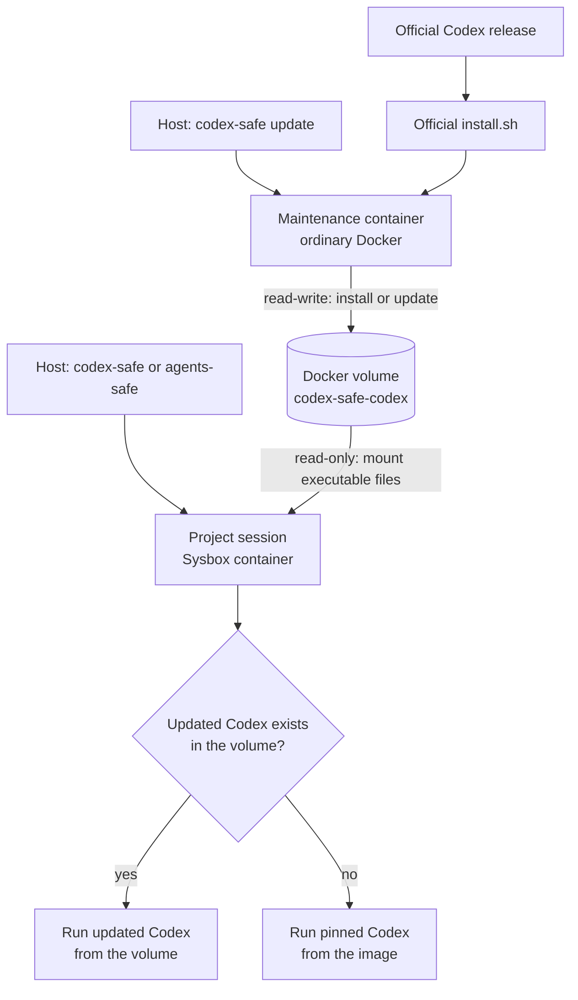

# Persistent Container Codex Installation and Updates

Status: Implemented

Scope:

- the Linux Codex executable used by `codex-safe` and `agents-safe` sessions;
- explicit updates through `codex-safe update`;
- one Docker named volume shared by session and maintenance containers;
- Docker Desktop compatibility for the update command.

Host Codex state remains owned by [Safe Environment](codex-safe.md). Session lifecycle remains owned by
[Go Session Manager](go-session-manager.md).

## Purpose and Intent

The image contains a checksum-pinned Codex binary, but rebuilding the base image and every derived project image for
each Codex release is unnecessarily expensive. Executing the host installation is not portable: a macOS host has a
Darwin binary while the managed container needs Linux.

The solution keeps the image binary as an offline fallback and stores routine Linux updates in one Docker named
volume. OpenAI's official standalone installer owns the release layout, checksum validation, installation lock, and
`current` symlink. This repository does not duplicate that logic with another release protocol.

## Chosen Shape

Normal sessions and updates use the same daemon-local volume in different modes:



The maintenance container is the only supported writer. Any number of project sessions can mount the same volume
read-only; each new Codex process uses the updated binary when it exists and falls back to the image otherwise.

The managed installation is not mounted inside host `CODEX_HOME`. Host configuration, authentication, sessions,
skills, and host-native standalone packages keep their existing mount behavior, but the launcher never selects a
host-native package as the container executable.

## Contract

### 1. Command Interface

The supported update command is:

```text
codex-safe update
```

A leading `update` is recognized before launcher flags and Git discovery. It accepts no version or project arguments
in this implementation. `codex-safe update --help` prints command-specific help.

`codex-safe -- update` remains a forwarded Codex invocation. The image dispatcher rejects direct `codex update` and
points the user to the host command, because normal sessions mount the shared installation read-only.

The update command always uses the product's default base image. It does not use a project-derived image or the
session `--image` override.

### 2. Persistent Volume

The Docker volume name is fixed:

```text
codex-safe-codex
```

It is scoped naturally by the connected Docker daemon and is shared by every project and host user using that daemon.
The volume contains executable packages only, not Codex authentication, configuration, sessions, skills, project
files, or dependency caches.

Docker creates the volume automatically when either a session or update container first mounts it. The launcher does
not implement volume inspect/create/adoption policy, ownership labels, a store protocol version, or migration logic.
Docker-daemon access is already part of the host trusted computing base; labels would not protect the volume from an
actor who can replace containers, images, or volumes through that daemon.

The official installer receives these paths inside the maintenance container:

```text
CODEX_HOME=/opt/codex-safe/codex/home
CODEX_INSTALL_DIR=/opt/codex-safe/codex/bin
CODEX_NON_INTERACTIVE=1
```

The resulting `bin/codex` alias and `home/packages/standalone` tree remain internal to the volume.

### 3. Image Bootstrap and Dispatcher

The image still downloads the pinned standalone musl binary during build and verifies its SHA-256 digest. It installs
that binary at `/usr/local/libexec/codex-bootstrap`.

The image-owned `/usr/local/bin/codex` dispatcher is intentionally small:

1. Reject a direct `codex update` with a host-command diagnostic.
2. Execute `/opt/codex-safe/codex/bin/codex` when it exists and is executable.
3. Otherwise execute the pinned bootstrap.

An empty, removed, or incomplete volume therefore degrades to the image bootstrap. The dispatcher does not parse
release manifests, calculate content digests, validate symlink ancestry, or maintain its own `current` pointer.

### 4. Update Container

`codex-safe update` runs one attached container named `codex-safe-codex-update` with Docker's default runtime. The
container receives:

- the default base image;
- normal outbound network access;
- the installation volume read-write;
- no project bind, host `CODEX_HOME`, credentials, skills, caches, host MCP channel, or Docker socket.

Its image-owned wrapper downloads `https://chatgpt.com/codex/install.sh` with `curl` and runs it non-interactively.
The official installer resolves the native Linux package, verifies release checksums, and owns package staging,
locking, and `current` selection. The wrapper does not scrape GitHub releases or publish packages itself.

The container exit status becomes the `codex-safe update` exit status. A deterministic container name prevents a
second maintenance container from starting concurrently; the installer lock remains the filesystem-level guard.

The launcher does not implement special cancellation cleanup. If the local Docker client is interrupted while the
remote container continues, its deterministic name blocks another update until the first container exits. Operators
can inspect it with ordinary Docker commands.

### 5. Session Mount and Reuse

Every newly created session mounts `codex-safe-codex` read-only at `/opt/codex-safe/codex`. This mount is launcher
policy, not project configuration, and is absent from the host MCP relay sidecar.

Changing the installed Codex version does not recreate a running session. Each new Codex process resolves the volume
alias when it starts; a process already executing keeps its loaded release.

The creation-fingerprint schema is incremented when the read-only volume is introduced so a pre-feature container is
not reused without the mount. Release contents and version are not fingerprint inputs.

### 6. Platform Boundary

The update path uses only the host Docker CLI and an ordinary Linux container. It does not construct
`DockerLauncher`, inspect Git, or require `sysbox-runc`, so the same contract works with Docker Desktop on macOS.

Project sessions remain Linux/Sysbox-only. This design does not add a Docker Desktop session backend or claim macOS
project-session support.

### 7. Trust and Failure Model

- Session containers receive the executable volume read-only; their normal update path cannot modify it.
- The maintenance container is trusted executable supply-chain code and receives network plus the only supported
  read-write mount.
- The official installer and release endpoints are part of the update trusted computing base.
- The pinned image bootstrap remains available when the network is down or no volume release exists.
- A failed installer returns non-zero. Recovery and atomicity inside `packages/standalone` are delegated to the
  official installer rather than reimplemented here.
- Manual removal of `codex-safe-codex` discards all downloaded releases; the next session uses the bootstrap and the
  next update recreates the volume.

## Alternatives Rejected

- Rebuild every image for each Codex release: portable but too slow for routine updates.
- Mount host standalone packages: selects Darwin packages on macOS and depends on host installation layout.
- Install at every session startup: makes launch network-dependent and introduces uncontrolled concurrent writers.
- Repository-owned release manifests and atomic publisher: duplicates the official installer and made the first
  implementation much larger without providing a user-visible update command.
- Per-project or per-UID volumes: duplicate identical executable packages without protecting secrets, because the
  volume intentionally stores none.

## Implementation Map

- `cmd/codex-safe/`: recognizes `codex-safe update` before the normal launcher path.
- `internal/launcher/codex_update.go`: builds the isolated attached maintenance request.
- `internal/launcher/docker_requests.go`: adds the read-only session volume.
- `internal/launcher/dockercli/`: encodes named-volume mounts, entrypoint override, and attached `docker run`.
- `container/codex-dispatcher`: selects the volume installation or image bootstrap.
- `container/codex-safe-update`: runs the official standalone installer.
- `container/Dockerfile`: installs `curl`, the scripts, and the pinned bootstrap.

## Verification

- Unit tests prove update dispatch happens before Git discovery and preserves the container exit code.
- Docker argv tests prove sessions mount the volume read-only while maintenance mounts it read-write without project
  or sensitive host mounts.
- Image validation proves the dispatcher falls back to the pinned bootstrap.
- An ordinary-Docker update probe proves the installer creates a usable release in a disposable volume.
- Linux/Sysbox smoke tests prove the public session sees the read-only volume when that runtime is available.
- A real Docker Desktop macOS run is required before claiming real-host macOS verification.

## Out of Scope

- Version selection, downgrade, channels, automatic/background updates, rollback UI, release pruning, or quotas.
- Custom release manifests, store migrations, ownership labels, or automatic repair.
- Windows support, remote-daemon platform selection, or explicit cross-architecture emulation.
- A macOS project-session backend.
