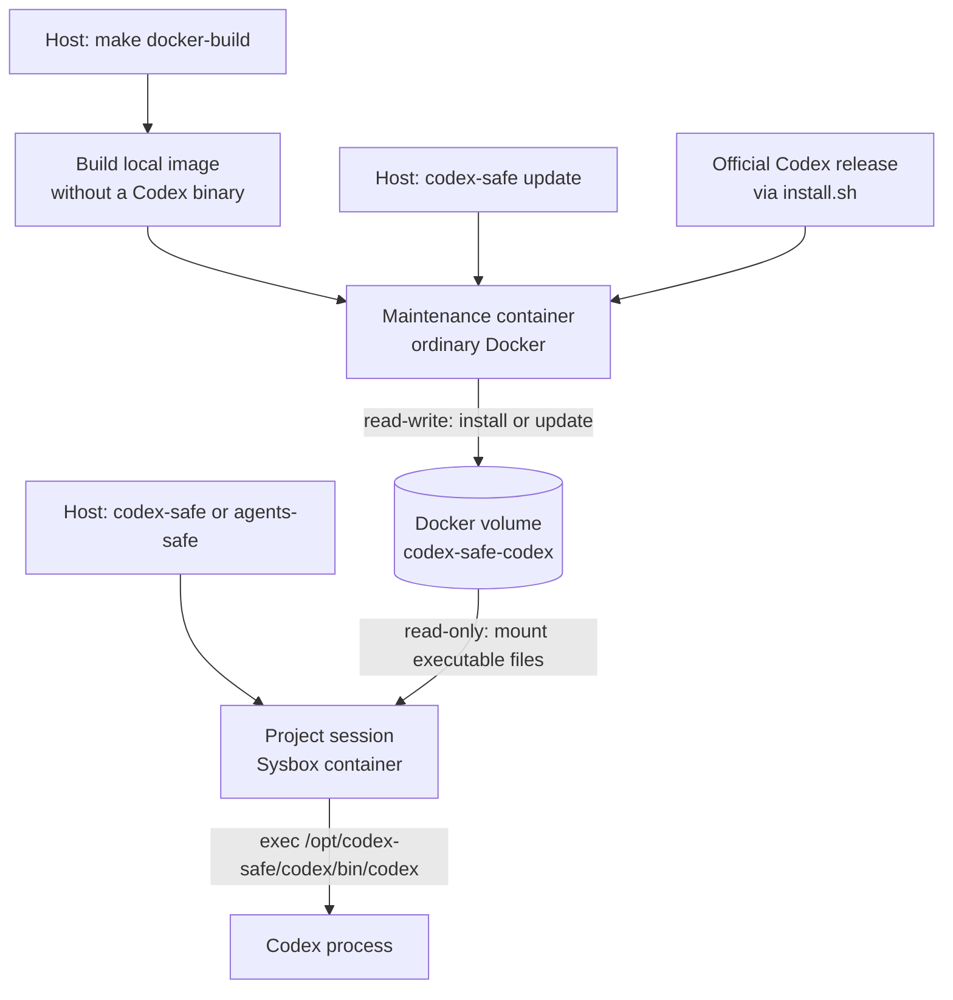

# Persistent Container Codex Installation and Updates

Status: Implemented

Scope:

- the Linux Codex executable used by `codex-safe` and `agents-safe` sessions;
- initialization through `make docker-build`;
- explicit updates through `codex-safe update`;
- one Docker named volume shared by session and maintenance containers;
- the Docker Desktop-compatible maintenance boundary and its current host-launcher portability limitation.

Host Codex state remains owned by [Safe Environment](codex-safe.md). Session lifecycle remains owned by
[Go Session Manager](go-session-manager.md).

## Purpose and Intent

Rebuilding the base image and every derived project image for each Codex release is unnecessarily expensive.
Executing the host installation is not portable: a macOS host has a Darwin binary while the managed container needs
Linux.

The solution stores the only Linux Codex installation in one Docker named volume. `make docker-build` initializes or
updates it immediately after building the local image; `codex-safe update` refreshes it later without rebuilding.
OpenAI's official standalone installer owns the release layout, checksum validation, installation lock, and `current`
symlink. This repository does not duplicate that logic with another release protocol, image fallback, or dispatcher.

## Chosen Shape

Normal sessions and updates use the same daemon-local volume in different modes:



The maintenance container is the only supported writer. Any number of project sessions can mount the same volume
read-only; each new Codex process uses the installation in that volume. The image contains the updater wrapper and
adds the volume's `bin` directory to `PATH`, but contains no Codex executable or dispatcher.

The managed installation is not mounted inside host `CODEX_HOME`. Host configuration, authentication, sessions,
skills, and host-native standalone packages keep their existing mount behavior, but the launcher never selects a
host-native package as the container executable.

## Contract

### 1. Command Interface

The supported update command is:

```text
codex-safe update
```

A leading `update` is recognized before launcher flags and Git discovery. It accepts no version or project arguments
in this implementation. `codex-safe update --help` prints command-specific help.

`codex-safe -- update` remains a forwarded Codex invocation, but it is not a supported update path because normal
sessions mount the shared installation read-only. The supported writer remains the host `codex-safe update` command.

The update command always uses the product's default base image. It does not use a project-derived image or the
session `--image` override.

### 2. Persistent Volume

The Docker volume name is fixed:

```text
codex-safe-codex
```

It is scoped naturally by the connected Docker daemon and is shared by every project and host user using that daemon.
The volume contains executable packages only, not Codex authentication, configuration, sessions, skills, project
files, or dependency caches.

Docker creates the volume automatically when either a session or update container first mounts it. The launcher does
not implement volume inspect/create/adoption policy, ownership labels, a store protocol version, or migration logic.
Docker-daemon access is already part of the host trusted computing base; labels would not protect the volume from an
actor who can replace containers, images, or volumes through that daemon.

The official installer receives these paths inside the maintenance container:

```text
CODEX_HOME=/opt/codex-safe/codex/home
CODEX_INSTALL_DIR=/opt/codex-safe/codex/bin
CODEX_NON_INTERACTIVE=1
```

The resulting `bin/codex` alias and `home/packages/standalone` tree remain internal to the volume.

### 3. Image and Executable Path

The image installs `curl` and the updater wrapper. It contains no Codex executable or Codex dispatcher in its layers.

The product launcher invokes the installer-created executable by absolute path:

```text
/opt/codex-safe/codex/bin/codex
```

The image also prepends `/opt/codex-safe/codex/bin` to `PATH`, so an interactive `agents-safe` shell resolves the same
executable by the bare `codex` name. If the volume is empty or absent, normal executable lookup fails; recovery is
`codex-safe update` or `make docker-build`. A derived project image can currently replace that `PATH` entry without
failing compatibility validation; enforcing it is tracked as `TD-4` in the
[tech debt tracker](../reviews/tech-debt-tracker.md).

### 4. Update Container

Both `make docker-build` and `codex-safe update` run one anonymous attached container with Docker's default runtime.
The container receives:

- the default base image;
- normal outbound network access;
- the installation volume read-write;
- no project bind, host `CODEX_HOME`, credentials, skills, caches, host MCP channel, or Docker socket.

Its image-owned wrapper downloads `https://chatgpt.com/codex/install.sh` with `curl` and runs it non-interactively.
The official installer resolves the native Linux package, verifies release checksums, and owns package staging,
locking, and `current` selection. The wrapper does not scrape GitHub releases or publish packages itself.

The `make docker-build` target first completes `docker build`, then starts this maintenance container from the newly
built image. The named volume is a runtime resource and is not mounted by the Dockerfile build. If installation fails,
the Make target fails even though Docker may already have produced the image.

The container exit status becomes the `codex-safe update` exit status. Docker assigns the container name, while the
official installer lock serializes concurrent writers to the shared volume. The launcher does not add a second
Docker-level update lock or special cancellation cleanup.

### 5. Session Mount and Reuse

Every newly created session mounts `codex-safe-codex` read-only at `/opt/codex-safe/codex`. This mount is launcher
policy, not project configuration, and is absent from the host MCP relay sidecar.

Changing the installed Codex version does not recreate a running session. Each new Codex process resolves the volume
alias when it starts; a process already executing keeps its loaded release.

The creation-fingerprint schema is incremented when the read-only volume is introduced so a pre-feature container is
not reused without the mount. Release contents and version are not fingerprint inputs.

### 6. Platform Boundary

The maintenance path uses only the host Docker CLI and an ordinary Linux container. It does not construct
`DockerLauncher`, inspect Git, or require `sysbox-runc`, so its container contract is compatible with Docker Desktop.
The current host binary still uses Linux-only terminal detection and does not compile for Darwin; enabling the public
`codex-safe update` command on macOS is tracked as `TD-3` in the
[tech debt tracker](../reviews/tech-debt-tracker.md).

Project sessions remain Linux/Sysbox-only. This design does not add a Docker Desktop session backend or claim macOS
project-session support.

### 7. Trust and Failure Model

- Session containers receive the executable volume read-only; their normal update path cannot modify it.
- The maintenance container is trusted executable supply-chain code and receives network plus the only supported
  read-write mount.
- The official installer and release endpoints are part of the update trusted computing base.
- A failed installer returns non-zero. Recovery and atomicity inside `packages/standalone` are delegated to the
  official installer rather than reimplemented here.
- Manual removal of `codex-safe-codex` discards the installation. Sessions then fail executable lookup;
  `codex-safe update` or `make docker-build` recreates it and requires network access.

## Alternatives Rejected

- Rebuild every image for each Codex release: portable but too slow for routine updates.
- Mount host standalone packages: selects Darwin packages on macOS and depends on host installation layout.
- Install at every session startup: makes launch network-dependent and introduces uncontrolled concurrent writers.
- Repository-owned release manifests and atomic publisher: duplicates the official installer and made the first
  implementation much larger without providing a user-visible update command.
- Pinned image bootstrap: duplicates the executable and preserves two release locations only to support offline
  recovery from a missing volume.
- Per-project or per-UID volumes: duplicate identical executable packages without protecting secrets, because the
  volume intentionally stores none.

## Implementation Map

- `cmd/codex-safe/`: recognizes `codex-safe update` before the normal launcher path.
- `internal/launcher/codex_update.go`: builds the isolated attached maintenance request.
- `internal/launcher/docker_requests.go`: adds the read-only session volume.
- `internal/launcher/dockercli/`: encodes named-volume mounts, entrypoint override, and attached `docker run`.
- `container/codex-safe-update`: runs the official standalone installer.
- `container/Dockerfile`: installs `curl`, the updater wrapper, and the volume-backed `PATH` without a Codex
  executable.
- `Makefile`: builds the local image and then initializes or updates the shared volume.

## Verification

- Unit tests prove update dispatch happens before Git discovery and preserves the container exit code.
- Docker argv tests prove sessions mount the volume read-only while maintenance mounts it read-write without project
  or sensitive host mounts.
- Image validation proves no Codex executable or dispatcher exists in the image.
- An empty disposable volume proves the absolute executable path fails until installation.
- An ordinary-Docker update probe proves the installer creates a usable release in a disposable volume.
- Linux/Sysbox smoke tests prove the public session sees the read-only volume when that runtime is available.
- Darwin host-binary compilation and a real Docker Desktop macOS run remain required before claiming macOS support.

## Out of Scope

- Version selection, downgrade, channels, automatic/background updates, rollback UI, release pruning, or quotas.
- Custom release manifests, store migrations, ownership labels, or automatic repair.
- Offline recovery from an empty or removed installation volume.
- Windows support, remote-daemon platform selection, or explicit cross-architecture emulation.
- A macOS project-session backend.
