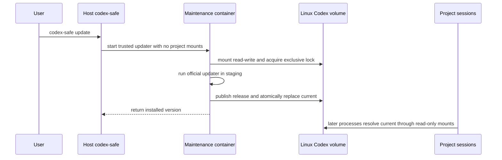

# Persistent Container Codex Installation and Updates

Status: Proposed

Scope:

- the Linux Codex CLI installation used inside `codex-safe` and `agents-safe` containers;
- a Docker-managed store shared across projects, session containers, and container lifetimes;
- image bootstrap, user-requested updates, atomic publication, concurrency, and recovery;
- separation between host-native Codex packages and the container's Linux packages;
- behavior that remains valid for a future macOS launcher backend.

Host Codex state and project mounts remain owned by [Safe Environment](codex-safe.md). Project-derived images remain
owned by [Project-Specific Agent Environments](project-environments.md). Container command lifetime remains owned by
[Go Session Manager](go-session-manager.md).

## Purpose and Intent

### Problem

The base image currently owns one pinned Codex binary. Updating it requires editing checksums, rebuilding the base
image, and rebuilding any project image whose cached base layer changed. Codex releases frequently enough that this
couples routine agent updates to the slower environment release cycle.

Executing the host Codex installation inside the container is not a portable alternative. A macOS host installs a
Darwin executable, while the session container requires a Linux executable. A host package path can also be an npm
wrapper or another layout whose runtime dependencies are absent from the container.

Sharing a writable executable directory directly with every project container is also unsafe. Any agent with root
inside its Sysbox container could replace the shared binary and make a later project execute it.

### Worked Example

Before, a routine Codex update changes the environment image:

```text
edit pinned version and checksums
-> rebuild base image
-> rebuild project-derived image
-> wait for the active session to finish
-> launch the new Codex version
```

After, the user updates the container installation explicitly:

```text
codex-safe update
-> official Linux updater runs in an isolated maintenance container
-> new release is published into a persistent Docker volume
-> future Codex processes in every project use the new release
```

An already-running Codex process continues with the release it started. No session container or project image is
replaced solely because the `current` release changed.

### Chosen Shape

The container installation lives in one Docker named volume per Docker daemon, host UID, store protocol, and Linux
target architecture. Normal session containers mount the store read-only. A short-lived trusted maintenance
container is the only supported writer.

The host Codex home remains the state source for configuration, authentication, sessions, and authored content. A
narrower volume mount shadows only its `packages/standalone` subtree at the normal container path. The managed Codex
dispatcher therefore never selects Darwin, Windows, npm, or other host-native packages.

The image retains a verified, pinned Linux bootstrap installation. An image-owned dispatcher selects a valid
published release from the volume and otherwise runs the bootstrap. The bootstrap decouples first launch and
recovery from network availability; it is not the normal update mechanism.

One session sees the two mounts composed into this filesystem view:

```text
Session container: $CODEX_HOME/
│
│  read-write bind from host $CODEX_HOME
├── config.toml
├── auth.json
├── sessions/
│
│  narrower read-only mount from the Docker named volume
└── packages/standalone/
    ├── current -> releases/<version>-<linux-target>
    └── releases/
```

The narrower volume wins at `packages/standalone`. It hides the same subtree from the host Codex home, so a Darwin
binary on macOS is not visible at the managed executable path. The rest of the host-backed Codex state remains
read-write.

Updating that volume is a separate host operation:



### Success Criteria

- `codex-safe update` updates the Linux container Codex without rebuilding the base or project image.
- The store contract does not assume a Linux host, so a future macOS launcher backend can reuse it without a redesign.
- Host-native Codex packages are never selected as the managed Linux executable.
- Multiple project containers can read the same store concurrently.
- Project sessions cannot modify the shared executable store, including through container-local `sudo`.
- Concurrent update requests cannot publish partial or conflicting releases.
- A failed or interrupted update leaves the previously published release usable.
- An image rebuild is required only when the bootstrap or store protocol changes, not for every Codex release.

### Tradeoff

The store adds Docker-managed persistent state and a maintenance-container path. It also allows the container Codex
version to move independently of the image digest, so an image reference alone no longer identifies the effective
agent version.

The design makes that mutability explicit through store metadata, version diagnostics, and atomic publication. It
keeps the normal session mount read-only so mutable update state does not become a cross-project code-injection path.

## Contract

### 1. Store Identity and Lifecycle

One installation store is shared only when all of these values match:

- Docker daemon;
- invoking host UID;
- store protocol version;
- container operating system, fixed to `linux` in this design;
- selected container architecture, initially `amd64` or `arm64`.

The deterministic volume name is:

```text
codex-safe-codex-v<store-protocol>-<host-uid>-linux-<architecture>
```

The architecture belongs to the container image and Docker execution target, not to the host Codex executable. An
Apple Silicon client therefore selects the Linux `arm64` store when it launches Linux `arm64` containers. A future
explicit emulation mode must select the emulated image architecture instead.

The launcher creates or inspects the volume with these ownership labels:

```text
codex-safe.managed=true
codex-safe.resource=codex-installation
codex-safe.host-uid=<decimal uid>
codex-safe.codex-target=linux-<architecture>
codex-safe.codex-store-protocol=<integer>
```

An existing deterministic name with missing or conflicting labels fails before any container mounts it. The
launcher never adopts or deletes an unowned volume.

The volume outlives every session and maintenance container. Ordinary session cleanup does not remove it. Manual
Docker volume removal or pruning may remove an unused store; the next session then uses the image bootstrap until a
new update initializes the store.

### 2. Mount Topology and State Separation

Every session container mounts the installation volume read-only at:

```text
<container Codex home>/packages/standalone
```

When a host Codex home exists, its read-write bind is mounted first at the container Codex home. The narrower named
volume is mounted afterward and shadows only `packages/standalone`. Configuration, authentication, logs, sessions,
skills, plugins, and other state keep the existing host-backed behavior.

When no host Codex home exists, the same installation volume is mounted below the ephemeral container home. The
Codex state remains ephemeral, but the Linux executable installation is still available across sessions.

The session mount has these invariants:

- it is `type=volume`, not a host bind mount;
- it is read-only for every project session;
- it is absent from the relay sidecar and read-write only in the maintenance container;
- it shadows the host-native `packages/standalone` directory at the normal container path;
- project configuration cannot replace, disable, redirect, or overlap its target;
- the broad Codex-home bind precedes the narrower installation mount in Docker argv;
- the read-only volume nested inside the read-write Codex-home bind is an intended overlap. The overlap resolver in
  [Safe Environment](codex-safe.md#3-mount-plan) must accept this narrower read-only mount instead of rejecting it as
  an incompatible-mode conflict.

The volume is a launcher-managed runtime resource, not a `common.mounts` entry and not project intent serialized in
`.agents-safe/config.toml`.

The nested mount is an executable-selection boundary, not a stronger claim about the existing read-write Codex-home
trust model. Host state remains exposed under the contract in [Safe Environment](codex-safe.md). Excluding one host
subtree from container root would require a separate state-projection design rather than a nested mount alone.

### 3. Bootstrap and Executable Selection

The base image contains an updater-compatible Linux standalone bootstrap selected for the image architecture. The
image build pins and verifies that seed under the repository dependency policy and proves its version and target.

The bootstrap must include every file required for the official installation to self-update. A raw release binary
is sufficient only if a qualification test proves that the upstream updater recognizes and upgrades that layout.
Implementation cannot rely solely on the presence of an `update` subcommand or an observed `install.lock` file.

The image-owned `/usr/local/bin/codex` dispatcher performs this selection for both public launchers:

1. Inspect the store protocol marker and `current` entry.
2. Resolve `current` without allowing a path outside the store.
3. Validate the package layout, Linux target architecture, regular executable, and declared entrypoint.
4. Execute the published binary when the store is valid.
5. Execute the image bootstrap when the store is empty or has never been initialized.
6. Fail closed with a recovery diagnostic when an initialized store is malformed or inconsistent.

An invalid initialized store never silently falls back to an older image binary. Silent fallback would hide
corruption and make `codex --version` depend on an error path.

The selected release contents are immutable after publication. Only the `current` pointer and store metadata may
change during an update.

### 4. Update Command and Isolation

The supported user interface is:

```text
codex-safe update
```

This is a host launcher subcommand, like `agents-safe init`. A leading `update` token is recognized before launcher
options and Git discovery and does not require a project. It extends the `codex-safe` command grammar owned by
[Safe Environment](codex-safe.md#1-command-interface), which otherwise forwards only Codex arguments after `--`. As
with `agents-safe -- init`, `codex-safe -- update` still forwards `update` to Codex rather than invoking this
subcommand.

Inside a managed session the image-owned dispatcher rejects a direct `codex update` with a concise diagnostic directing
the user to run `codex-safe update` on the host. The maintenance helper is a separate image entrypoint that invokes the
official updater directly, so it is not subject to that session-dispatcher block.

The launcher runs the update through the trusted base image, never through a project-derived image. The maintenance
container receives:

- the installation volume read-write;
- ordinary outbound network access required by the official updater;
- a temporary home and staging directory;
- the target UID, GID, operating system, architecture, and store protocol.

It receives no project mount, host Codex home, credentials, personal skills, host Docker socket, host MCP channel,
dependency cache, or nested Docker daemon. It uses Docker's default runtime rather than Sysbox because it runs no
agent or project code.

The maintenance container has a deterministic name derived from the same store identity. A concurrent updater sees
that owned name and reports that an update is already in progress. The updater also holds a kernel file lock inside
the volume while it validates or publishes state; process exit releases the lock after crashes or cancellation.

### 5. Staged Publication

The maintenance helper treats the official updater as a download and installation engine, not as an owner of the
live store pointer.

An update follows this order:

1. Acquire the exclusive store lock.
2. Record and validate the currently published release, when present.
3. Create an isolated staging Codex home outside the live release namespace.
4. Seed staging from the current installation or the image bootstrap.
5. Run the official Linux `codex update` against staging.
6. Validate the staged package version, target, entrypoint, and executable behavior.
7. Copy the new release into a temporary directory under the persistent store.
8. Atomically rename that directory to its immutable release name.
9. Atomically replace `current` and then update the store metadata.
10. Release the lock and remove transient staging state.

The live `current` pointer is never handed directly to the upstream updater. A download failure, invalid artifact,
signal, full filesystem, or helper crash before publication leaves the previous pointer unchanged.

Publishing the same validated version twice is an idempotent success, judged by comparing the staged release content
digest against the already-published release. Publishing different bytes under an existing immutable release name fails
closed.

The implementation uses the official Codex updater because `codex update` is the supported command for releases
whose installation type supports self-update. The repository does not implement its own latest-version service or
GitHub release scraper.

### 6. Readers, Writers, and Active Sessions

A Docker named volume may be attached to multiple containers simultaneously. This design does not depend on
uncoordinated multi-writer behavior:

- session containers are concurrent read-only readers;
- at most one maintenance container is the read-write publisher;
- normal readers take no long-lived lock;
- the writer publishes a fully validated release before atomically changing `current`.

A process resolves `current` once during startup. It continues using that release after an update. A later process in
the same or another session container resolves the new release.

Published release directories are not removed automatically. Retaining them prevents a running process from losing
late-loaded resources after `current` moves. Garbage collection requires a separate design that can prove no active
process references a candidate release.

The release version and `current` target are intentionally excluded from the session creation fingerprint. The
fingerprint includes the volume identity, target, mount mode, and store protocol, so a changed store contract rejects
reuse while a routine version update does not.

### 7. Runtime and Failure Behavior

- Update unavailable: the current release or image bootstrap continues to run; the command returns the updater
  failure without changing `current`.
- Update already running: the second request exits without starting another writer and identifies the owned
  maintenance container.
- Empty store: normal sessions use the image bootstrap; `codex-safe update` may initialize the first release.
- Invalid initialized store: normal launch fails with the volume name, target, and a recovery diagnostic.
- Missing volume: the launcher creates a correctly labelled empty volume without network access.
- Removed unused volume: the next launch recreates it and returns to the image bootstrap.
- Unsupported target: launch fails before mounting a host-native or wrong-architecture package.
- Docker or network failure: the failure is reported as environment or update transport failure, never as a request
  to rebuild a project image.

Recovery never deletes the store automatically. An operator may inspect, back up, or explicitly remove the owned
volume after all containers using it have stopped. Destructive reset and automatic pruning are outside this design.

### 8. Security and Trust

The persistent store contains executable code shared across projects, so its write boundary is narrower than the
existing read-write Codex state mount.

- Project sessions receive only a read-only volume mount, even though their user has passwordless container-local
  `sudo`.
- The maintenance container runs only image-owned code plus the official updater.
- Project files, project images, and host Codex packages never participate in update publication.
- The store target and metadata are validated before every execution.
- No updater path gains the host Docker socket, host filesystem root, or broader host home.

This prevents a project agent from persistently replacing the Codex executable used by another project. It does not
make upstream Codex releases or the Docker daemon untrusted; both remain part of the local trusted computing base.

## Invariants

- A host-native Codex executable is never selected by the managed Linux launcher.
- The normal session mount of the persistent installation store is always read-only.
- Only a trusted maintenance container may publish a release.
- `current` changes only after complete validation and through an atomic filesystem operation.
- A failed update preserves the previously published release.
- Store identity includes the container target architecture and never infers it from a host package path.
- Routine Codex updates do not rebuild or replace session and project images.
- Existing Codex processes are never terminated to activate a new release.

## Boundaries and Non-Goals

This design does not add a macOS session runtime. The current Sysbox boundary remains Linux-only. It ensures that the
Codex installation contract does not assume a Linux host and can be reused by a future Docker Desktop or other
macOS-compatible backend.

The first implementation excludes:

- executing or copying a host Codex installation;
- npm installation and a Node runtime in the base image;
- automatic updates at every session startup;
- arbitrary version selection, downgrade, beta-channel, or rollback commands;
- multi-daemon, Swarm, Kubernetes, NFS, or custom volume-driver coordination;
- automatic release garbage collection or volume pruning;
- sharing one executable store between different host UIDs;
- modifying authentication, configuration, plugins, skills, or session-state persistence.

The default Docker local volume driver is the supported first implementation. Remote drivers require their own
multi-attach, locking, atomic-rename, and failure-semantics qualification.

## Test Plan

### Upstream Qualification Spike

Before implementation commits to the seed layout, a bounded spike must prove on both Linux targets:

- the image bootstrap installation is recognized by the official updater;
- update succeeds from an isolated staging Codex home;
- the resulting package metadata identifies the expected Linux target and entrypoint;
- a failed or killed updater does not mutate the live managed store;
- no undocumented host package path is needed.

If the raw image binary cannot self-update, the image must ship a complete updater-compatible seed. The launcher must
not reimplement release discovery as a workaround without a new design decision.

### Focused Tests

- deterministic volume and maintenance-container names for UID, protocol, and target;
- owned-volume creation and rejection of conflicting labels;
- exact parent Codex-home bind followed by the narrower read-only volume mount;
- absence of host package visibility below the shadowed target;
- dispatcher selection for empty, valid, escaping, wrong-target, and corrupt stores;
- update dispatch before Git discovery and clear rejection inside an ordinary session;
- staged publication, idempotent same-version publication, and atomic `current` replacement;
- cancellation, full-store, malformed-package, and interrupted-copy failure paths;
- fingerprint inclusion of store identity but exclusion of the selected release version.

### Docker Integration Tests

- two ordinary containers mount and execute from the same volume simultaneously;
- their store mounts remain read-only even for container root;
- one maintenance container publishes while both readers stay alive;
- an existing process keeps its old release while a later process selects the new release;
- two concurrent update requests produce one writer and one deterministic diagnostic;
- killing the writer releases coordination and preserves the old `current` pointer;
- a fake Darwin host package remains hidden while the Linux package executes;
- volume removal after all users stop returns the next launch to the image bootstrap.

These tests use the ordinary Docker runtime and do not require Sysbox unless they assert the full session security
boundary.

### Real-Host Acceptance

The Linux real-host smoke gate proves the complete launcher, Sysbox, read-only mount, container-local `sudo`, and
cross-project reuse path. A Docker Desktop test may prove volume sharing and Linux target selection on macOS before a
full macOS session backend exists; it must not claim Sysbox parity.

The repository docs gate remains `make check-docs` for this proposal. Implementation later selects the code, image,
Docker, and real-host suites through [Testing](../testing.md).

## External Contracts

- [Codex CLI command reference](https://learn.chatgpt.com/docs/developer-commands?surface=cli#cli-codex-update):
  `codex update` is the supported self-update command when the installed release supports it.
- [Docker volume documentation](https://docs.docker.com/engine/storage/volumes/): a named volume persists outside a
  container lifecycle and may be mounted into multiple containers simultaneously.

Neither source documents the repository-specific staging, locking, store protocol, or publication rules. Those are
owned by this design and must be tested locally.

## Where the Code Lives

- `cmd/codex-safe/`: host `update` subcommand routing and user diagnostics.
- `internal/launchcli/`: platform/store resolution shared by public launcher construction.
- `internal/launcher/`: volume ownership, maintenance-container lifecycle, session mount, and fingerprint policy.
- `internal/launcher/dockercli/`: typed volume inspect/create and bind-versus-volume Docker argv transport.
- `cmd/codex-safe-session/`: image-owned dispatcher and maintenance-helper entrypoints.
- `internal/container/`: package validation, staging, locking, publication, and privilege drop.
- `container/`: verified bootstrap installation and dispatcher paths.
- `tests/smoke/`: real Docker, Sysbox, cross-project, and platform-boundary proof.
