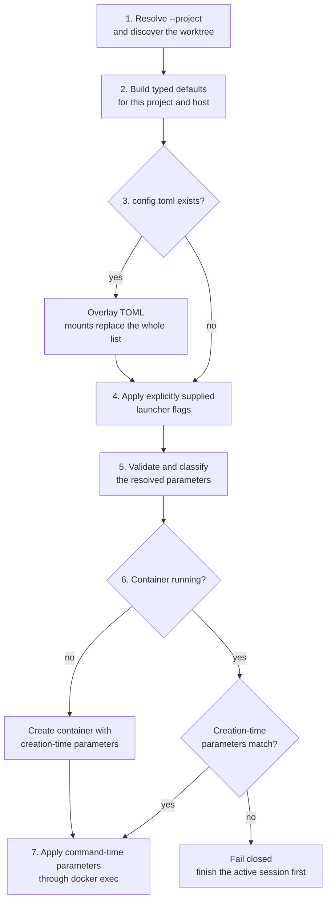

# Project Launcher Configuration

Status: Proposed

Scope:

- the generated `.agents-safe/config.toml` schema;
- project-config and CLI precedence for `codex-safe` and `agents-safe`;
- `.agents-safe/.gitignore` creation.

Image builds remain owned by [Project-Specific Agent Environments](project-environments.md). Mount topology, Codex
command policy, and container reuse remain owned by [Safe Environment](codex-safe.md).

## Purpose and Intent

### Proposal

`agents-safe init` writes one typed project config containing the effective launcher defaults. Later invocations read
that file, apply only explicitly supplied CLI overrides, validate the result, and launch with the resolved values.

This gives the user two things immediately:

- visibility: the project file shows the image, mount plan, host-MCP choice, and launcher-specific arguments;
- persistence: editing a value once replaces the need to pass the same flag on every invocation.

Parameters have two lifecycle classes:

| Class | Parameters | Running-container behavior |
| --- | --- | --- |
| Creation-time | image, mounts, host MCP | Must match; a mismatch fails without replacement. |
| Command-time | Codex and agent argv | Applied immediately through `docker exec`. |

`--project` is a bootstrap parameter: it selects the worktree and deterministic container identity before config
resolution begins.

### Default Values

| Area | Default | Meaning |
| --- | --- | --- |
| Bootstrap | `--project .` | Discover the Git worktree from the current directory. |
| Common | `image = "codex-safe-mvp:local"` | Base or direct session image. |
| Common | `no_host_mcp = false` | Forward eligible host MCP servers. |
| Common | resolved mount snapshot | Use the project, Git, Codex-home, skills, and MCP roles shown below. |
| Codex | `arguments = ['--sandbox', 'danger-full-access']` | Use the Sysbox container as the sandbox boundary. |
| Agents | no default argv | Require a command on every `agents-safe` invocation. |

### Resolution Order



`--project` is the only bootstrap option: it must be resolved before the project config can be found. At the CLI
layer, an omitted flag changes nothing; only a flag explicitly present in argv overrides the file.

### Worked Example

For this repository, `agents-safe init` generates:

```toml
[common]
image = "codex-safe-mvp:local"
no_host_mcp = false

[[common.mounts]]
role = "host_git_config"
source = "/home/alex/.gitconfig"
target = "/home/alex/.gitconfig"
read_only = true
comment = "Expose Git identity and includes without allowing the container to change them."

[[common.mounts]]
role = "primary_checkout"
source = "/home/alex/sources/agents-safe-environment"
target = "/home/alex/sources/agents-safe-environment"
read_only = true
comment = "Expose the primary checkout needed by the linked worktree without allowing branch changes there."

[[common.mounts]]
role = "common_git_dir"
source = "/home/alex/sources/agents-safe-environment/.git"
target = "/home/alex/sources/agents-safe-environment/.git"
read_only = false
comment = "Keep shared Git refs, indexes, locks, and linked-worktree metadata writable."

[[common.mounts]]
role = "worktree"
source = "/home/alex/sources/agents-safe-environment-init-command-support"
target = "/home/alex/sources/agents-safe-environment-init-command-support"
read_only = false
comment = "Expose the init-command-support branch worktree at the same absolute path used by host tools."

[[common.mounts]]
role = "codex_home"
source = "/home/alex/.codex"
target = "/home/alex/.codex"
read_only = false
comment = "Persist Codex configuration, authentication, sessions, logs, and installed state."

[[common.mounts]]
role = "personal_skills"
source = "/home/alex/.agents/skills"
target = "/home/alex/.agents/skills"
read_only = true
comment = "Expose personal skills without allowing the project to modify their source."

[[common.mounts]]
role = "host_mcp_channel"
source = "runtime://host-mcp-channel"
target = "/run/codex-safe-host-mcp"
read_only = false
comment = "Carry private Unix sockets to eligible host MCP relays."

[codex]
arguments = [
    '--sandbox', 'danger-full-access'
]

[agents]
```

### Success Criteria

- The first screen explains what is configured and the exact application order.
- The generated file accounts for every bind-mount role that can appear in the session container.
- Project values persist until the user edits the file; explicit CLI values affect one invocation.
- A running container is reused only when all creation-time parameters match.
- Invalid or stale paths fail before Docker creation.
- An explicit Codex sandbox choice is never overridden by configured defaults.

### Tradeoff

The file is an explicit host-specific snapshot. This makes the effective project settings inspectable and editable,
but a host-path change requires the user to update the file rather than silently accepting newly discovered state.

## Contract

### 1. Generated Files

`agents-safe init [--project PATH]` creates missing files without overwriting user content:

```text
<worktree>/.agents-safe/Dockerfile.sample
<worktree>/.agents-safe/config.toml
<worktree>/.agents-safe/.gitignore
```

`Dockerfile.sample` is an embedded text resource. `config.toml` is the TOML serialization of the resolved typed
defaults. Initialization reads project and host filesystem state but does not contact Docker or start a container.

`.agents-safe/.gitignore` contains:

```gitignore
*
!.gitignore
!Dockerfile
```

The worktree-root `.gitignore` is not modified. Only `.agents-safe/.gitignore` and an activated `Dockerfile` are
trackable by default.

### 2. Typed Schema

```go
type ProjectConfig struct {
	Common CommonConfig `toml:"common"`
	Codex  CodexConfig  `toml:"codex"`
	Agents AgentsConfig `toml:"agents"`
}

type CommonConfig struct {
	Image     string        `toml:"image"`
	NoHostMCP bool          `toml:"no_host_mcp"`
	Mounts    []MountConfig `toml:"mounts"`
}

type CodexConfig struct {
	Arguments []string `toml:"arguments"`
}

type AgentsConfig struct{}

type MountConfig struct {
	Role     string `toml:"role"`
	Source   string `toml:"source"`
	Target   string `toml:"target"`
	ReadOnly bool   `toml:"read_only"`
	Comment  string `toml:"comment"`
}
```

`CommonConfig` applies to both launchers. `CodexConfig` contains default Codex argv. `AgentsConfig` is empty until
`agents-safe` has launcher-specific defaults. `MountConfig.Comment` is serialized documentation and does not affect
Docker arguments.

### 3. File Layering

The decoder starts from a complete default `ProjectConfig` and overlays the TOML file:

- omitted scalar or section: retain the typed default;
- present scalar: replace the typed default;
- omitted `common.mounts`: retain the resolved default mount snapshot;
- present `common.mounts`: replace the entire list; mounts are never merged by index, role, source, or target.

The config is authoritative when present. The launcher does not silently reinsert a deleted entry or replace a stale
path. Validation instead requires the mandatory roles and modes defined by the
[mount-plan contract](codex-safe.md#3-mount-plan).

### 4. Parameter Classes and Active Containers

Creation-time parameters define immutable container state:

- the resolved image reference and whether explicit-image intent bypasses the project Dockerfile;
- the normalized mount plan, excluding `MountConfig.Comment`;
- `no_host_mcp` and the effective host-MCP endpoint identity.

The launcher stores a deterministic creation-time fingerprint on the container. A running container is reusable only
when its ownership, protocol, and creation-time fingerprint match the current request.

On mismatch, the launcher fails with the running and requested fingerprints and asks the user to finish the active
session. It never silently uses stale creation-time settings, stops another command, or replaces the container. After
the active container exits and is removed, the next invocation creates one from the resolved config.

Command-time parameters are the configured and invocation argv for `codex-safe` or `agents-safe`. They are not part of
the creation-time fingerprint and are applied to every command through `docker exec`, including commands entering a
reused container.

Every future config field must declare one of these classes. A creation-time field must participate in the
fingerprint; a command-time field must not.

### 5. CLI and Command Precedence

After file layering, only explicitly supplied launcher flags override the config. In particular:

- an omitted `--no-host-mcp` preserves `common.no_host_mcp`;
- `--no-host-mcp` sets it to `true` for one invocation;
- `--no-host-mcp=false` sets it to `false` for one invocation;
- an omitted `--image` preserves `common.image` and does not set explicit-image intent;
- an explicit `--image` replaces the image and bypasses `.agents-safe/Dockerfile` for that invocation.

`codex.arguments` is default argv in native Codex form. Invocation arguments are combined using the
[Codex command policy](codex-safe.md#codex-executable-and-process): when invocation arguments explicitly select a
sandbox policy, the configured default sandbox pair is suppressed. Other arguments remain separate argv elements;
the launcher does not invoke a shell.

### 6. Mount Serialization

`common.mounts` serializes the mount plan whose topology and required modes are owned by
[Safe Environment](codex-safe.md#3-mount-plan). `role` makes validation independent of list position and explains
why a mount exists. Supported roles are:

- `host_git_config`, `primary_checkout`, `common_git_dir`, `worktree`;
- `codex_home`, `personal_skills`, `host_mcp_channel`;
- `additional` for an explicit user-added mount.

Filesystem sources and targets are canonical absolute paths. Required roles must match the discovered project and
host identity. Security-sensitive read-only modes cannot be weakened. Duplicate targets, root sources, missing
sources, invalid modes, and unsafe overlaps fail before Docker creation.

The `host_mcp_channel` role is conditional. Its `runtime://host-mcp-channel` source is not treated as a filesystem
path. The launcher materializes it only when `common.no_host_mcp` is `false` and eligible endpoints exist. Otherwise
the session has no channel mount. Channel creation and lifetime remain owned by
[Host MCP Access](host-mcp-forwarding.md).

Mount changes apply only when a container is created. A different resolved mount plan causes a creation-time
fingerprint mismatch while the previous container is running.

### 7. Validation and Failure Behavior

The config must be a regular, non-symlink TOML file. Unknown keys, invalid types, an empty image, unsafe Codex argv,
missing required mount roles, and invalid mounts fail before Docker launch. Both binaries validate the complete file,
including the other launcher's section.

The file is loaded on every invocation. Creation-time changes require a matching container or a cold create;
command-time changes apply to the current command.

The file is local machine state and remains ignored. Project code can edit it through the writable worktree and
affect a later launch, so every writable source in the file must be treated as accessible to project code.

## Boundaries and Non-Goals

- Internal Docker runtime, timeout, naming, relay, and lifecycle constants are not user configuration.
- `--project`, positional agent commands, and one-invocation Codex arguments are not serialized.
- Config changes do not mutate a running container.
- The config is host-specific and must not contain credentials.

## Test Plan

- Initialization serializes the exact typed config and creates the exact local ignore file.
- The resolution-order tests distinguish omitted flags from explicit boolean values.
- Scalar overlay, omitted mounts, whole-list mount replacement, and required-role validation are covered.
- An invalid or stale mount snapshot fails before Docker creation.
- Creation-time fingerprints are stable, exclude comments and command argv, and cover every immutable config field.
- A running-container fingerprint mismatch fails without reuse, stop, or replacement.
- Config image and explicit CLI-image intent retain distinct project-Dockerfile behavior.
- Explicit invocation sandbox arguments suppress the configured default sandbox pair.
- Host-MCP mount presence follows `no_host_mcp` and endpoint eligibility.
- Real Sysbox smoke compares serialized mount roles with session-container `docker inspect` output.

Implementation requires focused Go tests, `make lint`, `make test`, `make check-docs`, and `make test-smoke-go` on a
host with Sysbox.

## Where the code lives

The authoritative ownership map is in [Architecture](../../ARCHITECTURE.md#core-modules). This design changes:

- `cmd/agents-safe/` and `cmd/codex-safe/`: launcher-specific typed defaults;
- `internal/cli/`: config and explicit-CLI precedence;
- `internal/launcher/projectenv/`: initialization, TOML loading, and project-config validation;
- `internal/launcher/launchplan/`: required mount-role validation;
- `internal/launcher/`: image, mount, host-MCP, and command application.
