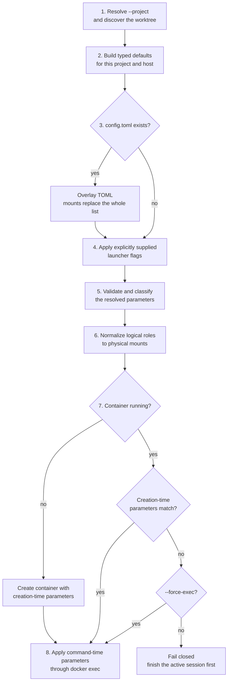

# Project Launcher Configuration

Status: Implemented

Scope:

- the generated `.agents-safe/config.toml` schema;
- project-config and CLI precedence for `codex-safe`, `claude-safe`, and `agents-safe`;
- `.agents-safe/.gitignore` creation.

Image builds remain owned by [Project-Specific Agent Environments](project-environments.md). Mount topology and
container reuse remain owned by [Safe Environment](agents-safe.md); product command/state policy is split between that
document and [Safe Claude Code Integration](claude-safe.md).

## Purpose and Intent

### Proposal

`agents-safe init` writes one typed project config containing the effective launcher defaults. Later invocations read
that file, apply only explicitly supplied CLI overrides, validate the result, and launch with the resolved values.

This gives the user two things immediately:

- visibility: the project file shows the image, mount plan, host-MCP choice, and launcher-specific arguments;
- persistence: editing a value once replaces the need to pass the same flag on every invocation.

Parameters have two lifecycle classes:

| Class | Parameters | Running-container behavior |
| --- | --- | --- |
| Creation-time | image, mounts, host MCP, dependency caches | Must match; a mismatch fails without replacement. |
| Command-time | Codex, Claude Code, and generic argv; managed Go and uv cache routing | Applied through `docker exec`. |
| Adoption-time | invocation-only `--force-exec` | May accept the active container's existing creation contract. |

`--project` is a bootstrap parameter: it selects the worktree and deterministic container identity before config
resolution begins.

### Default Values

| Area | Default | Meaning |
| --- | --- | --- |
| Bootstrap | `--project .` | Discover the Git worktree from the current directory. |
| Common | `image = "agents-safe-mvp:local"` | Base or direct session image. |
| Common | `no_host_mcp = false` | Forward eligible host MCP servers. |
| Common | `use_host_python_venv = false` | Mask discovered project-local Python virtual environments. |
| Common | resolved logical mount snapshot | Complete project/Git topology and available host integrations. |
| Codex | `arguments = ['--sandbox', 'danger-full-access']` | Use the Sysbox container as the sandbox boundary. |
| Claude | `arguments = ['--permission-mode', 'auto']` | Delegate permission decisions to Claude Code's automatic mode. |
| Agents | no default argv | Require a command on every `agents-safe` invocation. |

### Resolution Order



`--project` is the only bootstrap option: it must be resolved before the project config can be found. At the CLI
layer, an omitted flag changes nothing; only a flag explicitly present in argv overrides the file.

`--force-exec` is not a project-config override. It is an invocation-only adoption decision made after resolution and
fingerprinting: the current plan is still computed for diagnostics, but the owned, protocol-compatible active
container's creation-time resources remain in effect.

Host paths are resolved once per invocation. The canonical home used to build mount targets is carried through the
resolved CLI configuration into lazy launcher construction, so container environment and exec requests use the same
snapshot without repeating Git-config discovery.

### Worked Example

For this repository, `agents-safe init` generates:

```toml
[common]
image = "agents-safe-mvp:local"
no_host_mcp = false
use_host_python_venv = false

[[common.mounts]]
role = "host_git_config"
source = "/home/alex/.gitconfig"
target = "/home/alex/.gitconfig"
read_only = true
comment = "Optional: expose host Git identity and includes read-only."

[[common.mounts]]
role = "primary_checkout"
source = "/home/alex/sources/agents-safe-environment"
target = "/home/alex/sources/agents-safe-environment"
read_only = true
comment = "Required: expose the primary checkout for Git topology."

[[common.mounts]]
role = "common_git_dir"
source = "/home/alex/sources/agents-safe-environment/.git"
target = "/home/alex/sources/agents-safe-environment/.git"
read_only = false
comment = "Required: keep shared Git metadata writable."

[[common.mounts]]
role = "worktree"
source = "/home/alex/sources/agents-safe-environment-init-command-support"
target = "/home/alex/sources/agents-safe-environment-init-command-support"
read_only = false
comment = "Required: expose the selected worktree writable."

[[common.mounts]]
role = "codex_home"
source = "/home/alex/.codex"
target = "/home/alex/.codex"
read_only = false
comment = "Optional: persist host Codex state."

[[common.mounts]]
role = "claude_home"
source = "/home/alex/.claude"
target = "/home/alex/.claude"
read_only = false
comment = "Optional: persist host Claude Code state."

[[common.mounts]]
role = "claude_config"
source = "/home/alex/.claude.json"
target = "/home/alex/.claude.json"
read_only = false
comment = "Optional: persist host Claude Code global configuration."

[[common.mounts]]
role = "personal_skills"
source = "/home/alex/.agents/skills"
target = "/home/alex/.agents/skills"
read_only = true
comment = "Optional: expose personal skills read-only."

[[common.mounts]]
role = "host_mcp_channel"
source = "runtime://host-mcp-channel"
target = "/run/agents-safe-host-mcp"
read_only = false
comment = "Optional: forward eligible host MCP endpoints."

[codex]
arguments = [
    '--sandbox', 'danger-full-access'
]

[claude]
arguments = [
    '--permission-mode', 'auto'
]

[agents]
```

### Success Criteria

- The first screen explains what is configured and the exact application order.
- The generated file always contains the three required project/Git roles; Docker receives their minimal normalized
  physical mount set.
- Project values persist until the user edits the file; explicit CLI values affect one invocation.
- Removing a required mount fails before Docker access; removing a degradable mount starts with an explicit warning.
- A running container is reused only when all creation-time parameters match, unless that invocation explicitly uses
  `--force-exec`.
- Invalid or stale paths fail before Docker creation.
- An explicit Codex sandbox choice is never overridden by configured defaults.
- An explicit Claude permission mode is never overridden by configured defaults.

### Tradeoff

The file is an explicit host-specific snapshot. This makes the effective project settings inspectable and editable,
but a host-path change requires the user to update the file rather than silently accepting newly discovered state.

## Contract

### 1. Generated Files

`agents-safe init [--project PATH]` creates missing files without overwriting user content:

```text
<worktree>/.agents-safe/Dockerfile.sample
<worktree>/.agents-safe/config.toml
<worktree>/.agents-safe/.gitignore
```

`Dockerfile.sample` is an embedded text resource. `config.toml` is the TOML serialization of the resolved typed
defaults. Initialization reads project and host filesystem state but does not contact Docker or start a container.

`.agents-safe/.gitignore` contains:

```gitignore
*
!.gitignore
!Dockerfile
```

The worktree-root `.gitignore` is not modified. Only `.agents-safe/.gitignore` and an activated `Dockerfile` are
trackable by default.

### 2. Typed Schema

```go
type ProjectConfig struct {
	Common CommonConfig `toml:"common"`
	Codex  CodexConfig  `toml:"codex"`
	Claude ClaudeConfig `toml:"claude"`
	Agents AgentsConfig `toml:"agents"`
}

type CommonConfig struct {
	Image     string        `toml:"image"`
	NoHostMCP bool          `toml:"no_host_mcp"`
	Mounts    []MountConfig `toml:"mounts"`
}

type CodexConfig struct {
	Arguments []string `toml:"arguments"`
}

type ClaudeConfig struct {
	Arguments []string `toml:"arguments"`
}

type AgentsConfig struct{}

type MountRole string

type MountConfig struct {
	Role     MountRole `toml:"role"`
	Source   string    `toml:"source"`
	Target   string    `toml:"target"`
	ReadOnly bool      `toml:"read_only"`
	Comment  string    `toml:"comment"`
}
```

`CommonConfig` applies to all launchers. `CodexConfig` and `ClaudeConfig` contain their product's default argv.
`AgentsConfig` is empty until `agents-safe` has launcher-specific defaults. `MountRole` gives role constants and
downstream launch-plan APIs one shared domain type. `MountConfig.Comment` is serialized documentation and does not
affect Docker arguments.

The implemented Go and uv cache contract of [Host-Backed Dependency Caches](host-backed-dependency-caches.md) extends
`CommonConfig` and increments the creation-time fingerprint schema to version 2:

```go
type CommonConfig struct {
	Image             string                  `toml:"image"`
	NoHostMCP         bool                    `toml:"no_host_mcp"`
	UseHostPythonVenv bool                    `toml:"use_host_python_venv"`
	Mounts            []MountConfig           `toml:"mounts"`
	TmpfsMounts       []TmpfsMountConfig      `toml:"tmpfs_mounts"`
	DependencyCaches  []DependencyCacheConfig `toml:"dependency_caches"`
}

type TmpfsMountConfig struct {
	Target  string `toml:"target"`
	Mode    string `toml:"mode"`
	Comment string `toml:"comment"`
}
```

`dependency_caches` is creation-time configuration. Its host-side resolvers, kind-derived sharing policies,
path-preserving targets, managed container routing, and validation policy remain owned by the cache design; this
document owns its typed schema, overlay behavior, and participation in container reuse. `go_build`, `go_modules`, and
`uv` are implemented; the field is part of the version 2 fingerprint. Maven and Gradle are deferred.

`tmpfs_mounts` is an optional explicit base for the Python-environment isolation plan and is empty by default; the
generated config preconfigures no venv target. Targets must be canonical absolute paths strictly inside the selected
worktree and cannot contain Docker's `--tmpfs` option delimiter (`:`); modes are three- or four-digit octal strings.
Duplicate and overlapping targets fail before Docker access. Each configured target must exist as a directory when
privileged container bootstrap reapplies the mask; otherwise startup fails closed. The proactive root `.venv`
reservation below is the only target the launcher may materialize. Comments are serialized documentation and do not
affect creation.

`use_host_python_venv` is a creation-time policy and defaults to `false`. After TOML and explicit CLI overrides are
applied, the safe default first checks regular root Python-project markers. A match reserves `<worktree>/.venv` with
mode `1777`, even before `pyvenv.cfg` exists. The stable marker set is `pyproject.toml`, `setup.py`, `setup.cfg`,
`requirements.txt`, `Pipfile`, `uv.lock`, `poetry.lock`, `pdm.lock`, `tox.ini`, `pytest.ini`, and `.python-version`;
symlinks, directories, and nested markers do not trigger proactive reservation.

The launcher then scans the selected worktree for existing directories containing a regular `pyvenv.cfg`, appends new
targets with mode `1777`, and removes exact duplicates. Discovery does not follow symlinks, skips Git metadata, stops
descending after finding an environment, and fails closed on unreadable or non-regular markers. Every resolved target
receives a session-local `tmpfs` after the worktree bind.

If the proactive root target is absent, resolution records one-time materialization intent without changing the host.
Only a cold-create path creates the empty host directory, after active-session reuse has been ruled out. The transient
intent is not sent to the container and is not fingerprinted; the target and mode already describe the immutable
session contract. A later launcher sees the directory, resolves the same target/mode pair, and reuses the session.

`use_host_python_venv = true` skips configured targets, proactive reservation, and discovery, so the image sees project
virtual environments exactly as the host does. `--use-host-python-venv` and `--use-host-python-venv=false` explicitly
override the file for one invocation. Reusable Python downloads remain a separate uv-cache concern.

### 3. File Layering

The decoder starts from a complete default `ProjectConfig` and overlays the TOML file:

- omitted scalar or section: retain the typed default;
- present scalar: replace the typed default;
- omitted `common.mounts`: retain the resolved default mount snapshot;
- present `common.mounts`: replace the entire list; mounts are never merged by index, role, source, or target.
- omitted `common.tmpfs_mounts`: retain the empty default base;
- present `common.tmpfs_mounts`: replace that complete configured base before launch-time marker discovery.

The config is authoritative when present. The launcher does not silently reinsert a deleted entry or replace a stale
path. It compares the resolved list with the host-derived default roles: a missing required role fails, while a
missing degradable role remains absent and produces the warning defined below. Present entries always undergo full
path and mode validation.

The dependency-cache configuration extension adds presence-aware cache-list layering:

- in-memory `common.dependency_caches` defaults are always empty;
- omitted `common.dependency_caches` and a present empty list both resolve to no caches;
- a present non-empty list replaces the whole list and is never merged by kind or index;
- the decoding overlay uses `*[]DependencyCacheConfig` to represent presence without retaining or creating a default
  cache snapshot.

`agents-safe init` may place its one-time discovered cache snapshot into the config passed to the encoder. Later file
loads never run discovery or synthesize entries when `dependency_caches` is omitted.

### 4. Parameter Classes and Active Containers

The creation-time fingerprint is the SHA-256 digest of one versioned canonical structure:

| Field | Canonical value |
| --- | --- |
| `schema_version` | Integer `5`; incremented whenever encoding or implicit creation behavior changes. |
| `image_reference` | Resolved requested image reference, before resolving or building an immutable image ID. |
| `image_override` | Explicit `--image` bypasses the project Dockerfile, even when its reference is unchanged. |
| `mounts` | Ordered physical binds with canonical `source`, `target`, and `read_only`. |
| `no_host_mcp` | Resolved boolean after defaults, TOML, and explicit CLI overrides. |
| `use_host_python_venv` | Resolved host-virtual-environment policy after TOML and explicit CLI overrides. |
| `host_mcp_endpoints` | Eligible endpoints as canonical `host:port` strings, sorted by host and then port. |

The host-backed dependency-cache implementation increments `schema_version` to `2` and appends one field after
`host_mcp_endpoints`:

| Field | Canonical value |
| --- | --- |
| `dependency_caches` | Canonical cache entries in deterministic kind order. |

Each canonical entry contains kind, physical source, and the managed tool-routing contract. Sharing policy is not a
separate field because it is fixed by kind. The cache target is not duplicated in this entry: the normalized `mounts`
field records the configured host-visible target, while the routing contract points to that target explicitly.

This is an extension of the existing canonical structure, not a second digest. Path-preserving physical cache binds
also participate in `mounts`; `dependency_caches` additionally captures the tool identity and behavior that the bind
list cannot express. Cache contents, timestamps, size, and hit rate remain excluded.

Changing from schema version 1 to 2 makes every container created by an older launcher incompatible after upgrade,
including projects whose resolved cache list is empty. The first version 2 invocation therefore follows the normal
active-container mismatch path instead of reusing version 1 state.

Schema version 3 introduces the implicit read-only `agents-safe-codex` volume mount. The mount is launcher policy and
is not duplicated in the configured physical-bind list, so the schema bump prevents reuse of a version 2 container
that lacks it. Codex release contents and version remain outside the fingerprint.

Schema version 4 introduces Claude state roles, the implicit read-only `agents-safe-claude` volume, and the union of
Codex/Claude host-MCP endpoints. It prevents reuse of a version 3 container that cannot accept `claude-safe`. Product
release contents and versions remain outside the fingerprint, so updating either volume does not invalidate a live
session.

Schema version 5 covers `use_host_python_venv`, the configured `tmpfs_mounts` base, proactive root `.venv`
reservation, and launch-time virtual-environment discovery. It prevents reuse of a version 4 session that can still
access host environments or lacks the resolved tmpfs targets. Adding proactive reservation does not require a new
schema number: an affected Python project gains a canonical tmpfs target and therefore a different digest, while an
unaffected project's creation contract is unchanged.

| Field | Canonical value |
| --- | --- |
| `tmpfs_mounts` | Ordered target/mode pairs from config, proactive root reservation, and `pyvenv.cfg` discovery. |

`mounts` uses the exact deterministic order passed to Docker after alias and nesting normalization. It excludes the
materialized `host_mcp_channel` bind because that bind has a random generation-directory source;
`host_mcp_endpoints` captures whether the channel is needed and what it forwards. Endpoint server names are excluded:
multiple names selecting the same canonical address do not change container capabilities. `no_host_mcp` remains a
separate field so disabled discovery and enabled discovery with no eligible endpoints have distinct fingerprints.

The canonical structure is encoded from ordered structs and slices, never maps or TOML bytes. The
`agents-safe.launch-config` container label stores the resulting 64-character lowercase hexadecimal SHA-256 digest.
The following values are deliberately excluded:

- logical mount roles, comments, redundant aliases, and original TOML ordering;
- configured and invocation command argv, including Codex sandbox and Claude permission arguments;
- the invocation working directory, which every `docker exec` supplies independently;
- built image IDs, Dockerfile contents, and mutable-tag resolution results;
- host-MCP server names, random channel-generation paths, and sidecar container/image identities;
- separate project-identity, host-UID, ownership, and manager-protocol fields, which are validated independently
  before the fingerprint; project paths still appear naturally in the normalized mount entries.

A running container is normally reusable only when its ownership, protocol, and creation-time fingerprint match the
current request.

On mismatch, the launcher fails with the active container's deterministic name and full ID, the running and requested
fingerprints, asks the user to finish the active session, and names `--force-exec` as the explicit escape hatch. It
never silently uses stale creation-time settings, stops another command, or replaces the container. After the active
container exits and is removed, the next invocation creates one from the resolved config.

When `--force-exec` is present, only creation-fingerprint equality is bypassed. Ownership and manager-protocol checks
remain mandatory. The launcher warns with both fingerprints, executes against the active container's existing
creation-time state, and does not reconcile host-MCP forwarding or any other immutable resource from the current
plan. The flag is not serialized and is excluded from the fingerprint.

Command-time parameters are the configured and invocation argv for `codex-safe`, `claude-safe`, or `agents-safe`.
They are not part of the creation-time fingerprint and are applied to every command through `docker exec`, including
commands entering a reused container.

Every future config field must declare one of these classes. A creation-time field must participate in the
fingerprint; a command-time field must not.

The dependency-cache implementation must update the typed schema, presence-aware overlay, schema-version constant,
canonical fingerprint structure, and both owning design docs in one change.

### 5. CLI and Command Precedence

After file layering, only explicitly supplied launcher flags override the config. In particular:

- an omitted `--no-host-mcp` preserves `common.no_host_mcp`;
- `--no-host-mcp` sets it to `true` for one invocation;
- `--no-host-mcp=false` sets it to `false` for one invocation;
- an omitted `--image` preserves `common.image` and does not set explicit-image intent;
- an explicit `--image` replaces the image and bypasses `.agents-safe/Dockerfile` for that invocation.

`codex.arguments` is default argv in native Codex form. Invocation arguments are combined using the
[Codex command policy](agents-safe.md#codex-executable-and-process): when invocation arguments explicitly select a
sandbox policy, the configured default sandbox pair is suppressed. Other arguments remain separate argv elements;
the launcher does not invoke a shell.

`claude.arguments` is default argv in native Claude Code form. When invocation arguments explicitly select a
permission mode, the configured `--permission-mode auto` default is suppressed. Other configured and
invocation arguments remain in order as separate argv elements. The complete state and command contract is owned by
[Safe Claude Code Integration](claude-safe.md).

### 6. Mount Serialization

`common.mounts` serializes logical mount roles whose topology and required modes are owned by
[Safe Environment](agents-safe.md#3-mount-plan). It is not a one-to-one copy of Docker's physical bind mounts:
validation first checks the complete logical topology, then normalization removes exact aliases and redundant nested
mounts without weakening their requested access mode. `role` makes validation independent of list position and
explains why access exists. Supported roles are:

- `host_git_config`, `primary_checkout`, `common_git_dir`, `worktree`;
- `codex_home`, `claude_home`, `claude_config`, `personal_skills`, `host_mcp_channel`;
- `additional` for an explicit user-added mount.

Default roles have one fixed absence policy. `MountConfig.Comment` begins with `Required:` or `Optional:` so the
generated file exposes that policy, but editing the comment never changes it. `ro` and `rw` below are the required
logical access modes; normalization may satisfy several logical roles with one physical `rw` mount.

| Role | Default when | Mode | If absent | Motivation |
| --- | --- | --- | --- | --- |
| `worktree` | Always. | `rw` | Stop. | No project files or valid working directory. |
| `primary_checkout` | Always. | See below. | Stop. | Preserve primary-checkout topology. |
| `common_git_dir` | Always. | `rw` | Stop. | Git refs, indexes, locks, and worktree metadata must remain writable. |
| `host_git_config` | Host file exists. | `ro` | Warn and continue. | Host identity/includes/defaults disappear. |
| `codex_home` | Host directory exists. | `rw` | Warn and continue. | Otherwise use ephemeral state. |
| `claude_home` | Complete default state or explicit config directory exists. | `rw` | Warn and continue. | Otherwise use ephemeral Claude state. |
| `claude_config` | Default `~/.claude.json` exists with `~/.claude`. | `rw` | Warn and continue. | Preserve native global configuration. |
| `personal_skills` | Skills directory exists. | `ro` | Warn and continue. | Otherwise omit personal skills. |
| `host_mcp_channel` | Host MCP enabled. | `rw` | Warn and continue. | Project works without forwarded host services. |
| `additional` | Never generated. | configured `ro` or `rw` | Ignore. | User-requested access only. |

The three project/Git roles are always generated and required. Their default paths and modes are:

| Checkout kind | `worktree` | `primary_checkout` | `common_git_dir` | Physical result |
| --- | --- | --- | --- | --- |
| Regular | root, `rw` | root, `rw` | `<root>/.git`, `rw` | One root bind. |
| Linked worktree | linked root, `rw` | primary root, `ro` | `<primary>/.git`, `rw` | Three ordered binds. |

For a regular checkout, the exact `worktree`/`primary_checkout` alias is deduplicated and the writable worktree mount
already exposes the nested writable `.git` directory, so no separate `common_git_dir` bind is needed. For a linked
worktree, none of the three roles is redundant. `docker inspect` therefore shows the normalized physical result, not
necessarily one entry per serialized logical role; every inspected bind must still be traceable to one or more
validated roles.

The launcher stops when any of the three required project/Git roles is missing because the authoritative file no
longer describes a complete topology that can be validated and normalized safely. It does not reconstruct a deleted
role from host discovery. It continues when the loss is limited to an optional host integration; the warning keeps
that degradation visible rather than silently changing behavior.

Warnings are deterministic one-line diagnostics on `stderr`, emitted after config validation and before any Docker
inspection, build, or create operation:

```text
<binary>: warning: mount role "host_git_config" is omitted; host Git identity and includes are unavailable
<binary>: warning: mount role "codex_home" is omitted; host Codex state is unavailable; using ephemeral state
<binary>: warning: mount role "claude_home" is omitted; host Claude Code state is unavailable; using ephemeral state
<binary>: warning: mount role "claude_config" is omitted; host Claude Code global configuration is unavailable
<binary>: warning: mount role "personal_skills" is omitted; personal skills are unavailable
<binary>: warning: mount role "host_mcp_channel" is omitted; host MCP forwarding is disabled
```

Warnings use this role order and print at most once per invocation. If config removes a product-state role present in
the current default snapshot, all launchers emit its warning because the shared container loses that creation-time
mount. If the host product state never existed and the default snapshot therefore omitted the role, only its product
launcher emits the product-specific ephemeral-state warning. Other optional host state absent from the default
snapshot does not produce a deletion warning.

A present mount whose source is stale or invalid is not treated as an omission. It fails closed so a typo or host-path
change cannot silently broaden or redirect access. Optionality authorizes deletion of the entry, not invalid content.

An omitted degradable role is still a creation-time mount-plan change. A cold launch may start after warning, but a
running container created with that mount remains incompatible and is left untouched until its active session ends.

Filesystem sources and targets are canonical absolute paths. Required roles must match the discovered project and
host identity. In a regular checkout, `worktree` and `primary_checkout` must be the same writable path and
`common_git_dir` must be its writable `.git` directory. In a linked worktree, the primary checkout must be read-only
and its nested common Git directory writable. Other security-sensitive read-only modes cannot be weakened. Conflicting
duplicate targets, root sources, missing sources, invalid modes, and unsafe overlaps fail before Docker creation.

Normalization deduplicates exact source/target/mode aliases and removes a nested mount only when an already retained
parent exposes the same source subtree with the required mode. It never replaces `ro` with broader `rw` access. The
creation-time fingerprint is computed from this normalized physical mount list, not from redundant logical aliases.

The `host_mcp_channel` role is conditional. Its `runtime://host-mcp-channel` source is not treated as a filesystem
path. The launcher materializes it only when `common.no_host_mcp` is `false`, the role remains in the resolved list,
and eligible endpoints exist. Otherwise the session has no channel mount. Channel creation and lifetime remain owned by
[Host MCP Access](host-mcp-forwarding.md).

Mount changes apply only when a container is created. A different normalized physical mount plan causes a
creation-time fingerprint mismatch while the previous container is running.

### 7. Validation and Failure Behavior

The config must be a regular, non-symlink TOML file. Unknown keys, invalid types, an empty image, unsafe product argv,
missing required mount roles, and invalid present mounts fail before Docker launch. Missing degradable roles emit
warnings and remain absent. All launchers validate the complete file, including the other products' sections.

The file is loaded on every invocation. Creation-time changes require a matching container or a cold create;
command-time changes apply to the current command.

The file is local machine state and remains ignored. Project code can edit it through the writable worktree and
affect a later launch, so every writable source in the file must be treated as accessible to project code.

## Boundaries and Non-Goals

- Internal Docker runtime, timeout, naming, relay, and lifecycle constants are not user configuration.
- `--project`, positional agent commands, and one-invocation product arguments are not serialized.
- Config changes do not mutate a running container.
- The config is host-specific and must not contain credentials.

## Test Plan

- Initialization serializes the exact typed config and creates the exact local ignore file.
- The resolution-order tests distinguish omitted flags from explicit boolean values.
- Scalar overlay, omitted mounts, whole-list mount replacement, and validation of all three required project/Git
  roles are covered.
- Dependency-cache overlay tests prove omitted and present-empty lists both resolve empty, while a present non-empty
  list replaces the whole list without merging.
- Dependency-cache initialization resolves host paths once; ordinary loads never probe the container or rediscover
  host defaults.
- Removing each required role fails before Docker access; removing each degradable role emits the exact warning and
  omits that mount from the effective plan.
- A regular checkout serializes all three required roles and normalizes them to one writable physical mount; a linked
  worktree normalizes them to the three expected physical mounts in safe parent-before-child order.
- An invalid or stale mount snapshot fails before Docker creation.
- Creation-time fingerprints are stable, exclude comments and command argv, and cover every immutable config field.
- Schema version 4 fingerprints include canonical cache entries, both implicit product volumes, and the merged
  host-MCP endpoint set; product argv and executable versions remain excluded.
- Managed command routing points each configured tool to its mounted target and overrides conflicting image defaults.
- A running-container fingerprint mismatch fails without reuse, stop, or replacement.
- Config image and explicit CLI-image intent retain distinct project-Dockerfile behavior.
- Explicit invocation sandbox arguments suppress the configured default sandbox pair.
- Explicit invocation permission arguments suppress Claude's configured automatic-mode default.
- Host-MCP mount presence follows `no_host_mcp` and endpoint eligibility.
- Real Sysbox smoke compares the normalized physical plan with session-container `docker inspect` output and traces
  every physical bind back to its serialized logical role or roles.

Implementation requires focused Go tests, `make lint`, `make test`, `make check-docs`, and `make test-smoke-go` on a
host with Sysbox.

## Where the code lives

The authoritative ownership map is in [Architecture](../../ARCHITECTURE.md#core-modules). This design changes:

- `cmd/agents-safe/`, `cmd/codex-safe/`, and `cmd/claude-safe/`: launcher-specific typed defaults;
- `internal/cli/`: config and explicit-CLI precedence;
- `internal/launcher/projectenv/`: initialization, TOML loading, and project-config validation;
- `internal/launcher/launchplan/`: required mount-role validation;
- `internal/launcher/`: image, mount, host-MCP, and command application.
